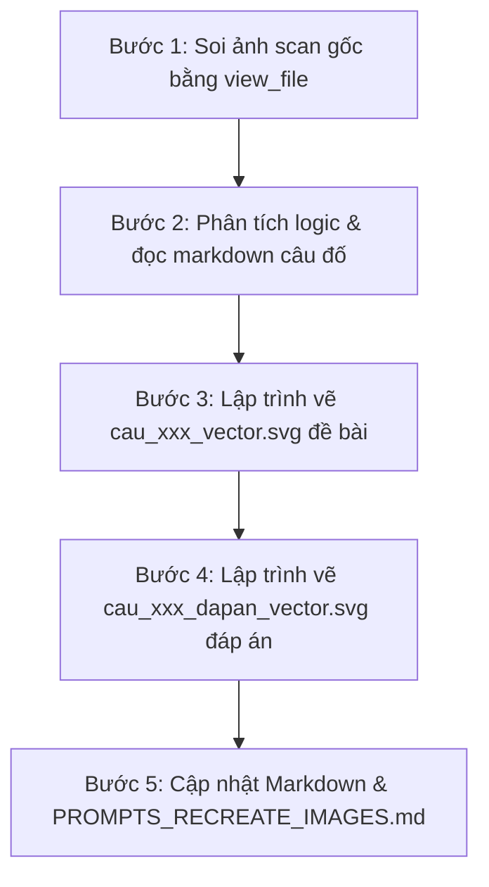

# Quy trình vẽ lại ảnh câu đố thành Vector SVG (draw-puzzle-svg)

Tài liệu này đúc kết toàn bộ kinh nghiệm và quy chuẩn thực chiến từ việc chuyển đổi các ảnh scan câu đố mờ, đen trắng trong bộ sách thành các file **Vector SVG độ nét vô cực**, chuẩn xác toán học 100% và đạt tính thẩm mỹ cao cấp (UI Premium).

---

## 1. Các nguyên tắc cốt lõi bắt buộc (CRITICAL CONSTRAINTS)

### 1.1. Soi ảnh scan gốc ở cấp độ pixel (Pixel-Level Vision Verification)
- **Tuyệt đối không phỏng đoán:** Phải dùng `view_file` xem kỹ ảnh scan gốc `cau_xxx.png` trước khi vẽ bất kỳ nét nào.
- **Kiểm tra kỹ lưỡng từng thành phần:**
  - Lưới ma trận có bao nhiêu hàng, bao nhiêu cột?
  - Ô nào là ô có hình, ô nào là ô gạch sọc bóng mờ (shaded/hatched), và ô nào là **ô trống cần điền** (blank cell)?
  - Vị trí của các ký tự nhãn phương án ($A, B, C, D$): Nằm ở **bên trái**, **bên phải**, **bên trên** hay **bên dưới** của hình vẽ?
  - Tương quan hình dáng: Đâu là hình chữ nhật, đâu là hình vuông, đâu là hình tròn, hình thoi, dấu cộng hay chấm tròn?

### 1.2. Tuyệt đối "Sạch chữ" (No Extra Text in SVG)
- **KHÔNG đưa chữ thừa tiếng Việt vào SVG:** Tuyệt đối không vẽ tiêu đề câu hỏi, đề bài ("Phải điền gì vào ô trống?", "Kiểm tra IQ 1"...), đáp án ("Chọn D", "Lời giải...") hay bất kỳ watermark nào vào file SVG.
- **Chỉ giữ lại các ký hiệu bắt buộc của câu đố:**
  - Tên các phương án trắc nghiệm: $A, B, C, D$.
  - Dấu hỏi chấm `?` ở ô trống cần tìm (nếu cần làm nổi bật câu đố).
  - Tên các phòng/đỉnh/nhãn hình học bắt buộc của bài toán: ví dụ tên phòng $R, S, T, U, X, Y, Z$.

### 1.3. Luôn tạo "Bộ đôi Vector SVG" (Đề bài & Đáp án)
Mỗi câu đố có hình ảnh bắt buộc phải có ít nhất 2 file SVG độc lập:
1. `cau_xxx_vector.svg`: Hình minh họa cho phần **Đề bài** (thể hiện rõ ô trống/dấu hỏi cần giải).
2. `cau_xxx_dapan_vector.svg`: Hình minh họa cho phần **Lời giải chi tiết** trong thẻ `
`:
   - Ô trống đã được điền hoàn chỉnh bằng phương án đúng với màu sắc nổi bật.
   - Thẻ phương án đúng được highlight rực rỡ (viền xanh Emerald, huy hiệu checkmark chiến thắng), các phương án sai được làm mờ nhẹ (opacity $\approx 0.35 - 0.45$).
3. *(Trường hợp đặc biệt phát hiện sạn/mở rộng như Câu 015):* Vẽ thêm file bonus riêng biệt (ví dụ `cau_xxx_dapan_4vien.svg`).

---

## 2. Tiêu chuẩn Thẩm mỹ Cao cấp (Rich Aesthetics & Design System)

Để tạo ra sản phẩm khiến người xem cảm thấy "WOW", hiện đại và chuyên nghiệp:

### 2.1. Bảng màu tuyển chọn (Curated Color Palette)
- **Canvas Background:** Nền sáng sang trọng với gradient nhẹ:
  - `linearGradient` từ `#f8fafc` (Slate 50) sang `#f1f5f9` (Slate 100).
- **Màu sắc các khối Đen (Dark Shapes):**
  - Tránh dùng màu đen tuyền gắt `#000000`.
  - Thay bằng **Deep Indigo Slate Gradient** từ `#1e293b` (Slate 800) sang `#0f172a` (Slate 900) tạo độ sâu tinh tế.
- **Màu sắc các khối Trắng (White Shapes):**
  - Fill `#ffffff`, viền sắc nét màu Dark Slate `#0f172a` hoặc `#1e293b`, `stroke-width` từ $2.4 - 2.8\text{px}$.
- **Ô trống mục tiêu (Target Empty Cell):**
  - Viền nét đứt màu hổ phách: `stroke="#f59e0b"`, `stroke-dasharray="6,4"`.
  - Nền vàng cam nhạt: gradient `#fffbeb` $\to$ `#fef3c7`.
  - Dấu hỏi `?` màu hổ phách đậm `#d97706`, font-weight 800.
  - Hiệu ứng ánh sáng dịu: `target-glow` (`#f59e0b`, opacity 0.45).
- **Màu sắc chiến thắng trong Đáp án (Emerald Success Theme):**
  - Nền ô/thẻ chiến thắng: gradient `#f0fdf4` $\to$ `#dcfce7` (Emerald 50 - 100).
  - Viền & đường nét đáp án: `#10b981` (Emerald 500) hoặc `#047857` (Emerald 700).
  - Huy hiệu Checkmark: Vòng tròn xanh `#10b981` kèm dấu tích trắng thanh mảnh, sắc nét.
- **Nhãn chữ cái phương án $A, B, C, D$:**
  - Đặt trong các circular badge tinh tế (nền `#eff6ff`, chữ màu Royal Blue/Indigo `#2563eb`).
  - Typography: Font sans-serif hiện đại (`-apple-system, BlinkMacSystemFont, 'Segoe UI', Roboto, sans-serif`), font-weight 800.

### 2.2. Chiều sâu & Đổ bóng (Depth & Shadows)
- Sử dụng bộ lọc SVG `<feDropShadow>` đa tầng:
  - `card-shadow` cho khung bao và các thẻ: `dx="0" dy="6" stdDeviation="10" flood-opacity="0.08"`.
  - `shape-depth` cho các khối hình học: `dx="0" dy="2" stdDeviation="2" flood-opacity="0.12"`.

### 2.3. Bẫy kỹ thuật kinh điển: Đoạn thẳng 0-dimension và SVG Filters (Zero-Area Bounding Box Trap)
> [!CAUTION]
> **LỖI KINH ĐIỂN LÀM BIẾN MẤT HÌNH VẼ TRONG SVG:**
> Theo đặc tả chuẩn W3C SVG, mặc định thẻ `<filter>` sử dụng `filterUnits="objectBoundingBox"`.
> - Nếu một đoạn thẳng nằm **ngang hoàn toàn** (`y1 == y2`, `height = 0`) hoặc **thẳng đứng hoàn toàn** (`x1 == x2`, `width = 0`), bounding box của nó có diện tích bằng $0$.
> - Khi đó, mọi trình duyệt hiện đại (Chrome, Safari, Firefox, Edge) và viewer SVG của IDE **sẽ không render bất kỳ pixel nào**, khiến đoạn thẳng bị "bốc hơi" biến mất hoàn toàn!
> - **Cách phòng tránh bắt buộc:**
>   1. **Giải pháp tối ưu nhất cho que diêm, que vạch, đoạn thẳng đơn lẻ:** Luôn dùng thẻ `<rect>` có chiều dài, độ dày và bo góc tròn `rx` (ví dụ: `<rect x="154" y="106.5" width="60" height="7" rx="3.5" .../>`) thay vì dùng thẻ `<line>`. Khối hình có diện tích dương sẽ render bóng đổ và đường nét sắc nét $100\%$.
>   2. **Giải pháp 2:** Nếu bắt buộc dùng `<line>` hoặc `<path>` đơn trục, tuyệt đối không gán filter `objectBoundingBox`, hoặc phải khai báo `filterUnits="userSpaceOnUse"` trong `<filter>`.

---

## 3. Quy trình 5 bước thực hiện chuẩn

### Bước 1: Soi ảnh scan gốc bằng `view_file`
- Mở file ảnh tại `cau_do/images/cau_xxx.png`.
- Ghi chép tọa độ lưới, số hàng, số cột, kiểu đường kẻ, các ký hiệu bên trong từng ô.
- Xác định chính xác vị trí của ô cần tìm (ô sọc bóng mờ hay ô trống trắng tinh).

### Bước 2: Phân tích logic & đọc markdown câu đố
- Mở file `cau_do/tap_x/phan_y/.../cau_xxx.md`.
- Đọc kỹ đề bài, 4 phương án $A, B, C, D$ và lời giải chi tiết.
- Kiểm tra tính nhất quán: Nếu có sự mâu thuẫn giữa mô tả trong lời giải và hình scan gốc (như trường hợp Câu 015 hay Câu 059), phải ưu tiên **logic đúng của hình vẽ và đáp án chuẩn**, đồng thời chỉnh sửa lại lời giải cho khúc chiết, thuyết phục 100%.

### Bước 3: Lập trình vẽ file đề bài `cau_xxx_vector.svg`
- Thiết lập `viewBox` cân đối (thường là `800x450`, `820x460` hoặc `800x440`).
- Dùng công thức toán học tính tọa độ tâm ô $(cx, cy)$ để đặt các hình học chính xác từng pixel:
  $$\text{Tâm ô } (i, j): cx = x_0 + (j - 1) \times \text{cell\_w} + \frac{\text{cell\_w}}{2}, \quad cy = y_0 + (i - 1) \times \text{cell\_h} + \frac{\text{cell\_h}}{2}$$
- Đảm bảo các đường nét thẳng hàng, đối xứng hoàn hảo.
- Áp dụng quy tắc mục 2.3: dùng `<rect rx="...">` cho các đoạn thẳng ngang/dọc đơn lẻ để tránh bẫy mất nét.
- Lưu file vào `cau_do/images/cau_xxx_vector.svg`.

### Bước 4: Lập trình vẽ file đáp án `cau_xxx_dapan_vector.svg`
- Sao chép bố cục từ file đề bài.
- Thay thế ô trống mục tiêu bằng cấu hình đáp án đúng (tô màu xanh Emerald, hiệu ứng phát sáng `success-glow`, badge checkmark).
- Thẻ phương án đúng ở bên phải được bao khung highlight mint green, các phương án còn lại giảm `opacity="0.38"`.
- Lưu file vào `cau_do/images/cau_xxx_dapan_vector.svg`.

### Bước 5: Cập nhật đồng bộ hệ thống
1. **Cập nhật Markdown câu đố (`cau_xxx.md`):**
   - Thay link ảnh đề bài cũ `cau_xxx.png` $\to$ `cau_xxx_vector.svg`.
   - Chèn link ảnh đáp án `cau_xxx_dapan_vector.svg` vào ngay sau dòng `### Đáp án:` trong thẻ `
`.
   - Chỉnh sửa lời giải chi tiết ăn khớp chuẩn xác với hình vẽ vector mới.
2. **Cập nhật tài liệu tổng hợp (`PROMPTS_RECREATE_IMAGES.md`):**
   - Bổ sung đường dẫn clickable link tới 2 file SVG vừa tạo tại mục câu tương ứng.

---

## 4. Các Case Study Mẫu Điển Hình

| Dạng câu đố | Ví dụ thực tế | Đặc điểm xử lý |
| :--- | :--- | :--- |
| **Dãy hình tăng dần số cạnh & Bẫy đoạn thẳng** | **Câu 062** | • Dãy 4 ô ngang: 1 đoạn `—`, 2 đoạn `<`, 3 đoạn `△`, ô trống `?` $\to$ chọn hình vuông $C$ (4 đoạn). • Đoạn thẳng nằm ngang `—` bắt buộc dùng `<rect rx="3.5">` để không bị bẫy zero-height filter làm biến mất nét. |
| **Ma trận IQ $3 \times 3$ (Ký hiệu vệ tinh tịnh tiến)** | **Câu 061** | • Phần tử con (dấu `+`, vuông nhỏ, chấm tròn) dịch chuyển từ trong ra ngoài biên. • Ô (2,1) và (3,2) là ô bóng mờ sọc chéo $45^\circ$. • Highlight phương án B thắng cuộc. |
| **Ma trận IQ $3 \times 3$ (Ký hiệu vệ tinh xoay góc)** | **Câu 060** | • Hàng: hình chính (tròn, vuông đen, tam giác); Cột: sao đen bên trái, không có gì, chấm tròn trên-phải. • Highlight phương án C thắng cuộc. |
| **Ma trận IQ $3 \times 3$ (Ký hiệu trên - dưới)** | **Câu 059** | • Phân tích chính xác ô $(1,2)$ là ô bóng mờ sọc chéo, ô $(3,2)$ mới là ô trống cần điền. • Ô $(3,3)$ là hình thoi trắng / vuông đen. • Nhãn $A, C$ bên trái; $B, D$ bên phải. • Lời giải chứng minh quy luật 2 trắng 1 đen của hình vuông hàng 3. |
| **Ma trận IQ $3 \times 3$ (Que vạch đối xứng)** | **Câu 058** | • Tính toán tọa độ đoạn thẳng nghiêng $/$, $\backslash$, $|$, $-$ đối xứng tâm. • Tâm là hình hoa thị 8 hướng kết hợp từ 4 đoạn thẳng. • Highlight phương án B thắng cuộc. |
| **Bàn cờ lưới tọa độ ($6 \times 6$)** | **Câu 053** | • Lưới kẻ $6 \times 6$ sắc nét. • Quân cờ là viên bi tròn 3D gradient có bóng đổ. • Hình đáp án đặt chính xác 12 quân cờ theo 6 cặp hàng/cột. |
| **Mặt bằng kiến trúc & Lối đi** | **Câu 057** | • Vẽ mặt bằng 7 phòng triển lãm $R, S, T, U, X, Y, Z$ phối màu pastel thanh lịch. • Cửa mở kiến trúc góc $90^\circ$ kèm cung tròn mở cửa tiêu chuẩn. • Mũi tên dẫn đường vào phòng $R$. |
| **Xếp hạt & Phát hiện sạn sách** | **Câu 015** | • Cây thánh giá 27 viên đá saphire xếp nhánh. • Phát hiện sạn scan mất 4 viên thay vì 2 viên $\to$ Vẽ riêng đáp án chính thức 2 viên và đáp án bonus 4 viên. |

---

## 5. Checklist Kiểm Tra Chất Lượng Trước Khi Bàn Giao

- [ ] Ảnh scan gốc đã được soi kỹ từng góc bằng `view_file` chưa?
- [ ] Thứ tự các hàng, các cột và vị trí ô trống đã trùng khớp 100% với scan chưa?
- [ ] Vị trí các chữ cái $A, B, C, D$ đã nằm đúng bên trái / bên phải / bên dưới của hình chưa?
- [ ] Đã kiểm tra bẫy mục 2.3: các đoạn thẳng ngang (`y1=y2`) hoặc dọc (`x1=x2`) có bị gán filter làm biến mất không? (Đã dùng `<rect rx="...">` an toàn 100%).
- [ ] SVG đã được xóa sạch toàn bộ chữ thừa tiếng Việt chưa?
- [ ] Đã có đủ cả 2 file: file đề bài (`_vector.svg`) và file đáp án (`_dapan_vector.svg`) chưa?
- [ ] Phối màu đã đạt chuẩn UI Premium (gradient, shadow, dark slate, emerald) chưa?
- [ ] File `cau_xxx.md` đã được cập nhật link 2 ảnh và lời giải đã được rà soát chưa?
- [ ] File `PROMPTS_RECREATE_IMAGES.md` đã được cập nhật mục tương ứng chưa?

