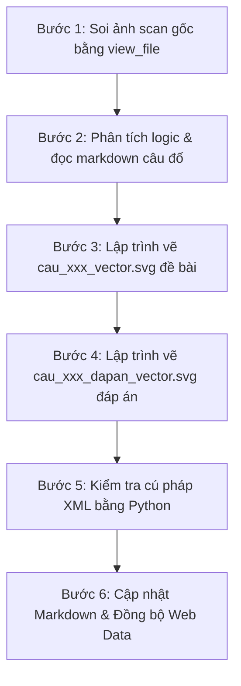

# Quy trình vẽ lại ảnh câu đố thành Vector SVG (draw-puzzle-svg)

Tài liệu này đúc kết toàn bộ kinh nghiệm và quy chuẩn thực chiến từ việc chuyển đổi các ảnh scan câu đố mờ, đen trắng trong bộ sách thành các file **Vector SVG độ nét vô cực**, chuẩn xác toán học 100% và đạt tính thẩm mỹ cao cấp (UI Premium), thích ứng hoàn hảo với cả 2 giao diện Sáng và Tối (Light/Dark Mode).

---

## 1. Các nguyên tắc cốt lõi bắt buộc (CRITICAL CONSTRAINTS)

### 1.1. Soi ảnh scan gốc ở cấp độ pixel (Pixel-Level Vision Verification)
- **Tuyệt đối không phỏng đoán:** Phải dùng `view_file` xem kỹ ảnh scan gốc `cau_xxx.png` trước khi vẽ bất kỳ nét nào.
- **Kiểm tra kỹ lưỡng từng thành phần:**
  - Lưới ma trận có bao nhiêu hàng, bao nhiêu cột?
  - Ô nào là ô có hình, ô nào là ô gạch sọc bóng mờ (shaded/hatched), và ô nào là **ô trống cần điền** (blank cell)?
  - Vị trí của các ký tự nhãn phương án ($A, B, C, D$): Nằm ở **bên trái**, **bên phải**, **bên trên** hay **bên dưới** của hình vẽ?
  - Tương quan hình dáng: Đâu là hình chữ nhật, đâu là hình vuông, đâu là hình tròn, hình thoi, dấu cộng hay chấm tròn?

### 1.2. Tuyệt đối "Sạch chữ" (No Extra Text in SVG)
- **KHÔNG đưa chữ thừa tiếng Việt vào SVG:** Tuyệt đối không vẽ tiêu đề câu hỏi, đề bài ("Phải điền gì vào ô trống?", "Kiểm tra IQ 1"...), đáp án ("Chọn D", "Lời giải...") hay bất kỳ watermark nào vào file SVG.
- **Chỉ giữ lại các ký hiệu bắt buộc của câu đố:**
  - Tên các phương án trắc nghiệm: $A, B, C, D$.
  - Dấu hỏi chấm `?` ở ô trống cần tìm (nếu cần làm nổi bật câu đố).
  - Tên các phòng/đỉnh/nhãn hình học bắt buộc của bài toán: ví dụ tên phòng $R, S, T, U, X, Y, Z$.
  - Nhãn dữ kiện ngắn gọn khi giải bài toán phân tích/trục số (ví dụ: $x \ge 5$, tên đối tượng Giáp/Ất).

### 1.3. Luôn tạo "Bộ đôi Vector SVG" (Đề bài & Đáp án)
Mỗi câu đố có hình ảnh bắt buộc phải có ít nhất 2 file SVG độc lập:
1. `cau_xxx_vector.svg`: Hình minh họa cho phần **Đề bài** (thể hiện rõ ô trống/dấu hỏi cần giải).
2. `cau_xxx_dapan_vector.svg`: Hình minh họa cho phần **Lời giải chi tiết** trong thẻ `<details>`:
   - Ô trống đã được điền hoàn chỉnh bằng phương án đúng với màu sắc nổi bật.
   - Thẻ phương án đúng được highlight rực rỡ (viền xanh Emerald, huy hiệu checkmark chiến thắng), các phương án sai được làm mờ nhẹ (opacity $\approx 0.35 - 0.45$).
3. *(Trường hợp đặc biệt phát hiện sạn/mở rộng như Câu 015):* Vẽ thêm file bonus riêng biệt (ví dụ `cau_xxx_dapan_4vien.svg`).

---

## 2. Tiêu chuẩn Thẩm mỹ Cao cấp & Kỹ thuật Vector Hiện đại

### 2.1. Tách Nền Trong Suốt (Transparent Canvas)
- **KHÔNG vẽ hình chữ nhật nền bọc toàn bộ SVG:** Tuyệt đối không thêm `<rect width="100%" height="100%" fill="#ffffff".../>` hoặc bất kỳ rect bao canvas nào.
- Để canvas trong suốt tự nhiên, giúp đồ họa vector hòa nhập hoàn hảo vào thẻ card của Web App trên mọi kích cỡ màn hình và nền màu khác nhau.

### 2.2. Thích Ứng Đa Giao Diện (Dual Theme: Light / Dark Mode)
Web app hỗ trợ cả 2 chế độ Sáng và Tối, vì vậy đồ họa SVG phải tự động biến đổi màu sắc đẹp mắt theo hệ thống:
- Sử dụng media query `@media (prefers-color-scheme: dark)` trong thẻ `<style>` của SVG:
  ```xml
  <style><![CDATA[
    /* Light theme default */
    .card-box { fill: #ffffff; stroke: #cbd5e1; }
    .card-text-primary { fill: #0f172a; }
    .badge-blue { fill: #eff6ff; stroke: #93c5fd; }
    .badge-blue-text { fill: #1d4ed8; }

    /* Dark theme: solid opaque dark backgrounds & glowing accents */
    @media (prefers-color-scheme: dark) {
      .card-box { fill: #1e293b; stroke: #475569; }
      .card-text-primary { fill: #f8fafc; }
      .badge-blue { fill: #172554; stroke: #3b82f6; }
      .badge-blue-text { fill: #bfdbfe; }
    }
  ]]></style>
  ```
- **Quy tắc nền đục (Opaque Background) cho Badge/Pill:**
  - Trong Dark Mode, khi badge nằm trên đường kẻ hoặc nền có chi tiết khác, **bắt buộc dùng màu nền đục 100% (solid dark opaque)** như Deep Blue `#172554`, Deep Purple `#1e1b4b`, Slate `#1e293b`, Deep Amber `#451a03`...
  - **TRÁNH DÙNG `rgba(..., 0.2)` cho các badge đè trên đường nét**, vì độ trong suốt sẽ làm đường kẻ bên dưới lộ ra cắt ngang chữ!

### 2.3. Cắt Ngắt Đường Kẻ Quanh Badge (Line-Break Architecture)
- Khi vẽ các tia số, trục số, mũi tên hoặc đường nối mà có gắn nhãn chữ (pill badge):
  - **KHÔNG vẽ một đường kẻ liên tục chạy xuyên qua badge.**
  - **BẮT BUỘC ngắt đường kẻ thành 2 đoạn:** Đoạn trước badge và đoạn sau badge (ví dụ: `x1="680"` $\to$ `x2="355"` và `x1="225"` $\to$ `x2="70"`).
  - Áp dụng kỹ thuật này đảm bảo 100% chữ **không bao giờ bị đường kẻ đè lên hoặc gạch ngang**, ngay cả khi hiển thị trong bất kỳ chế độ tương phản hay môi trường render nào.

### 2.4. Chống Va Chạm & Đè Chữ (Text Collision Prevention)
- **Tách biệt không gian giữa số mốc và nhãn đơn vị:** Trên các trục số/biểu đồ, các nhãn chữ dài (ví dụ: `(triệu đồng)`) nếu đặt cùng tọa độ `y` với số mốc cuối cùng (ví dụ `20`) sẽ bị đè chữ do `text-anchor="end"`.
- **Giải pháp:** Đưa nhãn đơn vị lên phía trên mũi tên trục số (ví dụ: `y = y_axis - 12px`), giữ hàng bên dưới trục hoàn toàn thông thoáng cho các mốc số tọa độ.

### 2.5. Chuẩn Hóa Cú Pháp XML (Strict XML Well-formedness)
> [!CAUTION]
> **LỖI KHIẾN FILE SVG KHÔNG THỂ MỞ ĐƯỢC:**
> Bộ parser XML của trình duyệt và hệ thống rất nghiêm ngặt. Chỉ một ký tự không chuẩn sẽ khiến file SVG báo lỗi cú pháp và không thể hiển thị:
> 1. **Luôn bọc nội dung thẻ `<style>` trong `<![CDATA[ ... ]]>`:**
>    ```xml
>    <style><![CDATA[
>      /* CSS Rules */
>    ]]></style>
>    ```
> 2. **Tuyệt đối không để ký tự `&`, `<`, `>` tự do trong SVG (kể cả trong comment CSS!):**
>    - Thay `&` bằng `and` hoặc dùng entity `&amp;`.
>    - Thay `<` bằng `&lt;` trong nội dung thẻ `<text>`.
> 3. **Luôn kiểm tra đầy đủ cặp thẻ gốc `<svg ...>` và `</svg>`:** Tránh để sót thẻ mở `<svg>` ở dòng 1.
> 4. **Xác thực XML trước khi bàn giao:** Chạy script Python `xml.etree.ElementTree.parse(filepath)` để đảm bảo 100% hợp lệ.

### 2.6. Bẫy Đoạn Thẳng 0-dimension (Zero-Area Bounding Box Trap)
> [!CAUTION]
> **LỖI BIẾN MẤT HÌNH VẼ KHI DÙNG FILTER TRÊN ĐOẠN THẲNG:**
> - Theo chuẩn W3C SVG, `<filter>` mặc định dùng `filterUnits="objectBoundingBox"`.
> - Đoạn thẳng nằm ngang (`y1 == y2`, `height = 0`) hoặc thẳng đứng (`x1 == x2`, `width = 0`) có diện tích bounding box bằng $0$, dẫn đến trình duyệt không render bất kỳ pixel nào!
> - **Cách phòng tránh bắt buộc:**
>   - Dùng thẻ `<rect>` có độ dày và bo góc `rx` (ví dụ: `<rect x="154" y="106.5" width="60" height="7" rx="3.5".../>`) thay cho thẻ `<line>`.
>   - Hoặc nếu dùng `<line>`, phải khai báo `filterUnits="userSpaceOnUse"` trong thẻ `<filter>`.

---

## 3. Quy trình Thực hiện Chuẩn 6 Bước



### Bước 1: Soi ảnh scan gốc bằng `view_file`
- Mở file ảnh tại `cau_do/images/cau_xxx.png`.
- Ghi chép tọa độ lưới, số hàng, số cột, kiểu đường kẻ, các ký hiệu bên trong từng ô.
- Xác định chính xác vị trí của ô cần tìm (ô sọc bóng mờ hay ô trống trắng tinh).

### Bước 2: Phân tích logic & đọc markdown câu đố
- Mở file `cau_do/tap_x/phan_y/.../cau_xxx.md`.
- Đọc kỹ đề bài, 4 phương án $A, B, C, D$ và lời giải chi tiết.
- Kiểm tra tính nhất quán: Nếu có sự mâu thuẫn giữa mô tả trong lời giải và hình scan gốc, phải ưu tiên **logic đúng của hình vẽ và đáp án chuẩn**, đồng thời chỉnh sửa lại lời giải cho khúc chiết, thuyết phục 100%.

### Bước 3: Lập trình vẽ file đề bài `cau_xxx_vector.svg`
- Thiết lập `viewBox` cân đối (thường là `800x450`, `800x480` hoặc `880x520`).
- Không vẽ rect nền toàn bộ (để transparent canvas).
- Dùng công thức toán học tính tọa độ tâm ô $(cx, cy)$ để đặt các hình học chính xác từng pixel.
- Bọc `<style><![CDATA[ ... ]]></style>` hỗ trợ cả Light và Dark mode.
- Lưu file vào `cau_do/images/cau_xxx_vector.svg`.

### Bước 4: Lập trình vẽ file đáp án `cau_xxx_dapan_vector.svg`
- Kế thừa bố cục từ file đề bài.
- Thay thế ô trống mục tiêu bằng cấu hình đáp án đúng (tô màu xanh Emerald `#10b981`, badge checkmark).
- Thẻ phương án đúng được highlight rực rỡ, các phương án còn lại giảm `opacity="0.38"`.
- Nếu có trục số/tia số: ngắt đường kẻ xung quanh các badge để chữ không bị đè.
- Lưu file vào `cau_do/images/cau_xxx_dapan_vector.svg`.

### Bước 5: Kiểm tra cú pháp XML tự động bằng Python
- Chạy lệnh kiểm tra nhanh để đảm bảo file SVG không bị lỗi XML:
  ```bash
  python -c "import xml.etree.ElementTree as ET; ET.parse('cau_do/images/cau_xxx_vector.svg'); ET.parse('cau_do/images/cau_xxx_dapan_vector.svg'); print('XML OK!')"
  ```

### Bước 6: Cập nhật Markdown & Đồng bộ Web Data
1. **Cập nhật Markdown câu đố (`cau_xxx.md`):**
   - Thay link ảnh đề bài cũ `cau_xxx.png` $\to$ `cau_xxx_vector.svg`.
   - Chèn link ảnh đáp án `cau_xxx_dapan_vector.svg` vào ngay sau dòng `### Đáp án:` trong thẻ `<details>`.
2. **Đồng bộ hóa cơ sở dữ liệu Web App:**
   - Chạy lệnh biên dịch để cập nhật `data/puzzles.json`:
     ```bash
     python scripts/build_web_data.py
     ```
   - Xác nhận file `puzzles.json` đã được tạo thành công.

---

## 4. Các Case Study Mẫu Điển Hình

| Dạng câu đố | Ví dụ thực tế | Đặc điểm xử lý |
| :--- | :--- | :--- |
| **Trục số & Tia số bất đẳng thức** | **Câu 369** | • Trục tọa độ và các tia số $x < 20, x \ge 1, x \ge 5, x \ge 10$.<br>• Cắt ngắt đường tia quanh badge chữ.<br>• Nền badge đục 100% trong Dark mode (`#1e1b4b`, `#172554`...) kèm đổ bóng.<br>• Tách nhãn `(triệu đồng)` lên trên mũi tên tránh đè mốc `20`. |
| **Bàn cờ ma trận tròn & Vòng lặp đếm** | **Câu 447** | • 13 loại quả xếp vòng tròn $360^\circ / 13$.<br>• Cung tròn mũi tên chiều đếm cùng chiều kim đồng hồ.<br>• Tách nền trong suốt, bọc CDATA và kiểm tra kỹ thẻ `<svg>`. |
| **Ma trận chuỗi khối & 3D Đa tầng** | **Câu 443** | • 4 hình vuông đồng tâm xếp 10 chú lợn / chấm tròn.<br>• Thẻ badge chỉ dẫn đục trong suốt trên Dark mode. |
| **Bẫy đoạn thẳng 0-dimension** | **Câu 062** | • Dãy 4 ô ngang: đoạn thẳng `—` bắt buộc dùng `<rect rx="3.5">` thay cho `<line>` để không bị filter làm biến mất nét. |
| **Ma trận IQ $3 \times 3$ (Ký hiệu tịnh tiến/xoay)** | **Câu 060, 061** | • Phân tích chính xác ô sọc bóng mờ và ô trống cần điền.<br>• Highlight phương án đúng bằng viền Emerald và checkmark. |
| **Mặt bằng kiến trúc & Lối đi** | **Câu 057** | • Vẽ mặt bằng 7 phòng triển lãm $R, S, T, U, X, Y, Z$ phối màu pastel thanh lịch.<br>• Cửa mở kiến trúc góc $90^\circ$ kèm cung tròn mở cửa tiêu chuẩn. |
| **Chia cắt mảnh đất hình học** | **Câu 364** | • Khôi phục chính xác chữ bị che mất từ scan gốc.<br>• Vẽ bản đồ phân chia mảnh đất thành các phần bằng nhau với màu sắc phân biệt rõ ràng. |
| **Gấp dán hình học không gian** | **Câu 430, 431, 432** | • Vẽ lưới khai triển hình lập phương và các mặt phẳng 3D trực quan.<br>• Đánh dấu ký hiệu các mặt đối diện chính xác tuyệt đối. |

---

## 5. Checklist Kiểm Tra Chất Lượng Trước Khi Bàn Giao

- [ ] Ảnh scan gốc đã được soi kỹ từng góc bằng `view_file` chưa?
- [ ] Thứ tự các hàng, các cột và vị trí ô trống đã trùng khớp 100% với scan chưa?
- [ ] Vị trí các chữ cái $A, B, C, D$ đã nằm đúng bên trái / bên phải / bên dưới của hình chưa?
- [ ] **Canvas đã tách nền trong suốt chưa?** (Không có `<rect>` bao ngoài cùng toàn bộ canvas).
- [ ] **Đã hỗ trợ 2 theme (Light / Dark) chưa?** Các badge/card có chuyển màu mượt mà trong Dark mode không?
- [ ] **Cú pháp XML đã chuẩn chưa?**
  - Khối `<style>` đã được bọc `<![CDATA[ ... ]]>` chưa?
  - Có ký tự `&` tự do nào chưa escape thành `&amp;` hoặc `and` không?
  - Ký tự `<` trong văn bản đã đổi thành `&lt;` chưa?
  - Có đầy đủ cặp thẻ `<svg>` và `</svg>` chưa?
- [ ] **Bố cục đường nét & chữ:**
  - Các badge/pill trên đường kẻ đã được **ngắt đường nét** hoặc có **nền đục 100%** chưa? (Tuyệt đối không để chữ bị đường kẻ đè lên).
  - Các nhãn chữ và số mốc có bị đè chéo lên nhau không? (Ví dụ nhãn đơn vị đo).
- [ ] Đã kiểm tra bẫy mục 2.6: các đoạn thẳng ngang (`y1=y2`) hoặc dọc (`x1=x2`) có bị gán filter làm biến mất không? (Đã dùng `<rect rx="...">` an toàn 100%).
- [ ] SVG đã được xóa sạch toàn bộ chữ thừa tiếng Việt không bắt buộc chưa?
- [ ] Đã có đủ cả 2 file: file đề bài (`_vector.svg`) và file đáp án (`_dapan_vector.svg`) chưa?
- [ ] **Đã chạy script Python xác thực cú pháp XML `xml.etree.ElementTree` thành công chưa?**
- [ ] File `cau_xxx.md` đã được cập nhật link 2 ảnh và lời giải đã được rà soát chưa?
- [ ] **Đã chạy `python scripts/build_web_data.py`** và kiểm tra hiển thị trên Web App chưa?


