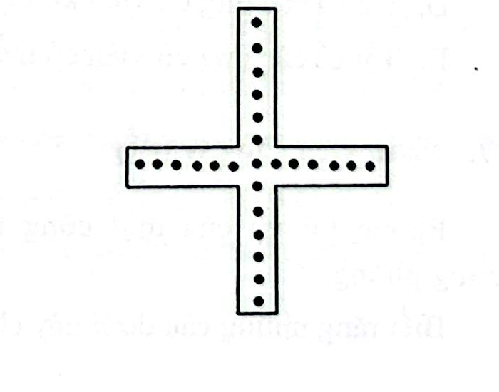
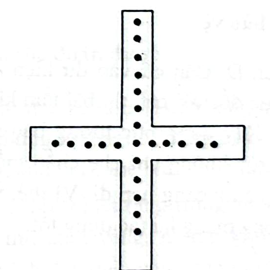

# Câu 015: Ăn trộm kim cương

- **Tập:** 1
- **Phần:** Phần 1 - Phương pháp loại trừ
- **Mức độ:** Dễ
- **Nguồn:** Trang 27 - 28 (Tập 1)
- **Tóm tắt câu hỏi:** Cây thánh giá nạm kim cương có quy luật: đếm từ đỉnh trên cùng đến viên ở tâm rồi rẽ sang trái, phải, hoặc đi xuống dưới đều được đúng 13 viên. Kẻ thợ sửa gian xảo đã lấy trộm 2 viên kim cương và dịch chuyển vị trí sao cho mỗi lượt đếm vẫn ra đủ 13 viên. Hãy tìm cách làm của hắn.

---

## Đề bài

Linh mục có một cây thánh giá rất quý, bên trên có gắn những hạt kim cương đắt tiền và được bố trí như hình vẽ sau:

Nhưng linh mục không biết được trên cây thánh giá có tất cả bao nhiêu viên kim cương. Mỗi lần đếm ông đều bắt đầu từ phía trên cùng. Khi đếm đến viên kim cương nằm ở giữa cây thánh giá, ông lần lượt đếm sang bên trái, bên phải và xuống dưới. Mỗi lượt đếm như vậy ông đều nhận được kết quả là 13 viên. 

Có một lần, cây thánh giá bị hư hỏng nhẹ, linh mục cho gọi một người thợ vào sửa. Người thợ này là một kẻ tham lam, hắn ta biết phương pháp đếm những viên kim cương của linh mục, nên lấy trộm đi 2 viên kim cương mà linh mục không phát hiện ra. 

Bạn có biết tên trộm này đã làm như thế nào không?

---

<b>💡 Xem đáp án & Lời giải chi tiết</b>

### Đáp án & Lời giải:

**Cách thực hiện của tên trộm:**
Hắn lấy trộm hai viên kim cương ở hai đầu mút cánh ngang của cây thánh giá (mỗi bên 1 viên), sau đó tháo viên kim cương dưới cùng của nhánh dọc đem gắn lên vị trí trên cùng. 

Bố trí mới như hình vẽ sau:

---

**Phân tích chi tiết:**

1. **Cấu trúc ban đầu:**
   - Nhánh trên (tính trước tâm): có 5 viên.
   - Viên tâm (giao điểm): 1 viên.
   - Khi đếm từ đỉnh trên cùng tới tâm: $5 + 1 = 6$ viên.
   - Nhánh trái: có 7 viên $\Rightarrow 6 + 7 = 13$ viên.
   - Nhánh phải: có 7 viên $\Rightarrow 6 + 7 = 13$ viên.
   - Nhánh dưới: có 7 viên $\Rightarrow 6 + 7 = 13$ viên.
   - Tổng số kim cương ban đầu: $5 + 1 + 7 + 7 + 7 = 27$ viên.

2. **Sau khi người thợ dịch chuyển:**
   - Trộm đi 2 viên ở đầu mút hai bên trái và phải $\Rightarrow$ nhánh trái còn 6 viên, nhánh phải còn 6 viên.
   - Chuyển 1 viên từ dưới cùng lên trên cùng $\Rightarrow$ nhánh trên tăng lên $5 + 1 = 6$ viên; nhánh dưới giảm xuống còn $7 - 1 = 6$ viên.
   - Số kim cương còn lại: $27 - 2 = 25$ viên.

3. **Kiểm tra cách đếm của linh mục:**
   - Đếm từ đỉnh trên cùng đến tâm: $6 + 1 = 7$ viên.
   - Rẽ sang trái: $7 + 6 = 13$ viên.
   - Rẽ sang phải: $7 + 6 = 13$ viên.
   - Xuống dưới: $7 + 6 = 13$ viên.

Cả ba lượt đếm vẫn cho kết quả chính xác 13 viên như cũ, do đó linh mục hoàn toàn không phát hiện ra 2 viên kim cương đã bị đánh cắp!

