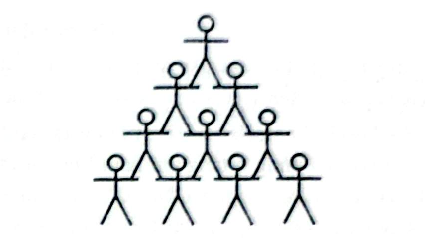

# Câu 044: Diễn viên xiếc

- **Tập:** 1
- **Phần:** Phần 1 - Phương pháp loại trừ
- **Mức độ:** Trung bình
- **Nguồn:** Trang 48 - 50 (Tập 1)
- **Tóm tắt câu hỏi:** 5 diễn viên thành niên (M, N, O, P, Q) và 5 diễn viên nhỏ tuổi (V, W, X, Y, Z) xếp thành tháp La Hán 4 tầng hình tam giác; xác định vị trí của từng người và phản ứng dây chuyền khi có người bị ngã.

---

## Đề bài

5 diễn viên xiếc thành niên M, N, O, P, Q và 5 diễn viên xiếc nhỏ tuổi V, W, X, Y, Z biểu diễn tiết mục xiếc La Hán có 4 tầng theo quy tắc như sau (người nọ đứng lên vai người kia và tất cả có 4 tầng):
1. Tầng thứ nhất (tầng dưới cùng trên mặt đất) có 4 người, tầng thứ hai có 3 người, tầng thứ ba có 2 người, tầng thứ tư (tầng trên cùng) chỉ có 1 người.
2. Trừ những diễn viên tầng thứ nhất đứng trên mặt đất, các diễn viên ở tầng trên đều đứng trên vai của hai diễn viên đứng cạnh nhau ở tầng ngay bên dưới.
3. Bất cứ diễn viên nào bị ngã, thì hai diễn viên đứng trên vai anh ta cũng bị ngã theo.
4. Diễn viên xiếc nhỏ tuổi không được đứng ở tầng dưới cùng, đồng thời cũng không được đứng ở vị trí mà hai vai đều có những diễn viên khác đứng lên.

---

### Câu hỏi 1:
Nếu X đứng trên vai V, đồng thời M và W đứng kề nhau trên cùng một tầng, vậy thì sự sắp xếp nào sau đây có thể là sự sắp xếp của tầng thứ hai?
- A. V, M, W
- B. V, W, M
- C. X, M, W
- D. Y, N, Z
- E. Y, O, V

### Câu hỏi 2:
Q và W đứng trên vai N, nếu M ngã thì sẽ kéo theo các diễn viên khác ngã, vậy thì những người nào sau đây không bị ngã?
- A. N, O, P, Q, V và W
- B. N, O, P, V, X và Y
- C. N, P, V, W, X và Y
- D. O, P, Q, V, X và Y
- E. O, P, Q, W, X và Y

### Câu hỏi 3:
Nếu V và W đứng ở hai tầng khác nhau, X và Z đứng trên cùng một tầng, vậy Y có thể đứng ở tầng nào?
- A. Tầng 2
- B. Tầng 3
- C. Tầng 4
- D. Tầng 2 hoặc tầng 3
- E. Tầng 3 hoặc tầng 4

### Câu hỏi 4:
Nếu V và W đứng trên vai của O, hơn nữa M, N và P đứng trên cùng một tầng, M là diễn viên duy nhất đứng giữa N và P, cho biết nhận định nào sau đây là đúng?
- A. Nếu M ngã, thì tất cả 5 diễn viên nhỏ tuổi cùng ngã theo.
- B. Nếu N ngã, thì có 4 diễn viên nhỏ tuổi ngã theo.
- C. Nếu O ngã, thì có 2 diễn viên nhỏ tuổi ngã theo.
- D. Nếu P ngã, thì có 3 diễn viên nhỏ tuổi ngã theo.
- E. Nếu Q ngã, thì có 3 diễn viên nhỏ tuổi ngã theo.

### Câu hỏi 5:
Nếu W đứng trên vai của V, V đứng trên vai của M, thì nhận định nào sau đây là sai?
- A. N và V đứng cạnh nhau trên cùng một tầng.
- B. W và X đứng cạnh nhau trên cùng một tầng.
- C. X và Y đứng cạnh nhau trên cùng một tầng.
- D. M đứng cùng tầng với N và P, đồng thời là người duy nhất đứng giữa N và P.
- E. M đứng cùng tầng với Y và Z, đồng thời là người duy nhất đứng giữa Y và Z.

### Câu hỏi 6:
Nếu W đứng trên vai của N và P, X đứng trên vai của M và V, thì nhận định nào sau đây là đúng?
- A. M đứng cùng tầng với V và W, đồng thời là người duy nhất đứng giữa V và W.
- B. N đứng cùng tầng với P và Q, đồng thời là người duy nhất đứng giữa P và Q.
- C. O đứng cùng tầng với P và Q, đồng thời là người duy nhất đứng giữa P và Q.
- D. Q đứng cùng tầng với N và O, đồng thời là người duy nhất đứng giữa N và O.
- E. P đứng cùng tầng với N và O, đồng thời là người duy nhất đứng giữa N và O.

### Câu hỏi 7:
Nếu N và Y đứng trên vai M, Z đứng trên vai P và O, thì cặp diễn viên nào sau đây chắc chắn đứng cạnh nhau trên cùng một tầng?
- A. M và O
- B. M và P
- C. N và Z
- D. P và Q
- E. W và X

---

<b>💡 Xem đáp án & Lời giải chi tiết</b>

### Đáp án & Lời giải:

**Phân tích tổng thể cấu trúc tháp:**
- Cấu trúc tháp gồm: Tầng 1 (4 người), Tầng 2 (3 người), Tầng 3 (2 người), Tầng 4 (1 người).
- Theo giả thiết (4):
  + Diễn viên nhỏ tuổi (V, W, X, Y, Z) không được đứng ở tầng 1 $\rightarrow$ Toàn bộ 4 vị trí ở tầng 1 phải là người lớn (chọn 4 trong 5 người M, N, O, P, Q).
  + Diễn viên nhỏ tuổi không được đứng ở vị trí mà cả hai vai đều có người khác đứng lên. Ở tầng 2 (3 vị trí), vị trí chính giữa gánh chân của cả 2 người ở tầng 3 (hai vai đều chịu lực), nên vị trí giữa tầng 2 bắt buộc phải là 1 người lớn. Hai vị trí mép ngoài tầng 2 chỉ gánh 1 bên vai nên dành cho trẻ em.
  + Do đó: **5 người lớn chiếm 4 vị trí tầng 1 và 1 vị trí giữa tầng 2**. Còn **5 diễn viên nhỏ tuổi chiếm 2 vị trí ngoài ở tầng 2, cả 2 vị trí ở tầng 3, và đỉnh tháp (tầng 4)**.

**Câu hỏi 1: Lựa chọn đáp án A.**
Ở tầng 2, người đứng giữa phải là người lớn, hai bên là trẻ em.
- Vì X đứng trên vai V nên V phải ở tầng dưới X. Do trẻ em không ở tầng 1, nên V phải ở tầng 2 và X ở tầng 3.
- M và W đứng cạnh nhau trên cùng một tầng, mà M là người lớn nên M phải ở vị trí giữa tầng 2, kéo theo W ở vị trí ngoài còn lại của tầng 2.
- Do đó tầng 2 gồm: **V, M, W** (hoặc W, M, V). Đáp án A phù hợp nhất.

**Câu hỏi 2: Chọn đáp án A.**
Q và W đứng trên vai N $\rightarrow$ N đứng ở tầng 1 (vị trí số 2 hoặc 3). Q là người lớn nên Q đứng ở giữa tầng 2.
Nếu M ngã: Do M là người lớn ở tầng 1 (hoặc đứng ngoài), khi ngã sẽ kéo theo một nhánh các diễn viên phía trên ngã. Nhưng N ở tầng 1, Q và W ở tầng 2 đứng trên vai N không bị ảnh hưởng trực tiếp từ M. Cùng với các người lớn khác ở tầng 1 không bị M kéo ngã, số người an toàn gồm **N, O, P, Q, V và W** (Đáp án A).

**Câu hỏi 3: Chọn đáp án D.**
5 trẻ em phân bổ vào: tầng 2 (2 vị trí), tầng 3 (2 vị trí), tầng 4 (1 vị trí).
- Nếu X và Z ở tầng 2, thì V và W phải chia nhau ở tầng 3 và tầng 4 $\rightarrow$ Vị trí còn lại cho Y là tầng 3.
- Nếu X và Z ở tầng 3, thì V và W phải ở tầng 2 và tầng 4 $\rightarrow$ Vị trí còn lại cho Y là tầng 2.
Vậy Y có thể đứng ở **tầng 2 hoặc tầng 3** (Đáp án D).

**Câu hỏi 4: Chọn đáp án E.**
O đứng ở giữa tầng 2 (vì có V và W đứng trên vai). M, N, P, Q là 4 người lớn ở tầng 1.
M là người duy nhất đứng giữa N và P nên thứ tự tầng 1 là (N, M, P, Q) hoặc (Q, N, M, P) hoặc đối xứng. Q chắc chắn đứng ở vị trí ngoài cùng (số 1 hoặc số 4). Dù Q ở vị trí nào ở mép ngoài, khi ngã sẽ kéo theo 1 trẻ em ở tầng 2, 1 trẻ em ở tầng 3 và 1 trẻ em ở đỉnh tầng 4 ngã theo, tổng cộng là **3 diễn viên nhỏ tuổi ngã theo** (Đáp án E).

**Câu hỏi 5: Chọn đáp án C.**
X và Y đều là diễn viên nhỏ tuổi. Theo phân tích ở trên, nếu X và Y đứng cạnh nhau thì họ chỉ có thể đứng ở tầng 3 (vì tầng 2 có M đứng giữa, tầng 4 chỉ có 1 người).
Nhưng nếu X và Y ở tầng 3, thì 3 trẻ em còn lại (V, W, Z) phải ở tầng 2 (2 người) và tầng 4 (1 người). Khi đó W và V không thể đứng lên vai nhau theo chuỗi $M \rightarrow V \rightarrow W$ (W ở tầng 4 không đứng trực tiếp trên vai V ở tầng 2). Do đó, giả thiết câu hỏi mâu thuẫn với việc X và Y đứng cùng tầng. Nhận định C là sai.

**Câu hỏi 6: Chọn đáp án A.**
- W đứng trên vai N và P $\rightarrow$ N và P ở tầng 1, W ở tầng 2.
- X đứng trên vai M và V $\rightarrow$ X ở tầng 3, còn M và V ở tầng 2.
- Vì ở tầng 2 có M, V, W mà M là người lớn, nên M bắt buộc phải đứng ở giữa, V và W đứng ở hai bên.
Do đó: **M đứng cùng tầng với V và W, đồng thời là người duy nhất đứng giữa V và W** (Đáp án A).

**Câu hỏi 7: Chọn đáp án C.**
N và Y đứng trên vai M $\rightarrow$ M đứng ở tầng 1, N và Y đứng ở tầng 2 (với N là người lớn đứng ở giữa tầng 2).
Z đứng trên vai P và O $\rightarrow$ P và O ở tầng 1, Z đứng ở tầng 2.
Như vậy, cả 3 vị trí ở tầng 2 là N, Y và Z, trong đó N đứng giữa. Do đó, **N và Z chắc chắn đứng cạnh nhau** (Đáp án C).

