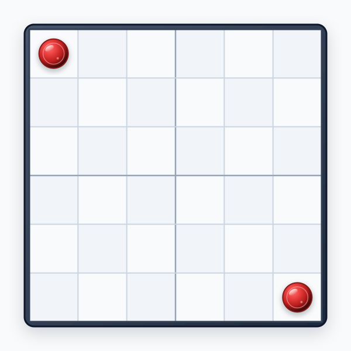
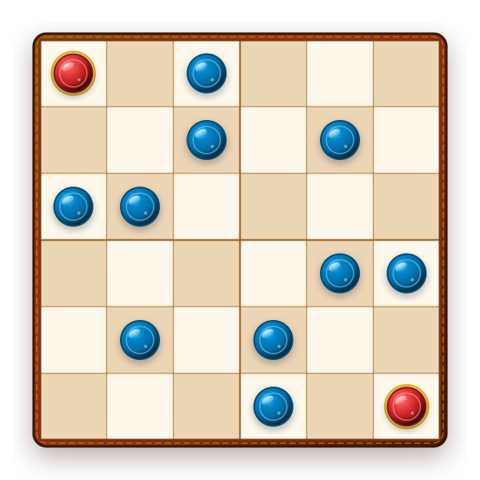

# Câu 053: Bàn cờ thú vị

- **Tập:** 1
- **Phần:** Phần 1 - Phương pháp loại trừ
- **Mức độ:** Khó
- **Nguồn:** Trang 67 (Tập 1)
- **Tóm tắt câu hỏi:** Trên một bàn cờ 6×6 đã có sẵn 2 quân cờ, hãy đặt thêm nhiều nhất có thể các quân cờ sao cho mỗi hàng, mỗi cột và mỗi đường chéo đều không chứa quá 2 quân cờ.

---

## Đề bài

Trên bàn cờ kích thước 6×6 người ta đặt 2 quân cờ (như trong hình vẽ), bây giờ bạn hãy đặt thêm những quân cờ khác lên bàn cờ, sao cho mỗi hàng, mỗi cột và mỗi đường chéo không được có nhiều hơn 2 quân cờ.

Hãy cho biết, trên bàn cờ này, nhiều nhất có thể đặt được bao nhiêu quân cờ?

---

<b>💡 Xem đáp án & Lời giải chi tiết</b>

### Đáp án & Lời giải:

Vì mỗi hàng chỉ được có tối đa 2 quân cờ, mà bàn cờ có 6 hàng, nên số quân cờ tối đa có thể đặt trên bàn cờ không thể vượt quá:
$$2 \times 6 = 12 \text{ quân cờ}$$

Trên thực tế, chúng ta hoàn toàn có thể sắp xếp thêm 10 quân cờ nữa để đạt đúng số lượng tối đa là **12 quân cờ** mà vẫn thỏa mãn điều kiện mỗi hàng, mỗi cột và mọi đường chéo đều không có quá 2 quân cờ.

Cách bố trí 12 quân cờ như hình vẽ dưới đây:

*(Tọa độ các quân cờ theo (hàng, cột) từ trên xuống dưới, từ trái sang phải: (1,1), (1,3); (2,3), (2,5); (3,1), (3,2); (4,5), (4,6); (5,2), (5,4); (6,4), (6,6))*

