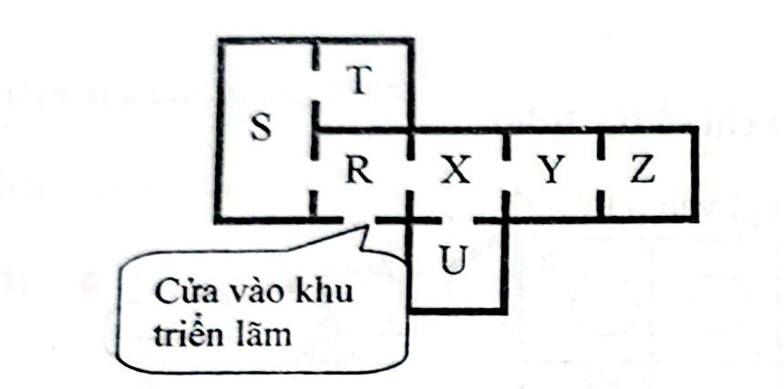

# Câu 057: Cửa của khu vực triển lãm

- **Tập:** 1
- **Phần:** Phần 1 - Phương pháp loại trừ
- **Mức độ:** Khó
- **Nguồn:** Trang 72 – 73 (Tập 1)
- **Tóm tắt câu hỏi:** Một khu triển lãm tranh gồm 7 gian phòng nối với nhau qua 7 cánh cửa với điểm ra/vào duy nhất tại phòng R. Hãy phân tích cấu trúc liên thông và lộ trình di chuyển của khách tham quan qua 4 câu hỏi tình huống.

---

## Đề bài

Một người đang bước vào một khu vực triển lãm tranh được chia là 7 gian trưng bày là R, S, T, U, X, Y, Z. Trước tiên ông ta đến được R, đồng thời chỉ có thể vào, ra khu vực triển lãm thông qua R. Nhưng một khi đã ở trong khu triển lãm thì có thể tự do đi lại giữa gian trưng bày này với gian trưng bày khác.

Có tất cả 7 cánh cửa thông giữa các gian trưng bày:
- Giữa R và S có một cánh cửa.
- Giữa R và T có một cánh cửa.
- Giữa R và X có một cánh cửa.
- Giữa S và T có một cánh cửa.
- Giữa X và U có một cánh cửa.
- Giữa X và Y có một cánh cửa.
- Giữa Y và Z có một cánh cửa.

**Câu hỏi 1:** Gian trưng bày nào dưới đây không thể là gian trưng bày thứ 3 mà người xem đặt chân vào tính từ vị trí cửa vào của khu triển lãm?
A. S  
B. T  
C. U  
D. Y  
E. Z  

**Câu hỏi 2:** Nếu có một cánh cửa giữa các gian trưng bày bị đóng, nhưng người xem vẫn có thể tham quan được tất cả 7 gian trưng bày, hãy cho biết cánh cửa bị đóng ấy nằm ở gian trưng bày nào?
A. S  
B. U  
C. X  
D. Y  
E. Z  

**Câu hỏi 3:** Giả sử người xem nào đó cho rằng không cần thiết phải đi đi lại lại trong khu triển lãm, mà chỉ muốn xem xong tất cả các gian trưng bày rồi ra về. Hãy cho biết trong số những gian trưng bày dưới đây, gian trưng bày nào mà người xem phải vào 2 lần?
A. U  
B. S  
C. T  
D. Z  
E. Y  

**Câu hỏi 4:** Có người đề nghị bố trí thêm một lối đi để người xem có thể bắt đầu từ R và kết thúc ở Z mà không lặp lại bất cứ gian trưng bày nào. Lối đi nào dưới đây thỏa mãn yêu cầu trên?
A. R-U  
B. S-Z  
C. T-U  
D. U-Y  
E. U-Z  

---

<b>💡 Xem đáp án & Lời giải chi tiết</b>

### Sơ đồ liên thông khu vực triển lãm:

Căn cứ vào mô tả các cánh cửa giữa 7 gian phòng, ta có sơ đồ mặt bằng:

- Cửa vào khu triển lãm dẫn trực tiếp vào phòng **R**.
- Cụm phòng bên trái $\{R, S, T\}$ tạo thành một chu trình tam giác khép kín với các cửa $R-S, S-T, T-R$.
- Từ phòng $R$ có lối sang nhánh phải $\{X, U, Y, Z\}$:
  - Cửa $R-X$ nối sang phòng $X$.
  - Từ $X$ có nhánh cụt rẽ xuống phòng $U$ (cửa $X-U$).
  - Từ $X$ nối tiếp sang phòng $Y$ (cửa $X-Y$).
  - Từ $Y$ nối tiếp đến phòng tận cùng $Z$ (cửa $Y-Z$).

---

### Đáp án & Lời giải:

- **Câu hỏi 1: Chọn đáp án E.**  
  Để đến được gian phòng $Z$, khách tham quan bắt buộc phải đi từ cửa vào $R$ qua $X$, rồi qua $Y$, rồi mới tới $Z$. Lộ trình ngắn nhất là:
  $$R \text{ (thứ 1)} \longrightarrow X \text{ (thứ 2)} \longrightarrow Y \text{ (thứ 3)} \longrightarrow Z \text{ (thứ 4)}$$
  Do đó, gian $Z$ sớm nhất phải là gian thứ 4, tuyệt đối không thể là gian thứ 3.

- **Câu hỏi 2: Chọn đáp án A.**  
  Toàn bộ sơ đồ là một cây (tree) nối với một chu trình duy nhất là tam giác $R-S-T$.
  - Nếu đóng bất kỳ cánh cửa nào trên nhánh cây ($R-X, X-U, X-Y, Y-Z$), khu triển lãm sẽ bị chia cắt và không thể đi hết 7 phòng.
  - Do đó chỉ có thể đóng 1 trong 3 cánh cửa thuộc tam giác chu trình: cửa giữa $S$ và $R$, giữa $S$ và $T$, hoặc giữa $T$ và $R$.
  - Cả hai cửa liên quan đến phòng $S$ ($S-R$ và $S-T$) đều thỏa mãn điều kiện này. Trong các phương án lựa chọn, chỉ có phòng **S** chứa cánh cửa thỏa mãn. Chọn A.

- **Câu hỏi 3: Chọn đáp án E.**  
  Phòng $Z$ là phòng tận cùng (nhánh cụt) chỉ có duy nhất một cánh cửa nối với $Y$. Muốn vào $Z$ thì phải đi qua $Y$, và sau khi xem xong $Z$ muốn ra ngoài để về cửa $R$ thì bắt buộc phải quay lại qua $Y$ một lần nữa. Do đó, người xem bắt buộc phải bước vào gian phòng **Y hai lần**. Chọn E.

- **Câu hỏi 4: Chọn đáp án C.**  
  Muốn đi một mạch từ $R$ qua tất cả các phòng đến $Z$ mà không đi lặp lại phòng nào (tạo thành đường đi Hamilton từ $R$ đến $Z$):
  - Nhánh $\{S, T\}$ nối với $R$. Nếu mở thêm một lối đi giữa **T và U** (hoặc $S$ và $U$), người tham quan có thể đi theo lộ trình:
    $$R \longrightarrow S \longrightarrow T \longrightarrow U \longrightarrow X \longrightarrow Y \longrightarrow Z$$
  - Lộ trình này đi qua đúng 7 phòng $\{R, S, T, U, X, Y, Z\}$ mỗi phòng đúng 1 lần duy nhất và kết thúc tại $Z$.
  - Do đó lối đi **T-U** hoàn toàn thỏa mãn yêu cầu. Chọn C.

