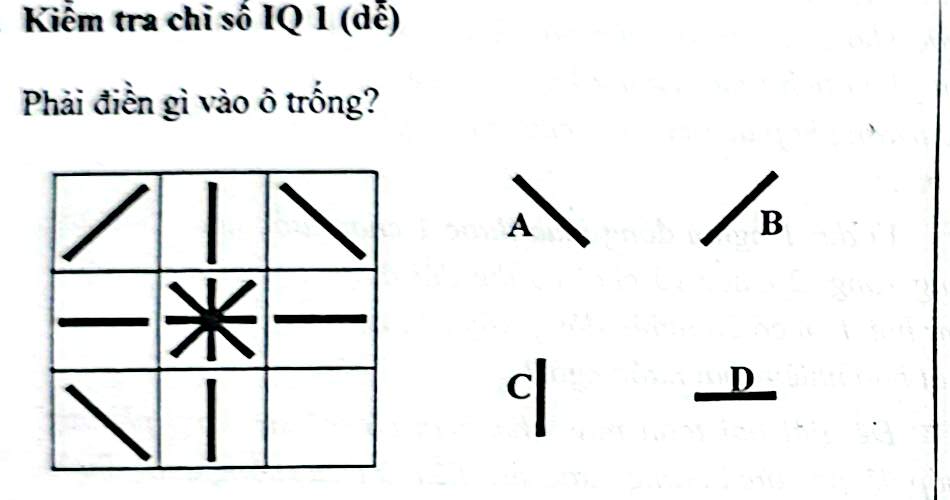

# Câu 058: Kiểm tra chỉ số IQ 1

- **Tập:** 1
- **Phần:** Phần 2 - Phương pháp đệ quy
- **Mức độ:** Dễ
- **Nguồn:** Trang 114 (Tập 1)
- **Tóm tắt câu hỏi:** Quan sát quy luật hướng và góc xoay của các đoạn thẳng trong bảng 3x3 để xác định hình thích hợp điền vào ô trống.

---

## Đề bài

Phải điền gì vào ô trống?

A. Đoạn thẳng nghiêng xuống sang phải (\\)  
B. Đoạn thẳng nghiêng lên sang phải (/)  
C. Đoạn thẳng đứng (|)  
D. Đoạn thẳng nằm ngang (-)  

---

<b>💡 Xem đáp án & Lời giải chi tiết</b>

### Đáp án:
**Chọn B.**

### Lời giải chi tiết:
- Quan sát quy luật phân bố và đối xứng của các đoạn thẳng trong bảng $3 \times 3$:
  - Hàng thứ nhất gồm 3 đoạn thẳng: nghiêng phải (/), thẳng đứng (|), nghiêng trái (\\).
  - Hàng thứ hai gồm: nằm ngang (-), hình hoa thị 8 hướng (*), nằm ngang (-).
  - Hàng thứ ba đã có: nghiêng trái (\\), thẳng đứng (|).
- Để hoàn thiện quy luật đối xứng cân đối với hàng thứ nhất, ô trống cuối cùng phải là đoạn thẳng nghiêng phải (/).
- Đối chiếu với các phương án, hình **B** là hình thích hợp nhất.

