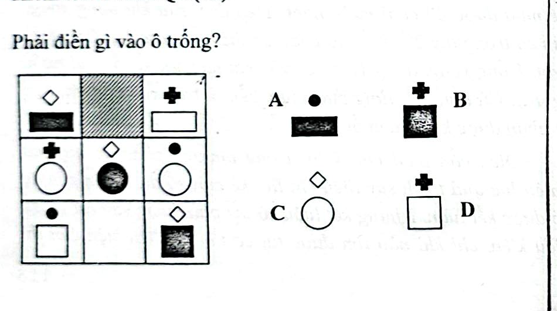

# Câu 059: Kiểm tra chỉ số IQ 2

- **Tập:** 1
- **Phần:** Phần 2 - Phương pháp đệ quy
- **Mức độ:** Dễ
- **Nguồn:** Trang 114 (Tập 1)
- **Tóm tắt câu hỏi:** Phân tích quy luật phối hợp giữa biểu tượng phía trên và hình khối phía dưới (về hình dáng và màu đen/trắng) trong bảng 3x3 để tìm hình ở ô bị gạch chéo.

---

## Đề bài

Phải điền gì vào ô trống (ô bị gạch bóng mờ ở hàng 1, cột 2)?

A. Hình gồm chấm tròn đen ở trên và hình chữ nhật đen ở dưới  
B. Hình gồm dấu cộng đen ở trên và hình vuông có bóng mờ ở dưới  
C. Hình gồm hình thoi trắng ở trên và hình tròn trắng ở dưới  
D. Hình gồm dấu cộng đen ở trên và hình vuông trắng ở dưới  

---

<b>💡 Xem đáp án & Lời giải chi tiết</b>

### Đáp án:
**Chọn D.**

### Lời giải chi tiết:
- Đối với mỗi hàng trong bảng:
  - Hình ảnh phía trên không giống nhau (gồm 3 ký hiệu khác nhau: hình thoi, dấu cộng, chấm tròn).
  - Hình ảnh phía dưới cùng một loại hình học (hàng 1 là hình chữ nhật, hàng 2 là hình tròn, hàng 3 là hình vuông).
  - Hơn nữa ở mỗi hàng: phần phía trên có hai hình màu đen và một hình màu trắng; phần phía dưới có hai hình màu trắng và một hình màu đen.
- Xét hàng thứ nhất:
  - Hình phía dưới là hình chữ nhật. Ô thứ nhất có chữ nhật đen, ô thứ ba có chữ nhật trắng, nên ô còn thiếu phải có chữ nhật trắng.
  - Hình phía trên đã có hình thoi trắng và dấu cộng đen.
- Kết hợp lại, hình cần tìm phải có dấu cộng đen ở trên và hình chữ nhật/hình vuông viền trắng ở dưới.
- Vì thế, đáp án đúng là **D**.

