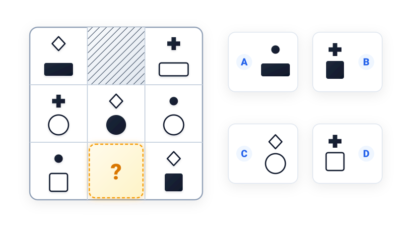
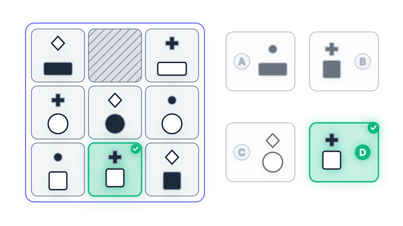

# Câu 059: Kiểm tra chỉ số IQ 2

- **Tập:** 1
- **Phần:** Phần 2 - Phương pháp đệ quy
- **Mức độ:** Dễ
- **Nguồn:** Trang 114 (Tập 1)
- **Tóm tắt câu hỏi:** Phân tích quy luật phối hợp giữa biểu tượng phía trên (hình thoi, dấu cộng, chấm tròn) và hình khối phía dưới (hình chữ nhật, hình tròn, hình vuông) trong bảng 3x3 để tìm hình thích hợp điền vào ô trống.

---

## Đề bài

Phải điền gì vào ô trống?

A. Hình gồm chấm tròn đen ở trên và hình chữ nhật đen ở dưới  
B. Hình gồm dấu cộng đen ở trên và hình vuông đen ở dưới  
C. Hình gồm hình thoi trắng ở trên và hình tròn trắng ở dưới  
D. Hình gồm dấu cộng đen ở trên và hình vuông trắng ở dưới  

---

<b>💡 Xem đáp án & Lời giải chi tiết</b>

### Đáp án:
**Chọn D.**

### Lời giải chi tiết:
- **Vị trí ô cần điền:** Ô trống trắng tinh trong bảng nằm ở **hàng 3, cột 2** (ô ở hàng 1, cột 2 là ô gạch sọc bóng mờ/che khuất).
- **Xét quy luật các hình khối phía dưới theo từng hàng:**
  - Hàng 1: đều là hình chữ nhật.
  - Hàng 2: đều là hình tròn (gồm 2 hình màu trắng và 1 hình màu đen).
  - Hàng 3: đều là hình vuông. Do ô trống cần điền nằm ở hàng 3 nên hình phía dưới bắt buộc phải là **hình vuông**.
  - Theo quy luật màu sắc (mỗi hàng có 2 hình trắng và 1 hình đen): Hàng 3 đã có 1 hình vuông trắng (ở ô 3,1) và 1 hình vuông đen (ở ô 3,3) $\to$ hình vuông ở ô trống (3,2) phải là **màu trắng**.
- **Xét quy luật các biểu tượng nhỏ phía trên:**
  - Mỗi hàng đều xuất hiện đầy đủ bộ 3 biểu tượng: {chấm tròn đen $\bullet$, dấu cộng đen $\boldsymbol{+}$, hình thoi trắng $\diamond$}.
  - Hàng 3 đã có chấm tròn đen (ở ô 3,1) và hình thoi trắng (ở ô 3,3) $\to$ biểu tượng còn thiếu ở ô trống (3,2) phải là **dấu cộng đen $\boldsymbol{+}$**.
- **Kết luận:**
  - Ô trống ở hàng 3, cột 2 cần điền hình gồm **dấu cộng đen ở trên** và **hình vuông trắng ở dưới**.
  - Đối chiếu với các phương án, hình **D** là đáp án chính xác tuyệt đối.

