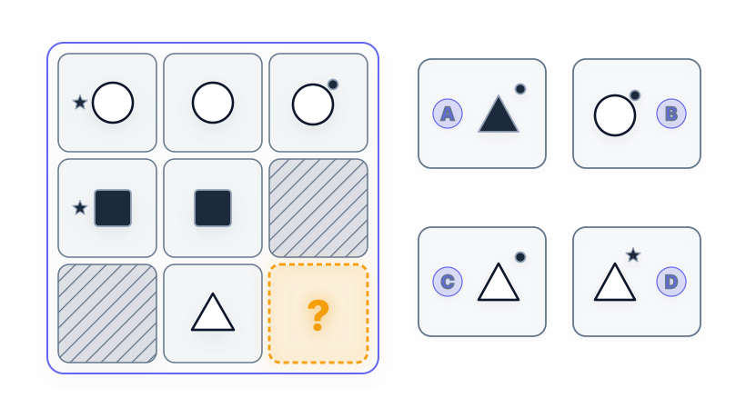
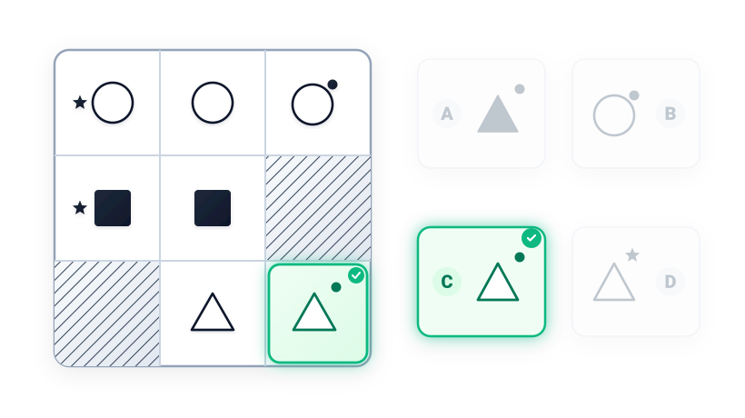

# Câu 060: Kiểm tra chỉ số IQ 3

- **Tập:** 1
- **Phần:** Phần 2 - Phương pháp đệ quy
- **Mức độ:** Dễ
- **Nguồn:** Trang 115 (Tập 1)
- **Tóm tắt câu hỏi:** Dựa vào quy luật xuất hiện của ký hiệu vệ tinh (ngôi sao nhỏ, chấm tròn) bên ngoài hình chính trong ma trận 3x3 để xác định hình cần điền vào ô trống (hàng 3, cột 3).

---

## Đề bài

Phải điền hình gì vào ô trống còn thiếu ở góc dưới cùng bên phải (hàng 3, cột 3)?

A. Hình tam giác đen có chấm tròn đen phía trên bên phải  
B. Hình tròn trắng có chấm tròn đen phía trên bên phải  
C. Hình tam giác trắng có chấm tròn đen phía trên bên phải  
D. Hình tam giác trắng có ngôi sao đen phía trên bên phải  

---

<b>💡 Xem đáp án & Lời giải chi tiết</b>

### Đáp án:
**Chọn C.**

### Lời giải chi tiết:
- **Quy luật hình chính theo từng hàng:**
  - Hàng thứ nhất: Hình chính là **hình tròn trắng**.
  - Hàng thứ hai: Hình chính là **hình vuông đen**.
  - Hàng thứ ba: Hình chính là **hình tam giác trắng**.
- **Quy luật ký hiệu vệ tinh đi kèm theo từng cột:**
  - Cột 1: Có một **ngôi sao đen** 5 cánh nằm ở bên trái hình chính. (Ô hàng 3, cột 1 là ô gạch sọc bóng mờ).
  - Cột 2: Chỉ có hình chính đơn độc, **không có ký hiệu nào** đi kèm.
  - Cột 3: Có một **chấm tròn đen** nằm ở phía trên bên phải hình chính. (Ô hàng 2, cột 3 là ô gạch sọc bóng mờ).
- **Xác định ô trống mục tiêu (hàng 3, cột 3):**
  - Giao điểm của hàng 3 và cột 3 phải kết hợp:
    1. Hình chính của hàng 3: **Hình tam giác trắng**.
    2. Ký hiệu vệ tinh của cột 3: **Chấm tròn đen ở phía trên bên phải**.
- Do đó, hình cần điền vào ô trống là **hình tam giác trắng có chấm tròn đen ở phía trên bên phải**.
- Đối chiếu với 4 phương án trắc nghiệm:
  - Phương án A sai vì dùng hình tam giác đen.
  - Phương án B sai vì dùng hình tròn trắng (hình của hàng 1).
  - Phương án D sai vì gắn ngôi sao đen (ký hiệu của cột 1).
  - Phương án **C** hoàn toàn chính xác.

