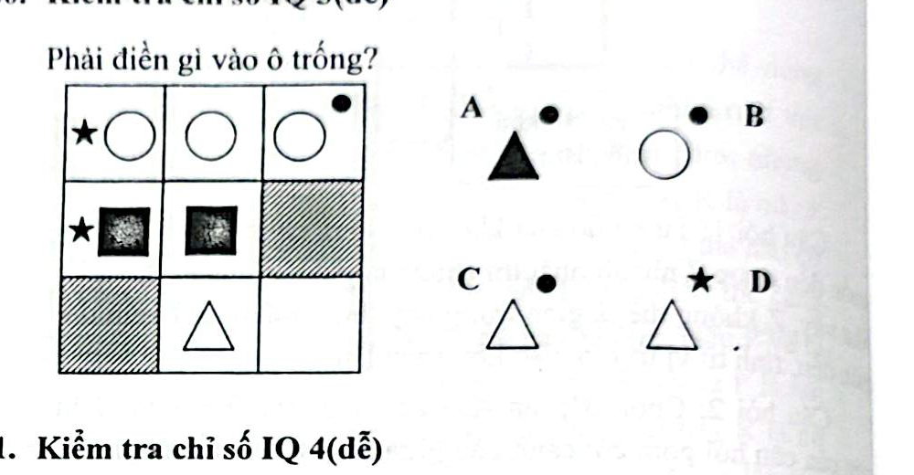

# Câu 060: Kiểm tra chỉ số IQ 3

- **Tập:** 1
- **Phần:** Phần 2 - Phương pháp đệ quy
- **Mức độ:** Dễ
- **Nguồn:** Trang 115 (Tập 1)
- **Tóm tắt câu hỏi:** Dựa vào quy luật xuất hiện của ký hiệu đi kèm (ngôi sao nhỏ, chấm tròn) bên ngoài hình chính trong bảng 3x3 để xác định hình cần điền vào ô trống.

---

## Đề bài

Phải điền gì vào ô trống (vị trí hàng 2 cột 3 hoặc hàng 3 cột 3)?

A. Hình tam giác đen có chấm tròn đen phía trên bên phải  
B. Hình tròn trắng có chấm tròn đen phía trên bên phải  
C. Hình tam giác trắng có chấm tròn đen phía trên bên phải  
D. Hình tam giác trắng có ngôi sao đen phía trên bên trái  

---

<b>💡 Xem đáp án & Lời giải chi tiết</b>

### Đáp án:
**Chọn C.**

### Lời giải chi tiết:
- Suy luận tương tự như các bài toán ma trận hình học trước:
  - Hàng thứ nhất: Hình chính là hình tròn trắng, lần lượt đi kèm ngôi sao bên trái, không có gì, và chấm tròn bên phải.
  - Hàng thứ hai: Hình chính là hình vuông đen.
  - Hàng thứ ba: Hình chính là hình tam giác trắng.
- Vị trí cột thứ 3 luôn đi kèm một chấm tròn đen ở phía trên bên phải của hình chính.
- Do đó ở hàng thứ ba cột thứ ba, hình cần tìm là hình tam giác trắng có chấm tròn đen ở phía trên bên phải.
- Vì thế, đáp án đúng là **C**.

