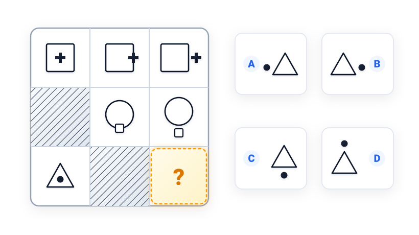
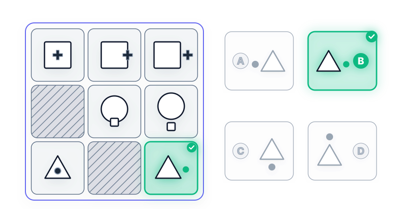

# Câu 061: Kiểm tra chỉ số IQ 4

- **Tập:** 1
- **Phần:** Phần 2 - Phương pháp đệ quy
- **Mức độ:** Dễ
- **Nguồn:** Trang 115 (Tập 1)
- **Tóm tắt câu hỏi:** Quan sát quy luật dịch chuyển vị trí của phần tử con (bên trong -> trên cạnh -> ra ngoài hình lớn) trong từng hàng của ma trận 3x3 để tìm hình ở vị trí cuối cùng (hàng 3, cột 3).

---

## Đề bài

Phải điền hình gì vào ô trống còn thiếu ở góc dưới cùng bên phải (hàng 3, cột 3)?

A. Hình tam giác có chấm tròn đen nằm bên ngoài cạnh trái  
B. Hình tam giác có chấm tròn đen nằm bên ngoài cạnh phải  
C. Hình tam giác có chấm tròn đen nằm bên ngoài cạnh đáy  
D. Hình tam giác có chấm tròn đen nằm bên ngoài đỉnh trên  

---

<b>💡 Xem đáp án & Lời giải chi tiết</b>

### Đáp án:
**Chọn B.**

### Lời giải chi tiết:
- **Quy luật hình lớn theo từng hàng:**
  - Hàng thứ nhất: Hình chính là **hình vuông lớn**.
  - Hàng thứ hai: Hình chính là **hình tròn lớn**.
  - Hàng thứ ba: Hình chính là **hình tam giác lớn**.
- **Quy luật dịch chuyển của phần tử con từ trái sang phải:**
  - **Hàng 1 (Dấu cộng đen):**
    - Cột 1: Nằm hoàn toàn bên trong hình vuông.
    - Cột 2: Di chuyển chạm đè lên cạnh phải của hình vuông.
    - Cột 3: Di chuyển ra hẳn bên ngoài cạnh phải.
  - **Hàng 2 (Hình vuông nhỏ trắng):**
    - Cột 1: (Ô gạch sọc bóng mờ) nằm bên trong hình tròn.
    - Cột 2: Di chuyển chạm đè lên cạnh đáy (phía dưới) của hình tròn.
    - Cột 3: Di chuyển ra hẳn bên ngoài cạnh đáy.
  - **Hàng 3 (Chấm tròn đen):**
    - Cột 1: Chấm tròn đen nằm hoàn toàn bên trong hình tam giác.
    - Cột 2: (Ô gạch sọc bóng mờ) chấm tròn dịch chuyển lên cạnh phải của tam giác.
    - Cột 3: Chấm tròn đen dịch chuyển ra hẳn bên ngoài cạnh phải của hình tam giác (tương tự như quy luật tịnh tiến sang phải của phần tử con tô đen ở hàng 1).
- Đối chiếu với 4 phương án trắc nghiệm:
  - Phương án A: Chấm tròn nằm ngoài cạnh trái $\to$ Sai.
  - Phương án C: Chấm tròn nằm ngoài cạnh đáy $\to$ Sai.
  - Phương án D: Chấm tròn nằm ngoài đỉnh trên $\to$ Sai.
  - Phương án **B** hoàn toàn chính xác.

