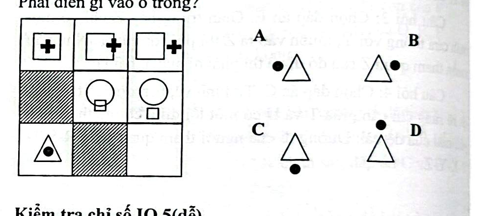

# Câu 061: Kiểm tra chỉ số IQ 4

- **Tập:** 1
- **Phần:** Phần 2 - Phương pháp đệ quy
- **Mức độ:** Dễ
- **Nguồn:** Trang 115 (Tập 1)
- **Tóm tắt câu hỏi:** Quan sát sự dịch chuyển vị trí của phần tử con (ở trong -> trên cạnh -> ra ngoài hình lớn) trong từng hàng của ma trận 3x3 để tìm hình ở vị trí cuối cùng.

---

## Đề bài

Phải điền gì vào ô trống (hàng 3 cột 3)?

A. Hình tam giác có chấm tròn đen nằm bên ngoài cạnh trái  
B. Hình tam giác có chấm tròn đen nằm bên ngoài cạnh phải  
C. Hình tam giác có chấm tròn đen nằm bên ngoài cạnh đáy  
D. Hình tam giác có chấm tròn đen nằm bên ngoài đỉnh trên  

---

<b>💡 Xem đáp án & Lời giải chi tiết</b>

### Đáp án:
**Chọn B.**

### Lời giải chi tiết:
- Quan sát quy luật biến đổi vị trí của phần tử con so với hình lớn theo từng hàng từ trái sang phải:
  - **Hàng 1 (Hình vuông và dấu cộng):** Dấu cộng nằm hoàn toàn bên trong hình $\rightarrow$ chạm đè lên cạnh phải $\rightarrow$ di chuyển hẳn ra ngoài cạnh phải.
  - **Hàng 2 (Hình tròn và hình vuông nhỏ):** Hình vuông nhỏ nằm chạm cạnh dưới $\rightarrow$ di chuyển hẳn ra ngoài cạnh dưới.
  - **Hàng 3 (Hình tam giác và chấm tròn đen):**
    - Cột 1: Chấm tròn đen nằm ở bên trong hình tam giác.
    - Cột 2: Chấm tròn dịch dần ra cạnh.
    - Cột 3: Chấm tròn đen dịch chuyển ra hẳn bên ngoài (phía bên phải, tương tự như quy luật dịch ngang ở hàng 1).
- Đối chiếu với các phương án lựa chọn, hình **B** thỏa mãn chính xác quy luật này.

