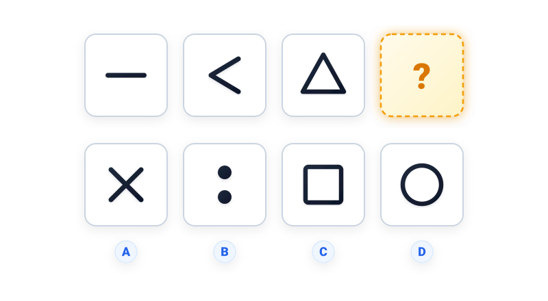

# Câu 062: Kiểm tra chỉ số IQ 5

- **Tập:** 1
- **Phần:** Phần 2 - Phương pháp đệ quy
- **Mức độ:** Dễ
- **Nguồn:** Trang 115 (Tập 1)
- **Tóm tắt câu hỏi:** Tìm quy luật tăng dần số lượng đoạn thẳng tạo thành các hình để xác định hình thích hợp thay thế cho dấu hỏi chấm.

---

## Đề bài

Phải điền hình gì vào ô có dấu hỏi chấm?

A. Hình dấu chữ X  
B. Hai chấm tròn dọc  
C. Hình vuông  
D. Hình tròn  

---

<b>💡 Xem đáp án & Lời giải chi tiết</b>

### Đáp án:
**Chọn C.**

### Lời giải chi tiết:
- **Quy luật đếm số đoạn thẳng cấu tạo nên hình theo dãy từ trái sang phải:**
  - Ô 1: **1 đoạn thẳng** nằm ngang ($1$).
  - Ô 2: **2 đoạn thẳng** nối nhau tạo thành một góc mở sang phải ($2$).
  - Ô 3: **3 đoạn thẳng** khép kín tạo thành hình tam giác ($3$).
- Theo quy luật đệ quy tăng dần cấp số cộng ($+1$), hình ở vị trí thứ tư phải là đa giác được cấu tạo từ **4 đoạn thẳng** khép kín.
- Đối chiếu với 4 phương án lựa chọn:
  - Phương án A: Dấu chữ X tạo từ 2 đoạn thẳng cắt nhau $\to$ Sai.
  - Phương án B: Hai chấm tròn không cấu tạo từ đoạn thẳng $\to$ Sai.
  - Phương án D: Hình tròn là đường cong tròn trơn khép kín $\to$ Sai.
  - Phương án **C (Hình vuông)** được tạo thành từ đúng 4 đoạn thẳng khép kín.
- Vì thế, đáp án đúng là **C**.

