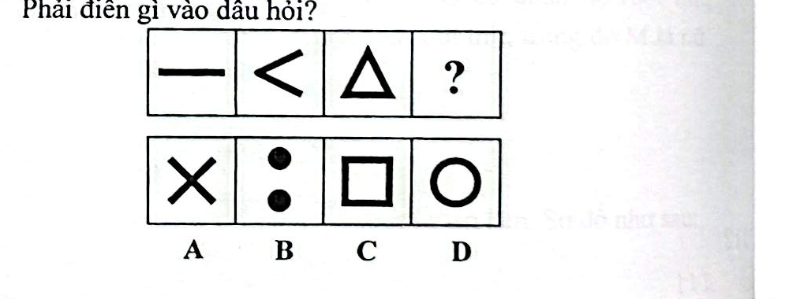

# Câu 062: Kiểm tra chỉ số IQ 5

- **Tập:** 1
- **Phần:** Phần 2 - Phương pháp đệ quy
- **Mức độ:** Dễ
- **Nguồn:** Trang 115 (Tập 1)
- **Tóm tắt câu hỏi:** Tìm quy luật tăng dần số lượng đoạn thẳng tạo thành các hình để xác định hình thích hợp thay thế cho dấu hỏi chấm.

---

## Đề bài

Phải điền gì vào dấu hỏi?

A. Hình dấu chữ X  
B. Hai chấm tròn  
C. Hình vuông  
D. Hình tròn  

---

<b>💡 Xem đáp án & Lời giải chi tiết</b>

### Đáp án:
**Chọn C.**

### Lời giải chi tiết:
- Đếm số lượng các đoạn thẳng tạo nên mỗi hình theo thứ tự từ trái sang phải:
  - Hình thứ nhất: 1 đoạn thẳng nằm ngang (1).
  - Hình thứ hai: Góc tạo bởi 2 đoạn thẳng (2).
  - Hình thứ ba: Tam giác khép kín tạo bởi 3 đoạn thẳng (3).
- Theo quy luật đệ quy tăng dần cấp số cộng ($+1$), hình thứ tư phải được cấu tạo từ 4 đoạn thẳng khép kín.
- Hình vuông (phương án C) được tạo thành từ đúng 4 đoạn thẳng.
- Vì thế, chọn đáp án **C**.

