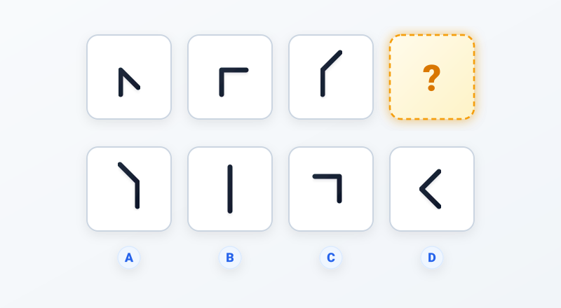
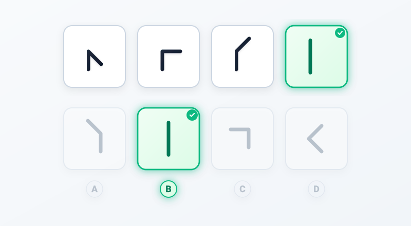

# Câu 063: Kiểm tra chỉ số IQ 6

- **Tập:** 1
- **Phần:** Phần 2 - Phương pháp đệ quy
- **Mức độ:** Dễ
- **Nguồn:** Trang 116 (Tập 1)
- **Tóm tắt câu hỏi:** Xác định quy luật quay mở rộng góc giữa hai đoạn thẳng (mỗi bước tăng đều 45 độ) để tìm hình tiếp theo ở ô có dấu hỏi chấm.

---

## Đề bài

Phải điền hình gì vào ô có dấu hỏi chấm?

A. Góc tù $135^\circ$ mở sang phía trên bên trái  
B. Một đoạn thẳng đứng thẳng hàng ($180^\circ$)  
C. Góc vuông $90^\circ$ mở sang phía dưới bên trái  
D. Góc nhọn $45^\circ$ mở sang bên phải  

---

<b>💡 Xem đáp án & Lời giải chi tiết</b>

### Đáp án:
**Chọn B.**

### Lời giải chi tiết:
- **Quan sát quy luật biến đổi góc giữa hai đoạn thẳng từ trái sang phải:**
  - Nét thẳng đứng từ dưới lên điểm gập được giữ cố định.
  - Nét thứ hai nối từ điểm gập quay ngược chiều kim đồng hồ đều đặn một góc $45^\circ$ qua mỗi bước:
    - **Ô 1:** Nét thứ hai chĩa xuống sang phải $\to$ Góc nhọn $45^\circ$.
    - **Ô 2:** Nét thứ hai quay lên phương nằm ngang sang phải $\to$ Góc vuông $90^\circ$ ($45^\circ + 45^\circ$).
    - **Ô 3:** Nét thứ hai quay tiếp lên phía trên sang phải $\to$ Góc tù $135^\circ$ ($90^\circ + 45^\circ$).
- **Xác định hình tiếp theo tại dấu hỏi chấm (Ô 4):**
  - Góc giữa hai đoạn thẳng tiếp tục tăng thêm $45^\circ$:
    $$135^\circ + 45^\circ = 180^\circ$$
  - Khi góc đạt $180^\circ$, nét thứ hai quay thẳng đứng lên trên, duỗi thẳng hàng cùng phương với nét thứ nhất, tạo thành **một đoạn thẳng đứng duy nhất**.
- Đối chiếu với 4 phương án trắc nghiệm:
  - Phương án A: Góc tù $135^\circ$ mở sang trái $\to$ Sai.
  - Phương án C: Góc vuông $90^\circ$ mở xuống dưới $\to$ Sai.
  - Phương án D: Góc nhọn $45^\circ$ $\to$ Sai.
  - Phương án **B (Một đoạn thẳng đứng duy nhất $180^\circ$)** hoàn toàn chính xác.

