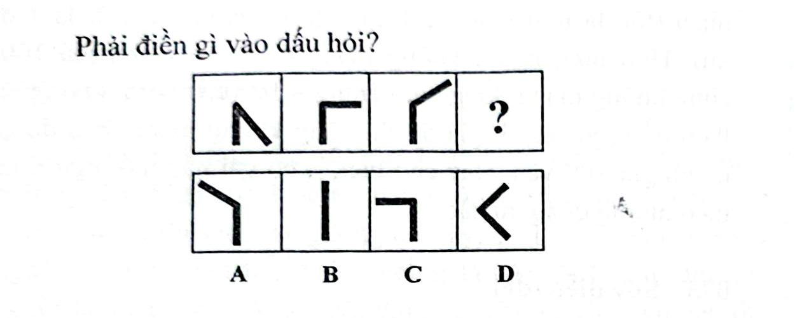

# Câu 063: Kiểm tra chỉ số IQ 6

- **Tập:** 1
- **Phần:** Phần 2 - Phương pháp đệ quy
- **Mức độ:** Dễ
- **Nguồn:** Trang 116 (Tập 1)
- **Tóm tắt câu hỏi:** Xác định quy luật tăng độ lớn của góc giữa hai đoạn thẳng theo từng bước để tìm hình tiếp theo ở dấu hỏi chấm.

---

## Đề bài

Phải điền gì vào dấu hỏi?

A. Góc tù $135^\circ$ mở sang trái  
B. Một đoạn thẳng đứng thẳng hàng ($180^\circ$)  
C. Góc vuông $90^\circ$ mở sang trái  
D. Góc nhọn $45^\circ$ mở sang trái  

---

<b>💡 Xem đáp án & Lời giải chi tiết</b>

### Đáp án:
**Chọn B.**

### Lời giải chi tiết:
- Quan sát góc giữa hai đoạn thẳng trong chuỗi hình:
  - Hình 1: Góc nhọn $45^\circ$.
  - Hình 2: Góc vuông $90^\circ$ ($45^\circ + 45^\circ$).
  - Hình 3: Góc tù $135^\circ$ ($90^\circ + 45^\circ$).
- Quy luật: Góc giữa hai đoạn thẳng tăng thêm $45^\circ$ qua mỗi bước.
- Do đó, hình tiếp theo tại dấu hỏi phải có góc:
  $$135^\circ + 45^\circ = 180^\circ$$
- Góc $180^\circ$ tức là hai đoạn thẳng duỗi thẳng hàng tạo thành một đoạn thẳng đứng duy nhất.
- Vì thế, lựa chọn đáp án **B**.

