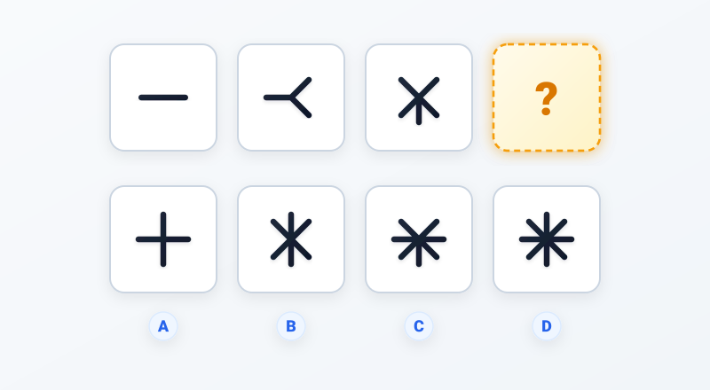
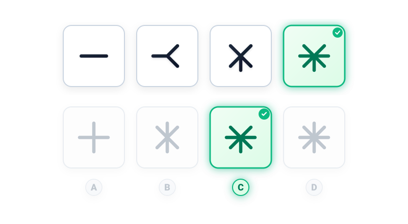

# Câu 064: Kiểm tra chỉ số IQ 7

- **Tập:** 1
- **Phần:** Phần 2 - Phương pháp đệ quy
- **Mức độ:** Dễ
- **Nguồn:** Trang 116 (Tập 1)
- **Tóm tắt câu hỏi:** Đếm số lượng các nhánh tia tăng dần theo dãy số lẻ liên tiếp (1, 3, 5, ...) để tìm hình thích hợp điền vào ô có dấu hỏi chấm.

---

## Đề bài

Phải điền hình gì vào ô có dấu hỏi chấm?

A. Hình dấu cộng ($+$) gồm 4 tia  
B. Hình hoa thị 6 tia  
C. Hình hoa thị 7 tia  
D. Hình hoa thị 8 tia  

---

<b>💡 Xem đáp án & Lời giải chi tiết</b>

### Đáp án:
**Chọn C.**

### Lời giải chi tiết:
- **Đếm số lượng các nhánh tia xuất phát từ tâm theo chuỗi hình từ trái sang phải:**
  - Ô 1: **1 tia** (đoạn thẳng ngang đơn độc).
  - Ô 2: **3 tia** (hình chữ Y nằm ngang gồm 1 nhánh ngang sang trái và 2 nhánh chéo sang phải).
  - Ô 3: **5 tia** (dấu chữ X gồm 4 nhánh chéo kết hợp thêm 1 nhánh đứng chĩa xuống dưới).
- **Quy luật dãy số:** Số lượng tia tăng dần đều theo dãy các số lẻ liên tiếp:
  $$1 \to 3 \to 5 \to 7$$
- Do đó, hình tiếp theo tại ô có dấu hỏi chấm (Ô 4) phải có đúng **7 tia**.
- **Đối chiếu với 4 phương án trắc nghiệm:**
  - Phương án A: Dấu cộng ($+$) gồm đúng **4 tia** $\to$ Sai.
  - Phương án B: Gồm dấu X và trục thẳng đứng tạo thành **6 tia** $\to$ Sai.
  - Phương án D: Hoa thị 8 cánh hoàn chỉnh gồm **8 tia** $\to$ Sai.
  - Phương án **C** gồm dấu X (4 tia) + trục ngang xuyên suốt (2 tia) + 1 nhánh đứng chĩa xuống dưới (1 tia) = **đúng 7 tia**.
- Vì thế, đáp án đúng là **C**.

