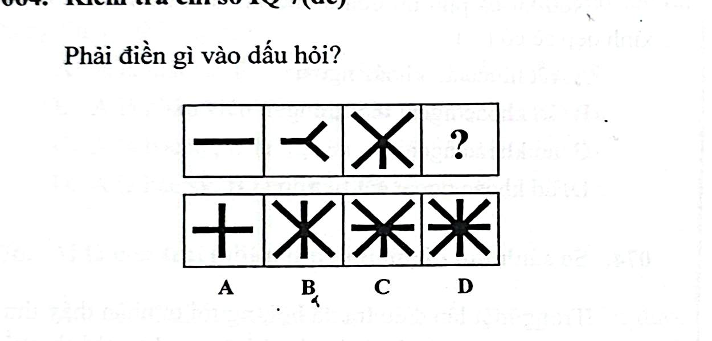

# Câu 064: Kiểm tra chỉ số IQ 7

- **Tập:** 1
- **Phần:** Phần 2 - Phương pháp đệ quy
- **Mức độ:** Dễ
- **Nguồn:** Trang 116 (Tập 1)
- **Tóm tắt câu hỏi:** Đếm số lượng các đoạn thẳng hoặc tia tăng dần theo cấp số cộng lẻ ($1, 3, 5, \dots$) để tìm hình thích hợp điền vào dấu hỏi chấm.

---

## Đề bài

Phải điền gì vào dấu hỏi?

A. Hình dấu cộng ($+$)  
B. Hình 6 tia  
C. Hình 7 tia  
D. Hình 8 tia  

---

<b>💡 Xem đáp án & Lời giải chi tiết</b>

### Đáp án:
**Chọn C.**

### Lời giải chi tiết:
- Đếm số đoạn thẳng (hoặc nhánh tia) tạo thành hình từ trái sang phải:
  - Hình thứ nhất: 1 đoạn thẳng.
  - Hình thứ hai: 3 đoạn thẳng nối nhau.
  - Hình thứ ba: 5 đoạn thẳng giao nhau tại tâm.
- Quy luật: Số đoạn thẳng tăng dần theo dãy số lẻ liên tiếp: $1, 3, 5, 7$.
- Do đó, hình tiếp theo tại vị trí dấu hỏi chấm phải có đúng **7 đoạn thẳng** (hoặc 7 tia).
- Hình **C** có đúng 7 tia.
- Vì thế, lựa chọn đáp án **C**.

