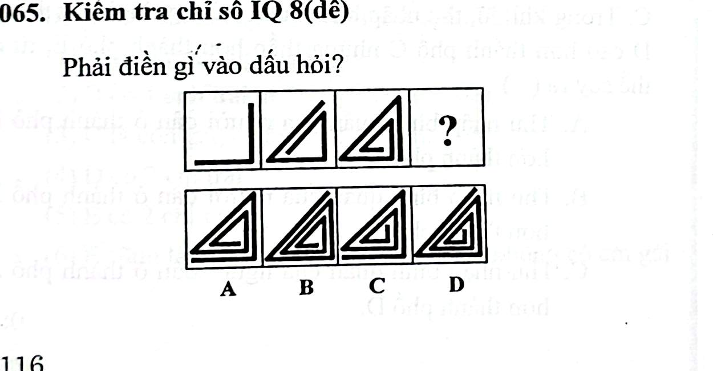

# Câu 065: Kiểm tra chỉ số IQ 8

- **Tập:** 1
- **Phần:** Phần 2 - Phương pháp đệ quy
- **Mức độ:** Dễ
- **Nguồn:** Trang 116 (Tập 1)
- **Tóm tắt câu hỏi:** Nhận diện quy luật cuộn xoắn ốc hình tam giác mở rộng đều đặn ở hai đầu của đường gấp khúc để chọn hình tiếp theo.

---

## Đề bài

Phải điền gì vào dấu hỏi?

A. Hình xoắn ốc tam giác A  
B. Hình xoắn ốc tam giác B  
C. Hình xoắn ốc tam giác C  
D. Hình xoắn ốc tam giác D  

---

<b>💡 Xem đáp án & Lời giải chi tiết</b>

### Đáp án:
**Chọn C.**

### Lời giải chi tiết:
- Quan sát quy luật phát triển của đường gấp khúc qua từng bước:
  - Đường gấp khúc hình tam giác liên tục được kéo dài mở rộng thêm về cả 2 đầu của nó.
  - Mỗi bước số lượng vòng xoắn cuộn lồng nhau tăng lên theo quy luật đối xứng định sẵn.
- Theo quy luật mở rộng đều ở hai đầu, hình tiếp theo tương ứng chính xác với hình **C**.
- Vì thế, lựa chọn đáp án **C**.

