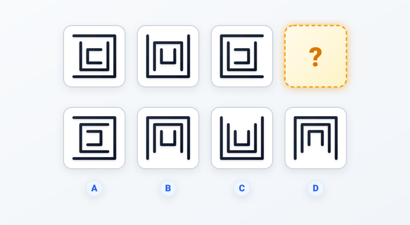
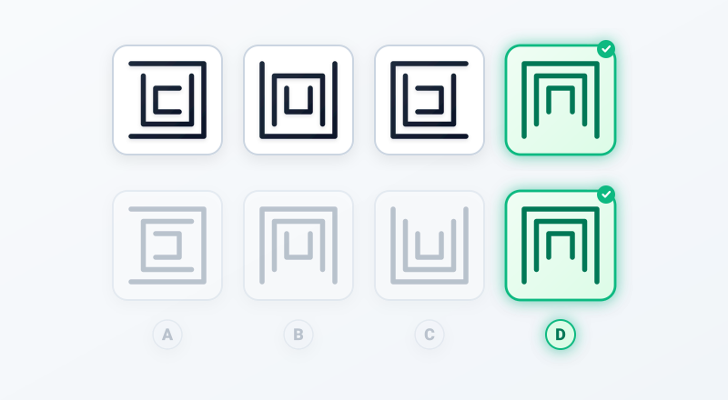

# Câu 066: Kiểm tra chỉ số IQ 9

- **Tập:** 1
- **Phần:** Phần 2 - Phương pháp đệ quy
- **Mức độ:** Dễ
- **Nguồn:** Trang 117 (Tập 1)
- **Tóm tắt câu hỏi:** Theo dõi quy luật xoay cạnh đáy của 3 lớp chữ U lồng nhau từ ngoài vào trong để tìm hình thích hợp.

---

## Đề bài

Phải điền gì vào dấu hỏi?

A. Lớp ngoài và trong mở sang trái, lớp giữa mở sang phải  
B. Lớp ngoài và giữa mở xuống dưới, lớp trong mở lên trên  
C. Cả 3 lớp đều mở lên trên  
D. Cả 3 lớp đều mở xuống dưới  

---

<b>💡 Xem đáp án & Lời giải chi tiết</b>

### Đáp án:
**Chọn D.**

### Lời giải chi tiết:
- **Quy luật biến đổi vị trí cạnh đáy của 3 lớp chữ U từ ngoài vào trong (từ trái sang phải):**
  - **Lớp ngoài cùng:** Cạnh đáy xoay thuận chiều kim đồng hồ $90^\circ$ qua từng bước:
    - **Ô 1:** Cạnh đáy ở **Phải** (miệng mở sang trái).
    - **Ô 2:** Cạnh đáy ở **Dưới** (miệng mở lên trên).
    - **Ô 3:** Cạnh đáy ở **Trái** (miệng mở sang phải).
    - **Ô 4 (Dấu hỏi chấm):** Cạnh đáy phải ở **Trên** (miệng mở xuống dưới).
  - **Lớp ở giữa:** Cạnh đáy lật luân phiên xen kẽ giữa Dưới và Trên:
    - **Ô 1:** Cạnh đáy ở **Dưới** (miệng mở lên trên).
    - **Ô 2:** Cạnh đáy ở **Trên** (miệng mở xuống dưới).
    - **Ô 3:** Cạnh đáy ở **Dưới** (miệng mở lên trên).
    - **Ô 4 (Dấu hỏi chấm):** Cạnh đáy phải ở **Trên** (miệng mở xuống dưới).
  - **Lớp trong cùng:** Cạnh đáy xoay ngược chiều kim đồng hồ $90^\circ$ qua từng bước:
    - **Ô 1:** Cạnh đáy ở **Trái** (miệng mở sang phải).
    - **Ô 2:** Cạnh đáy ở **Dưới** (miệng mở lên trên).
    - **Ô 3:** Cạnh đáy ở **Phải** (miệng mở sang trái).
    - **Ô 4 (Dấu hỏi chấm):** Cạnh đáy phải ở **Trên** (miệng mở xuống dưới).
- **Kết luận hình tại dấu hỏi chấm (Ô 4):**
  - Cả 3 lớp chữ U lồng nhau đều có cạnh đáy nằm ở **Trên** (tức là cả 3 chữ U đều **cùng mở xuống Dưới**).
- **Đối chiếu với các phương án:**
  - Phương án A: Cạnh đáy lần lượt ở phải, trái, phải $\rightarrow$ Loại.
  - Phương án B: Cạnh đáy lần lượt ở trên, trên, dưới (lớp trong mở lên trên) $\rightarrow$ Loại.
  - Phương án C: Cả 3 lớp đều có cạnh đáy ở dưới (cùng mở lên trên) $\rightarrow$ Loại.
  - Phương án **D**: Cả 3 lớp đều có cạnh đáy ở trên (cùng mở xuống dưới) $\rightarrow$ **Hoàn toàn thỏa mãn chính xác trọn vẹn quy luật!**

