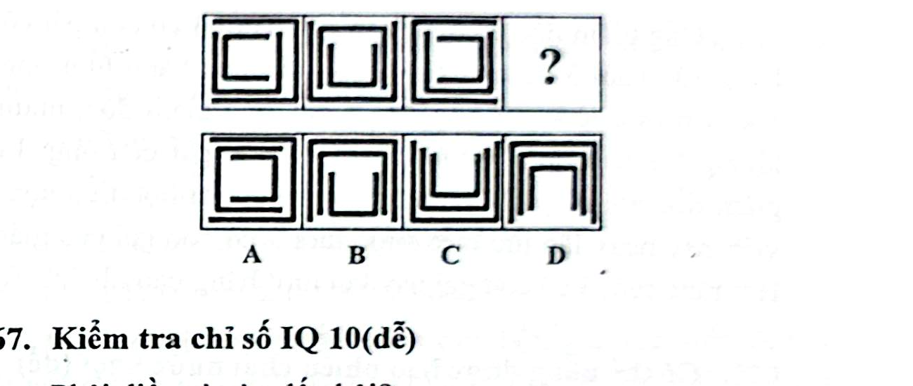

# Câu 066: Kiểm tra chỉ số IQ 9

- **Tập:** 1
- **Phần:** Phần 2 - Phương pháp đệ quy
- **Mức độ:** Dễ
- **Nguồn:** Trang 117 (Tập 1)
- **Tóm tắt câu hỏi:** Theo dõi quy luật xoay hướng khe hở của 3 lớp đường gấp khúc hình chữ nhật lồng nhau để tìm hình thích hợp.

---

## Đề bài

Phải điền gì vào dấu hỏi?

A. Hình A (khe hở mở sang phải)  
B. Hình B (khe hở mở lên trên)  
C. Hình C (khe hở lồng nhau hỗn hợp)  
D. Hình D (khe hở mở xuống dưới)  

---

<b>💡 Xem đáp án & Lời giải chi tiết</b>

### Đáp án:
**Chọn D.**

### Lời giải chi tiết:
- Quan sát hướng của khe hở (lỗ hổng) trên các lớp đường gấp khúc:
  - **Lớp ngoài cùng và lớp trong cùng:** Hướng của lỗ hổng xoay tuần tự theo chu kỳ 4 hướng: sang phải $\rightarrow$ lên trên $\rightarrow$ sang trái $\rightarrow$ và tiếp theo phải là **hướng xuống dưới**.
  - **Lớp giữa:** Lỗ hổng luân phiên xen kẽ giữa hai hướng: hướng lên trên và hướng xuống dưới.
- Xét hình thứ tư (vị trí dấu hỏi chấm): Lớp trong cùng và lớp ngoài cùng phải có khe hở cùng hướng xuống dưới.
- Đối chiếu với các phương án, hình **D** là hình duy nhất thỏa mãn trọn vẹn quy luật này.

