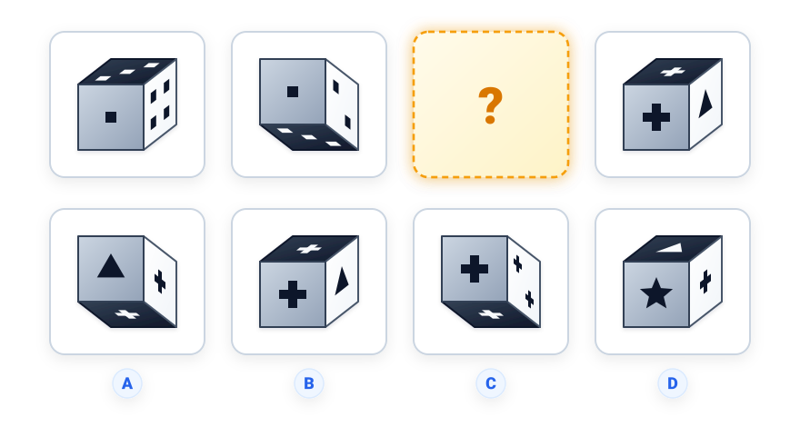
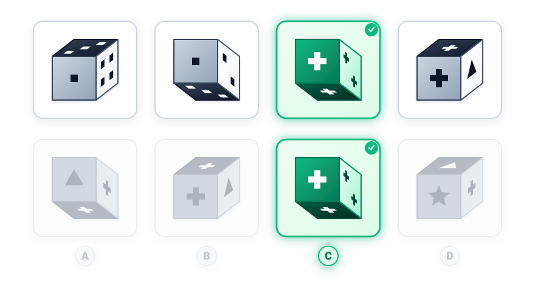

# Câu 067: Kiểm tra chỉ số IQ 10

- **Tập:** 1
- **Phần:** Phần 2 - Phương pháp đệ quy
- **Mức độ:** Dễ
- **Nguồn:** Trang 117 (Tập 1)
- **Tóm tắt câu hỏi:** Phân tích góc nhìn phối cảnh 3D (nhìn từ trên xuống hay từ dưới lên) và hoa văn trên các mặt của khối lập phương để tìm hình tại dấu hỏi.

---

## Đề bài

Phải điền gì vào dấu hỏi?

A. Khối lập phương với góc nhìn từ dưới lên, mặt trước là hình tam giác, mặt đáy và mặt bên là dấu cộng  
B. Khối lập phương với góc nhìn từ trên xuống, mặt trước là dấu cộng, mặt bên là tam giác  
C. Khối lập phương với góc nhìn từ dưới lên, mặt trước là dấu cộng lớn, mặt đáy là 1 dấu cộng và mặt bên là 2 dấu cộng  
D. Khối lập phương với góc nhìn từ trên xuống, mặt trước là ngôi sao  

---

<b>💡 Xem đáp án & Lời giải chi tiết</b>

### Đáp án:
**Chọn C.**

### Lời giải chi tiết:
- Dãy 4 khối lập phương được chia thành 2 cặp biến đổi tương ứng (cặp 1 gồm Khối 1 & Khối 2; cặp 2 gồm Khối 3 và Khối 4):
  1. **Quy luật góc nhìn phối cảnh (Perspective rule):**
     - Ở mỗi cặp, một khối có góc nhìn từ trên xuống (**Top View**, thấy mặt đỉnh và mặt bên phải), khối còn lại có góc nhìn từ dưới lên (**Bottom View**, thấy mặt đáy và mặt bên phải).
     - Cặp 1: Khối 1 là góc nhìn từ trên xuống $\to$ Khối 2 là góc nhìn từ dưới lên.
     - Cặp 2: Khối 4 là góc nhìn từ trên xuống $\to$ Khối 3 (ở vị trí dấu hỏi `$?$`) bắt buộc phải là **góc nhìn từ dưới lên (Bottom View)**.
  2. **Quy luật bảo toàn mặt trước (Front face constancy):**
     - Ở Cặp 1: Cả Khối 1 và Khối 2 đều giữ nguyên mặt trước là **1 chấm vuông**.
     - Ở Cặp 2: Khối 4 có mặt trước là **1 dấu cộng ($+$) lớn** $\implies$ Khối 3 ở vị trí dấu hỏi cũng phải giữ nguyên mặt trước là **1 dấu cộng ($+$) lớn**.
- Đối chiếu với 4 phương án lựa chọn:
  - **Phương án B và D:** Đều là góc nhìn từ trên xuống (Top View) $\to$ **Loại**.
  - **Phương án A:** Góc nhìn từ dưới lên, nhưng mặt trước lại là hình tam giác ($\blacktriangle$) $\to$ **Loại**.
  - **Phương án C:** Đúng góc nhìn từ dưới lên (Bottom View), mặt trước có dấu cộng lớn ($+$), mặt đáy có 1 dấu cộng và mặt bên có 2 dấu cộng $\to$ **Hoàn toàn thỏa mãn 100% quy luật**.
- Kết luận: Lựa chọn đáp án **C**.

