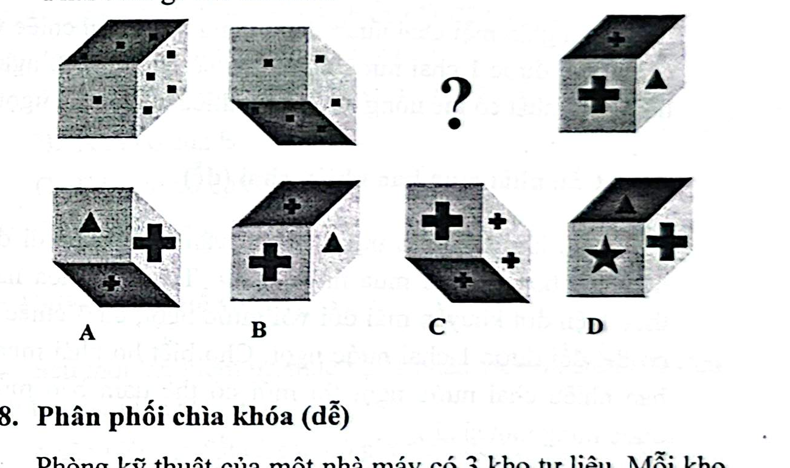

# Câu 067: Kiểm tra chỉ số IQ 10

- **Tập:** 1
- **Phần:** Phần 2 - Phương pháp đệ quy
- **Mức độ:** Dễ
- **Nguồn:** Trang 117 (Tập 1)
- **Tóm tắt câu hỏi:** Phân tích góc nhìn phối cảnh 3D (nhìn từ trên xuống hay từ dưới lên) và hoa văn trên các mặt của khối lập phương để tìm hình tại dấu hỏi.

---

## Đề bài

Phải điền gì vào dấu hỏi?

A. Khối lập phương với góc nhìn từ dưới lên, mặt bên là dấu cộng  
B. Khối lập phương với góc nhìn từ trên xuống, mặt trước là dấu cộng, mặt bên là tam giác  
C. Khối lập phương với góc nhìn chếch xuống dưới, mặt trước là dấu cộng lớn  
D. Khối lập phương với góc nhìn từ trên xuống, mặt trước là ngôi sao  

---

<b>💡 Xem đáp án & Lời giải chi tiết</b>

### Đáp án:
**Chọn C.**

### Lời giải chi tiết:
- Quan sát quy luật phối cảnh và các mặt biểu tượng của chuỗi khối lập phương:
  - Góc nhìn phối cảnh xen kẽ nhịp nhàng giữa góc nhìn từ trên xuống (thấy mặt đỉnh) và góc nhìn chếch từ dưới lên (thấy mặt đáy).
  - Khối thứ tư sau dấu hỏi là khối lập phương có mặt trước là dấu cộng lớn ($+$).
  - Theo quy luật đối xứng và liên hệ biến đổi hình thái, khối ở vị trí dấu hỏi chấm phải có mặt trước mang dấu cộng, đồng thời góc nhìn phối cảnh tương ứng là góc nhìn chếch xuống dưới.
- Đối chiếu các đặc điểm góc nhìn và hoa văn giữa các phương án, hình **C** là hình phù hợp nhất.
- Vì thế, lựa chọn đáp án **C**.

