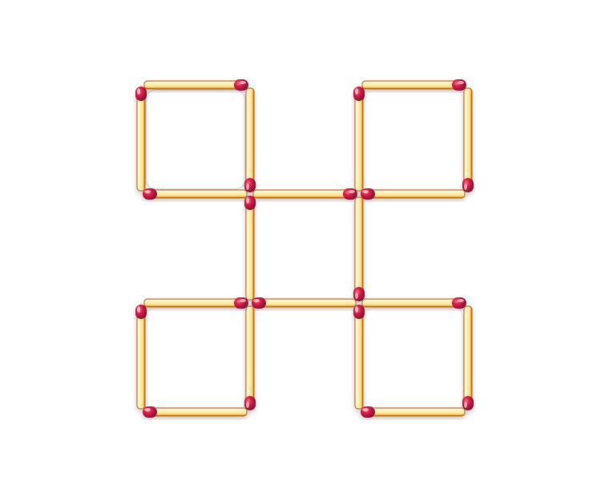
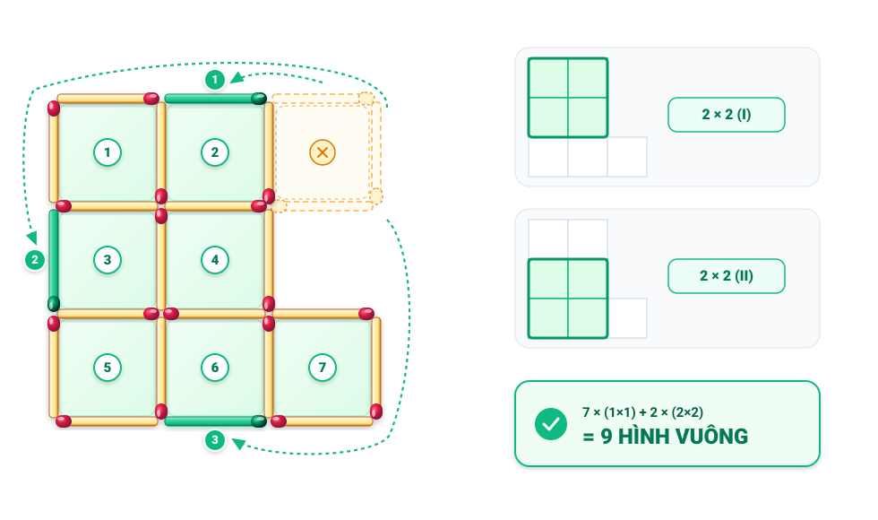

# Câu 122: Di chuyển que diêm

- **Tập:** 1
- **Phần:** Phần 3: Phương pháp suy diễn ngược
- **Mức độ:** Dễ
- **Nguồn:** Trang 170 (Tập 1)
- **Tóm tắt câu hỏi:** Dùng 20 que diêm xếp thành 5 hình vuông. Hãy di chuyển 3 que diêm để tạo ra 9 hình vuông.

---

## Đề bài

Dùng 20 que diêm xếp thành 5 hình vuông (xem hình vẽ). Bạn hãy di chuyển 3 que diêm trong số 20 que diêm này và xếp vào vị trí hợp lý để tạo ra 9 hình vuông.

---

<b>💡 Xem đáp án & Lời giải chi tiết</b>

### Đáp án & Lời giải:

1. **Cách di chuyển 3 que diêm:**
   - Lấy 3 que diêm (gồm cạnh trên, cạnh phải và cạnh dưới) từ hình vuông ở góc trên bên phải (cạnh trái của ô này được giữ nguyên).
   - Đặt 3 que diêm này vào 3 vị trí khuyết (được đánh dấu nổi bật màu xanh Emerald kèm số ①, ②, ③):
     - **Que ①:** Đặt vào cạnh trên của ô giữa hàng 1 (liên kết hai ô trên cùng).
     - **Que ②:** Đặt vào cạnh ngoài cùng bên trái của hàng 2 (liên kết hai ô bên trái).
     - **Que ③:** Đặt vào cạnh dưới cùng của ô giữa hàng 3 (liên kết hai ô dưới cùng).

2. **Đếm số hình vuông tạo thành:**
   - **7 hình vuông nhỏ kích thước $1 \times 1$:** Được đánh số thứ tự từ **1** đến **7** trên sơ đồ.
   - **2 hình vuông lớn kích thước $2 \times 2$:**
     - Hình vuông lớn $2 \times 2$ thứ nhất (phía trên): Tạo bởi 4 ô nhỏ **1, 2, 3, 4**.
     - Hình vuông lớn $2 \times 2$ thứ hai (phía dưới): Tạo bởi 4 ô nhỏ **3, 4, 5, 6**.

Tổng cộng: $7 \times (1 \times 1) + 2 \times (2 \times 2) =$ **9 hình vuông**.

