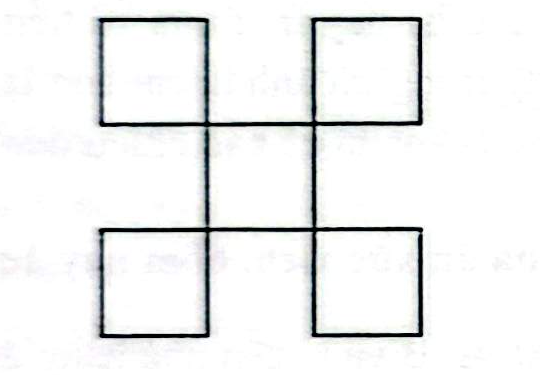
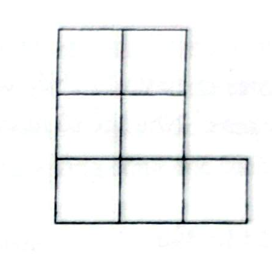

# Câu 122: Di chuyển que diêm

- **Tập:** 1
- **Phần:** Phần 3: Phương pháp suy diễn ngược
- **Mức độ:** Dễ
- **Nguồn:** Trang 170 (Tập 1)
- **Tóm tắt câu hỏi:** Dùng 20 que diêm xếp thành 5 hình vuông. Hãy di chuyển 3 que diêm để tạo ra 9 hình vuông.

---

## Đề bài

Dùng 20 que diêm xếp thành 5 hình vuông (xem hình vẽ). Bạn hãy di chuyển 3 que diêm trong số 20 que diêm này và xếp vào vị trí hợp lý để tạo ra 9 hình vuông.

---

<b>💡 Xem đáp án & Lời giải chi tiết</b>

### Đáp án & Lời giải:

Lấy 3 que diêm từ hình vuông ở phía trên góc phải, sau đó xếp vào 3 chỗ trống để hoàn thiện thêm các hình vuông (xem hình vẽ).

Trong hình vẽ mới tạo thành:
- Có 7 hình vuông nhỏ kích thước $1 \times 1$.
- Có 2 hình vuông lớn kích thước $2 \times 2$.

Tổng cộng có **9 hình vuông**.

