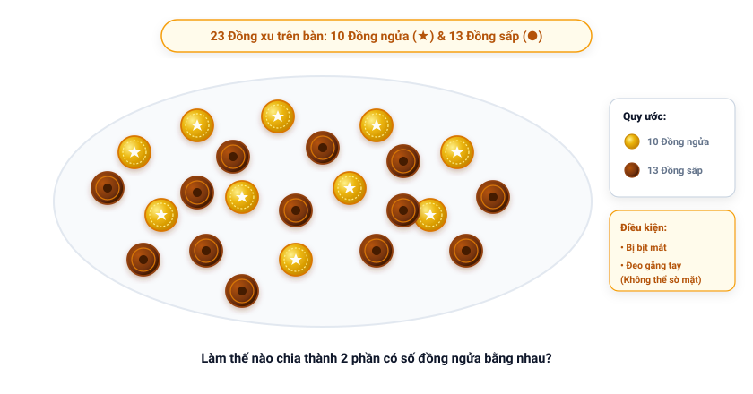
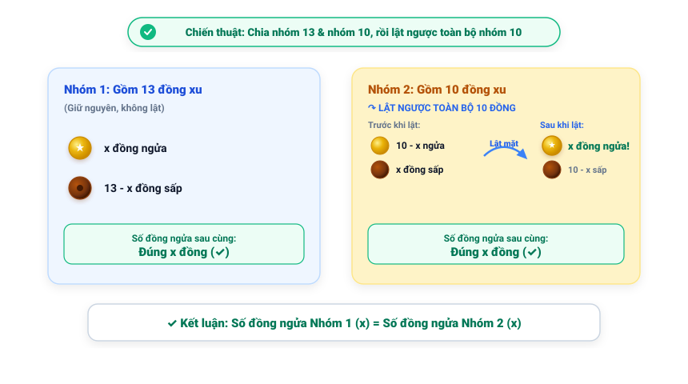

# Câu 124: Khéo léo lật đồng xu

- **Tập:** 1
- **Phần:** Phần 3: Phương pháp suy diễn ngược
- **Mức độ:** Dễ
- **Nguồn:** Trang 170 – 171 (Tập 1)
- **Tóm tắt câu hỏi:** Có 23 đồng xu trên bàn gồm 10 đồng ngửa. Bị bịt mắt và đeo găng tay, làm thế nào để chia làm 2 phần sao cho số đồng xu ngửa ở hai phần bằng nhau?

---

## Đề bài

Trên bàn có 23 đồng xu, trong đó có 10 đồng ngửa (và 13 đồng sấp). Người ta bịt mắt bạn, hơn nữa dùng tay để sờ, bạn không thể phân biệt được mặt sấp, mặt ngửa của đồng xu. Bạn hãy chia 23 đồng xu ấy thành 2 phần, sao cho hai phần ấy có số lượng đồng xu ngửa bằng nhau.

---

<b>💡 Xem đáp án & Lời giải chi tiết</b>

### Đáp án & Lời giải:

Chia 23 đồng xu thành 2 phần:
- Phần thứ nhất gồm 13 đồng xu (giữ nguyên).
- Phần thứ hai gồm 10 đồng xu $\to$ **Lật ngược toàn bộ 10 đồng xu này**.

*Chứng minh toán học:*
- Gọi $x$ là số đồng xu ngửa có trong phần thứ nhất ($0 \le x \le 10$).
- Khi đó:
  - Số đồng xu sấp trong phần thứ nhất là $13 - x$.
  - Do tổng cộng có 10 đồng xu ngửa nên số đồng xu ngửa trong phần thứ hai ban đầu là $10 - x$.
  - Vì phần thứ hai có tổng cộng 10 đồng xu, nên số đồng xu sấp trong phần thứ hai là:  
    $$10 - (10 - x) = x$$
- Khi **lật ngược lại tất cả 10 đồng xu trong phần thứ hai**:
  - Mỗi đồng xu sấp sẽ biến thành đồng xu ngửa, và ngược lại.
  - Vì trước khi lật, phần thứ hai có đúng $x$ đồng xu sấp, nên sau khi lật, phần thứ hai sẽ có đúng **$x$ đồng xu ngửa**.

**Bảng biến đổi trạng thái đại số của 2 phần:**

| Trạng thái | Phần 1 (13 đồng xu) | Phần 2 (10 đồng xu) | So sánh số đồng ngửa |
| :--- | :---: | :---: | :---: |
| **Ban đầu** | • $x$ đồng ngửa • $13-x$ đồng sấp | • $10-x$ đồng ngửa • $x$ đồng sấp | Phần 1 có $x$, Phần 2 có $10-x$ |
| **Thao tác** | Giữ nguyên | **Lật ngược toàn bộ 10 đồng** | Đảo mặt sấp $\leftrightarrow$ ngửa |
| **Sau khi lật** | • **$x$ đồng ngửa** • $13-x$ đồng sấp | • $10-x$ đồng sấp • **$x$ đồng ngửa** | **Phần 1 ($x$) = Phần 2 ($x$)** (✓) |

Dù giá trị $x$ có là bao nhiêu ($0 \le x \le 10$), số đồng xu ngửa ở hai phần luôn luôn bằng nhau tuyệt đối!

