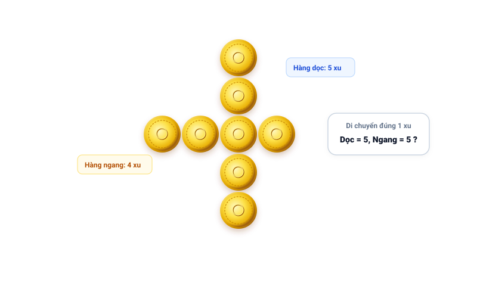
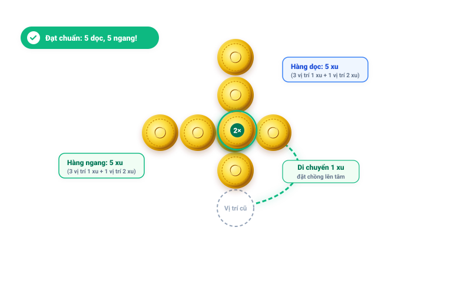

# Câu 224: Di chuyển đồng xu

- **Tập**: Tập 1
- **Phần**: Phần 4: Phương pháp giả thiết
- **Mức độ**: Trung bình
- **Nguồn**: Trang 239 (Tập 1)
- **Tóm tắt câu hỏi**: Có 8 đồng xu xếp thành hình chữ thập (hàng dọc 5 xu, hàng ngang 4 xu cắt nhau tại 1 xu). Hãy di chuyển chỉ 1 đồng xu để cả hàng ngang và hàng dọc đều có đúng 5 đồng xu.

---

## Đề bài

Trên bàn có 8 đồng xu giống hệt nhau được xếp thành hai hàng vuông góc tạo thành hình chữ thập:
- Hàng dọc gồm 5 đồng xu.
- Hàng ngang gồm 4 đồng xu.
- Hai hàng này giao nhau tại một đồng xu chung (ở vị trí chính giữa của hàng dọc, tức vị trí thứ ba tính từ trên xuống).

Như vậy, hiện tại hàng dọc có 5 đồng xu, còn hàng ngang chỉ có 4 đồng xu (tổng cộng là $5 + 4 - 1 = 8$ đồng xu).

Bạn hãy tìm cách **chỉ di chuyển đúng 1 đồng xu** sao cho sau khi di chuyển, cả hàng ngang và hàng dọc đều có đúng 5 đồng xu?

---

<b>💡 Xem đáp án & Lời giải chi tiết</b>

### Đáp án & Lời giải:
Lấy 1 đồng xu ở hàng dọc (ví dụ đồng xu ở vị trí dưới cùng của hàng dọc) và đặt nó **chồng lên đồng xu ở vị trí giao điểm** giữa hàng ngang và hàng dọc.

*Phân tích suy luận:*
1. Ban đầu có 8 đồng xu. Nếu hai hàng nằm phẳng hoàn toàn riêng biệt và giao nhau tại 1 đồng xu, tổng số đồng xu cần thiết phải là $5 + 5 - 1 = 9$ xu (thiếu 1 xu).
2. Tuy nhiên, bằng tư duy không gian 3 chiều, ta có thể xếp chồng một đồng xu lên đồng xu ở điểm giao nhau:
   - **Hàng dọc:** Ban đầu có 5 đồng xu ở 5 vị trí. Bớt đi 1 đồng xu ở đuôi thì còn 4 vị trí, nhưng tại vị trí giao điểm có 2 đồng xu xếp chồng lên nhau, nên tính theo số lượng đồng xu trên hàng dọc vẫn là: $3 \times 1 + (1 \times 2) = \mathbf{5\text{ đồng xu}}$.
   - **Hàng ngang:** Ban đầu có 4 đồng xu ở 4 vị trí. Nay tại vị trí giao điểm có thêm 1 đồng xu đặt chồng lên, nên tổng số đồng xu thuộc hàng ngang tăng lên thành: $3 \times 1 + (1 \times 2) = \mathbf{5\text{ đồng xu}}$.

**Bảng so sánh cơ cấu số lượng đồng xu trước và sau khi di chuyển:**

| Trạng thái | Số đồng xu hàng dọc | Số đồng xu hàng ngang | Số vị trí trên mặt bàn | Số đồng xu tại giao điểm | Tổng số xu thực tế |
| :--- | :---: | :---: | :---: | :---: | :---: |
| **Ban đầu** | 5 xu | 4 xu | 8 vị trí | 1 xu | **8 xu** |
| **Sau khi di chuyển** | **5 xu** | **5 xu** | 7 vị trí | **2 xu (xếp chồng)** | **8 xu** |
| **Hiệu quả** | Giữ nguyên 5 xu | **Tăng thêm 1 xu** | Giảm 1 vị trí đuôi | Tạo điểm giao đôi | **Thỏa mãn đề bài** |

Như vậy, chỉ bằng cách di chuyển 1 đồng xu đặt chồng lên đồng xu ở điểm giao nhau, cả hàng ngang và hàng dọc đều chứa đúng 5 đồng xu!

