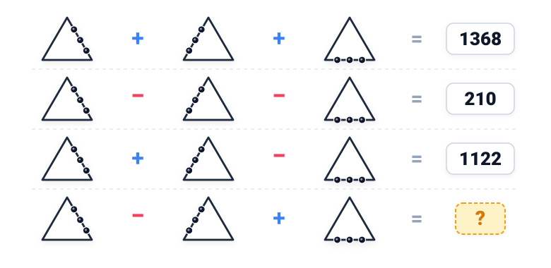
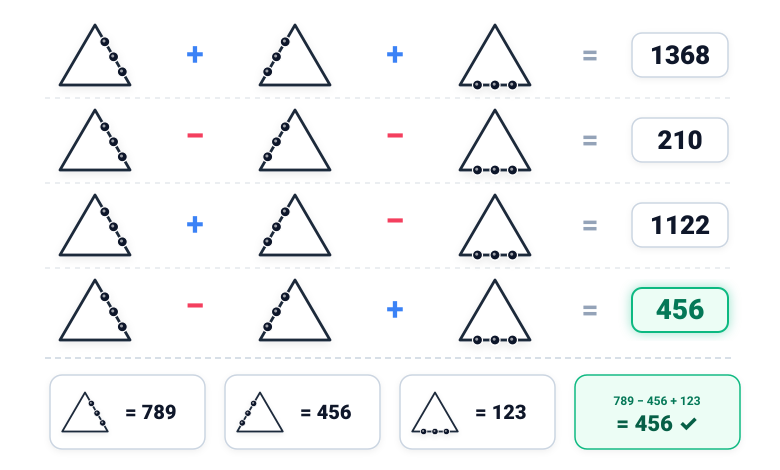

# Câu 228: Điểm và tam giác

- **Tập**: Tập 1
- **Phần**: Phần 4: Phương pháp giả thiết
- **Mức độ**: Khó
- **Nguồn**: Trang 240-241 (Tập 1)
- **Tóm tắt câu hỏi**: Dựa vào các phương trình biểu diễn các hình tam giác có gắn điểm ở các cạnh khác nhau, hãy tính giá trị của phép tính tam giác còn lại.

---

## Đề bài

Cho ba loại hình tam giác với các vị trí chấm tròn (điểm) đặc trưng khác nhau:
- Ký hiệu hình tam giác có 3 chấm tròn ở **cạnh bên phải** là $x$.
- Ký hiệu hình tam giác có 3 chấm tròn ở **cạnh bên trái** là $y$.
- Ký hiệu hình tam giác có 3 chấm tròn ở **cạnh đáy** là $z$.

Biết rằng giữa ba loại hình tam giác này có các đẳng thức sau:

$$\begin{cases}
(1)\quad x + y + z = 1368 \\
(2)\quad x - y - z = 210 \\
(3)\quad x + y - z = 1122
\end{cases}$$

Hỏi giá trị của phép tính dưới đây bằng bao nhiêu?

$$x - y + z = \;?$$

*(Tức là: Tam giác có chấm ở cạnh phải $-$ Tam giác có chấm ở cạnh trái $+$ Tam giác có chấm ở cạnh đáy = ?)*

| Dòng | Biểu thức hình học | Phương trình đại số | Giá trị |
| :---: | :--- | :--- | :---: |
| **(1)** | $\Delta_{\text{phải}} + \Delta_{\text{trái}} + \Delta_{\text{đáy}}$ | $x + y + z$ | **1368** |
| **(2)** | $\Delta_{\text{phải}} - \Delta_{\text{trái}} - \Delta_{\text{đáy}}$ | $x - y - z$ | **210** |
| **(3)** | $\Delta_{\text{phải}} + \Delta_{\text{trái}} - \Delta_{\text{đáy}}$ | $x + y - z$ | **1122** |
| **(4)** | $\Delta_{\text{phải}} - \Delta_{\text{trái}} + \Delta_{\text{đáy}}$ | $x - y + z$ | **?** |

---

<b>💡 Xem đáp án & Lời giải chi tiết</b>

### Đáp án & Lời giải:
Giá trị của phép tính là **456**.

*Bảng giá trị tương ứng của các loại hình tam giác:*

| Hình tam giác | Đặc điểm nhận dạng | Đặt ẩn | Giá trị tìm được |
| :---: | :--- | :---: | :---: |
| **$\Delta_{\text{phải}}$** | 3 chấm tròn ở cạnh bên phải | $x$ | **789** |
| **$\Delta_{\text{trái}}$** | 3 chấm tròn ở cạnh bên trái | $y$ | **456** |
| **$\Delta_{\text{đáy}}$** | 3 chấm tròn ở cạnh đáy | $z$ | **123** |

*Phân tích suy luận chi tiết:*
Ta có hệ 3 phương trình bậc nhất ba ẩn:
$$\begin{cases}
x + y + z = 1368 & (1) \\
x - y - z = 210 & (2) \\
x + y - z = 1122 & (3)
\end{cases}$$

1. **Tìm giá trị của $x$ ($\Delta_{\text{phải}}$):**
   Cộng vế với vế của phương trình $(1)$ và phương trình $(2)$:
   $$(x + y + z) + (x - y - z) = 1368 + 210$$
   $$2x = 1578 \implies x = 789$$

2. **Tìm giá trị của $z$ ($\Delta_{\text{đáy}}$):**
   Lấy phương trình $(1)$ trừ đi phương trình $(3)$:
   $$(x + y + z) - (x + y - z) = 1368 - 1122$$
   $$2z = 246 \implies z = 123$$

3. **Tìm giá trị của $y$ ($\Delta_{\text{trái}}$):**
   Lấy phương trình $(3)$ trừ đi phương trình $(2)$:
   $$(x + y - z) - (x - y - z) = 1122 - 210$$
   $$2y = 912 \implies y = 456$$

4. **Tính giá trị biểu thức cần tìm:**
   $$x - y + z = 789 - 456 + 123 = 456$$

Vậy đáp số cần tìm là **456**.

