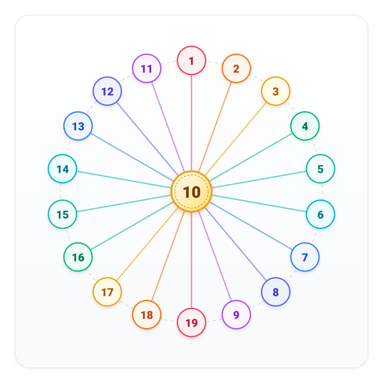

# Câu 274: Điền số

- **Tập**: Tập 2
- **Phần**: Phần 5: Phương pháp tính toán
- **Mức độ**: Trung bình
- **Nguồn**: Trang 28 (Tập 2)
- **Tóm tắt câu hỏi**: Điền các số từ 1 đến 19 vào 19 hình tròn trong hình vẽ sao cho tổng 3 số trên 3 vòng tròn thẳng hàng bất kỳ đều bằng 30. Hãy tìm số ở vòng tròn tâm và cách sắp xếp các số?

---

## Đề bài

Điền các số tự nhiên từ 1 đến 19 vào 19 hình tròn trong hình vẽ dưới đây, sao cho tổng của 3 số nằm trong 3 vòng tròn thẳng hàng bất kỳ (mỗi đường thẳng đều đi qua vòng tròn ở tâm) đều có giá trị bằng 30.

Hỏi số nào bắt buộc phải nằm ở vòng tròn trung tâm, và các cặp số còn lại được phân bố như thế nào?

---

<b>💡 Xem đáp án & Lời giải chi tiết</b>

### Đáp án & Lời giải:

Vòng tròn ở tâm phải điền số **10**. 
Chín cặp số đối xứng nhau qua tâm có tổng bằng 20: 
**(1, 19), (2, 18), (3, 17), (4, 16), (5, 15), (6, 14), (7, 13), (8, 12), (9, 11)**.

*Phân tích suy luận:*
1. **Phân tích cấu trúc hình vẽ:**
   - Hình vẽ gồm 1 vòng tròn nằm ở trung tâm và 18 vòng tròn nằm trên đường tròn bao quanh phía ngoài.
   - Nối vòng tròn tâm với các vòng tròn đối diện phía ngoài ta được đúng 9 đường thẳng đi qua tâm. Mỗi đường thẳng chứa đúng 3 vòng tròn: gồm 2 vòng tròn ở hai đầu đối diện và 1 vòng tròn ở chính giữa (vòng tròn tâm).

2. **Tính tổng của tất cả 19 số:**
   - Tổng của dãy số tự nhiên liên tiếp từ 1 đến 19 là:
     $$S = 1 + 2 + 3 + \dots + 19 = \frac{19 \times (19 + 1)}{2} = \frac{19 \times 20}{2} = 190$$

3. **Thiết lập phương trình tìm số ở tâm:**
   - Gọi số được điền vào vòng tròn ở tâm là $x$ ($1 \le x \le 19$).
   - Có 9 đường thẳng đi qua tâm, mỗi đường thẳng có tổng 3 số bằng 30.
   - Do đó, tổng giá trị của cả 9 đường thẳng là:
     $$9 \times 30 = 270$$
   - Trong phép cộng tổng của cả 9 đường thẳng này:
     + 18 số ở vòng tròn bên ngoài mỗi số được tính đúng 1 lần.
     + Số ở tâm $x$ xuất hiện trong cả 9 đường thẳng, do đó nó được cộng tới 9 lần (nhiều hơn so với khi tính tổng $S$ là $9 - 1 = 8$ lần).
   - Vì vậy, ta có phương trình:
     $$S + 8x = 270$$
     $$190 + 8x = 270$$
     $$8x = 270 - 190$$
     $$8x = 80$$
     $$x = 10$$
   - Như vậy, số ở vòng tròn tâm bắt buộc phải là **10**.

4. **Phân bố các số còn lại:**
   - Với số tâm là 10, trên mỗi đường thẳng thì tổng của hai số ở hai đầu đối diện phải là:
     $$30 - 10 = 20$$
   - Trong 18 số còn lại (từ 1 đến 19 trừ số 10), ta ghép thành 9 cặp số có tổng bằng 20:
     + $1 + 19 = 20$
     + $2 + 18 = 20$
     + $3 + 17 = 20$
     + $4 + 16 = 20$
     + $5 + 15 = 20$
     + $6 + 14 = 20$
     + $7 + 13 = 20$
     + $8 + 12 = 20$
     + $9 + 11 = 20$
   - Mỗi cặp số trên sẽ được điền vào 2 vòng tròn ở hai đầu đối xứng nhau qua tâm của một đường thẳng bất kỳ.

