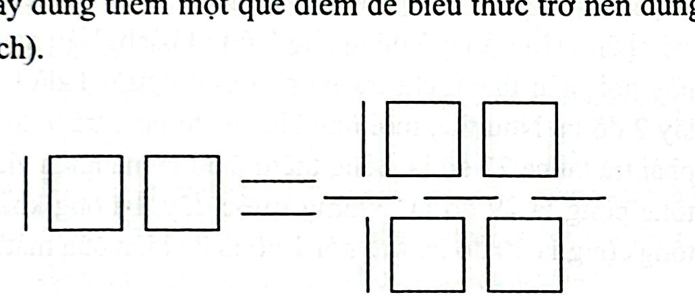

# Câu 286: Biểu thức

- **Tập**: Tập 2
- **Phần**: Phần 6: Phương pháp phân tích
- **Mức độ**: Dễ
- **Nguồn**: Trang 56 (Tập 2)
- **Tóm tắt câu hỏi**: Dưới đây là một biểu thức xếp bằng que diêm $100 = \frac{100}{100}$ (sai). Bạn hãy dùng thêm đúng một que diêm để biểu thức trở nên đúng (có hai cách làm).

---

## Đề bài

Hình dưới đây là một biểu thức toán học được xếp bằng các que diêm:

Biểu thức hiện tại đang biểu diễn:
$$100 = \frac{100}{100}$$
Rõ ràng đây là một biểu thức sai, vì $100 \neq 1$.

Bây giờ, bạn hãy lấy thêm đúng **một que diêm** và đặt vào vị trí thích hợp để biến biểu thức trên trở thành một khẳng định đúng đắn. Hãy tìm đủ **hai cách làm khác nhau**!

---

<b>💡 Xem đáp án & Lời giải chi tiết</b>

### Đáp án & Lời giải:
Có hai cách thêm 1 que diêm để nhận được khẳng định đúng:

*Phân tích suy luận:*
1. **Cách 1: Biến đổi thành bất đẳng thức đúng**
   - Lấy thêm 1 que diêm đặt gạch chéo qua dấu bằng ($=$) ở giữa để biến nó thành dấu khác ($\neq$).
   - Khi đó, ta được bất đẳng thức hoàn toàn chính xác:
     $$100 \neq \frac{100}{100}$$
     (vì $100 \neq 1$).

2. **Cách 2: Biến đổi thành số thập phân để đẳng thức cân bằng**
   - Lấy thêm 1 que diêm đặt thẳng đứng hoặc nằm ngang tạo thành dấu chấm thập phân chèn vào giữa chữ số $1$ và chữ số $0$ đầu tiên ở vế bên trái.
   - Khi đó, con số $100$ ở bên trái trở thành số thập phân:
     $$1.00$$
   - Ta nhận được một đẳng thức toán học hoàn hảo:
     $$1.00 = \frac{100}{100}$$
     (vì $1.00 = 1$ và $\frac{100}{100} = 1$).

