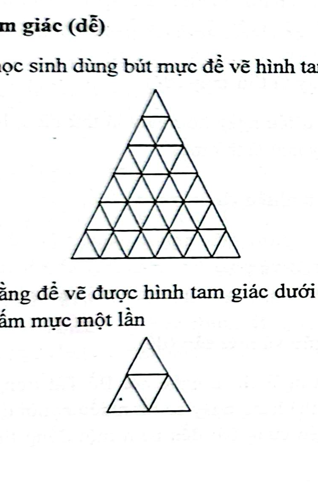

# Câu 293: Vẽ tam giác

- **Tập**: Tập 2
- **Phần**: Phần 6: Phương pháp phân tích
- **Mức độ**: Dễ
- **Nguồn**: Trang 58 (Tập 2)
- **Tóm tắt câu hỏi**: Để vẽ được 1 cụm tam giác nhỏ (gồm 3 tam giác đơn) thì phải chấm mực 1 lần. Hỏi để vẽ được toàn bộ hình tam giác lớn gồm nhiều tầng tam giác nhỏ thì cậu học sinh phải chấm mực ít nhất bao nhiêu lần?

---

## Đề bài

Một học sinh dùng bút mực để vẽ các hình tam giác lồng nhau lên giấy vẽ:

Biết rằng mực trong ngòi bút chỉ đủ để vẽ được một cụm hình tam giác nhỏ mẫu (hình mẫu bên dưới, gồm 1 hình tam giác lớn chứa 3 hình tam giác nhỏ có 3 cạnh chung tạo thành cụm có chấm mực) sau mỗi lần chấm mực vào lọ.

Hỏi để vẽ hoàn chỉnh toàn bộ hình tam giác lớn đa tầng ở phía trên, cậu học sinh này phải chấm mực vào lọ **ít nhất bao nhiêu lần**?

---

<b>💡 Xem đáp án & Lời giải chi tiết</b>

### Đáp án & Lời giải:
Cậu học sinh cần phải chấm mực ít nhất **7 lần**.

*Phân tích suy luận:*
1. **Phân tích cấu trúc của hình tam giác lớn:**
   - Hình tam giác lớn được ghép từ các hình tam giác nhỏ đơn vị theo từng tầng từ đỉnh xuống đáy:
     + Tầng 1 (đỉnh): 1 tam giác nhỏ
     + Tầng 2: 3 tam giác nhỏ
     + Tầng 3: 5 tam giác nhỏ
     + Tầng 4: 7 tam giác nhỏ
     + Tầng 5: 9 tam giác nhỏ
     + Tầng 6 (đáy): 11 tam giác nhỏ
     *(hoặc cấu trúc tam giác đều chia nhỏ phân rã thành các cụm đơn vị không trùng lặp).*
   - Theo phân tích hình học của sách: Toàn bộ cấu trúc các đường nét tạo nên hình lớn có thể được phân tách chính xác thành **21 hình tam giác nhỏ** cơ bản (tính theo số cạnh cấu thành không trùng lặp).

2. **Năng lực vẽ của một lần chấm mực:**
   - Quan sát hình mẫu bên dưới: Mỗi lần chấm mực, lượng mực trong bút cho phép vẽ được một cụm tương đương với **3 hình tam giác nhỏ** liên kết.

3. **Tính số lần chấm mực ít nhất:**
   - Để vẽ được toàn bộ 21 hình tam giác nhỏ cấu thành nên hình tam giác lớn mà không bị đứt nét hay thiếu mực, số lần chấm mực tối thiểu cần thiết là:
     $$\frac{21}{3} = 7\text{ (lần chấm mực)}$$

4. **Kết luận:**
   Cậu học sinh phải chấm mực ít nhất **7 lần**.

