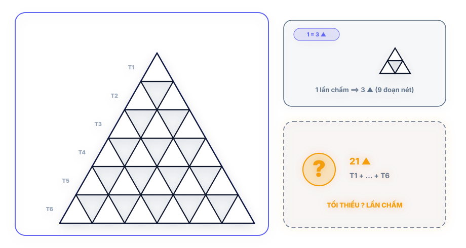
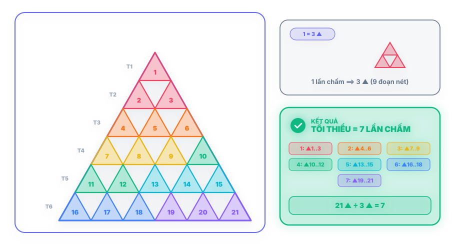

# Câu 293: Vẽ tam giác

- **Tập**: Tập 2
- **Phần**: Phần 6: Phương pháp phân tích
- **Mức độ**: Dễ
- **Nguồn**: Trang 58 (Tập 2)
- **Tóm tắt câu hỏi**: Để vẽ được 1 cụm tam giác nhỏ (gồm 3 tam giác đơn) thì phải chấm mực 1 lần. Hỏi để vẽ được toàn bộ hình tam giác lớn gồm nhiều tầng tam giác nhỏ thì cậu học sinh phải chấm mực ít nhất bao nhiêu lần?

---

## Đề bài

Một học sinh dùng bút mực để vẽ các hình tam giác lồng nhau lên giấy vẽ:

Biết rằng mực trong ngòi bút chỉ đủ để vẽ được một cụm hình tam giác nhỏ mẫu (hình mẫu bên phải, gồm 1 hình tam giác cạnh 2 chứa 3 hình tam giác đơn vị hướng lên và 1 tam giác ngược, tương đương 9 đoạn nét) sau mỗi lần chấm mực vào lọ.

Hỏi để vẽ hoàn chỉnh toàn bộ hình tam giác lớn đa tầng ở phía trên, cậu học sinh này phải chấm mực vào lọ **ít nhất bao nhiêu lần**?

---

<b>💡 Xem đáp án & Lời giải chi tiết</b>

### Đáp án & Lời giải:

Cậu học sinh cần phải chấm mực ít nhất **7 lần**.

*Phân tích suy luận (Chứng minh bằng 2 phương pháp hình học):*

#### Cách 1: Phân tích theo số tam giác đơn vị hướng lên (▲)
1. **Quy luật phân bố cạnh trong lưới tam giác đều:**
   - Trong một lưới tam giác đều bất kỳ, các hình tam giác nhỏ **hướng lên** (▲) hoàn toàn không có cạnh nào chung với nhau (chúng chỉ tiếp xúc nhau tại các đỉnh).
   - Ngược lại, mỗi đoạn thẳng trong lưới đều là một cạnh của đúng một tam giác hướng lên. Do đó, tập hợp các cạnh của toàn bộ các tam giác hướng lên chính là toàn bộ các đoạn nét tạo nên hình vẽ.

2. **Đếm số lượng tam giác hướng lên:**
   - **Tháp tam giác lớn (6 tầng):**
     + Tầng 1: 1 tam giác
     + Tầng 2: 2 tam giác
     + Tầng 3: 3 tam giác
     + Tầng 4: 4 tam giác
     + Tầng 5: 5 tam giác
     + Tầng 6: 6 tam giác
     $$\Rightarrow \text{Tổng cộng} = 1 + 2 + 3 + 4 + 5 + 6 = 21\text{ (tam giác hướng lên)}$$
   - **Cụm tam giác mẫu (cạnh 2):**
     + Tầng 1: 1 tam giác
     + Tầng 2: 2 tam giác
     $$\Rightarrow \text{Tổng cộng} = 1 + 2 = 3\text{ (tam giác hướng lên)}$$

3. **Tính số lần chấm mực:**
   $$\frac{21}{3} = 7\text{ (lần chấm mực)}$$

---

#### Cách 2: Phân tích theo tổng số đoạn nét cấu thành (Tổng độ dài nét mực)
1. **Công thức tính tổng số đoạn thẳng đơn vị trong tam giác cạnh $N$:**
   Mỗi tam giác đều gồm 3 họ đoạn thẳng song song với 3 cạnh. Với tam giác cạnh $N$:
   $$E(N) = 3 \times \frac{N(N + 1)}{2}$$

2. **Áp dụng vào bài toán:**
   - Với tháp lớn ($N = 6$):
     $$E(6) = 3 \times \frac{6 \times 7}{2} = 63\text{ (đoạn nét)}$$
   - Với hình mẫu đơn vị ($N = 2$):
     $$E(2) = 3 \times \frac{2 \times 3}{2} = 9\text{ (đoạn nét)}$$

3. **Số lần chấm mực tối thiểu:**
   $$\frac{63\text{ đoạn nét}}{9\text{ đoạn nét/lần}} = 7\text{ (lần chấm mực)}$$

**Kết luận:** Dù tính theo số tam giác đơn vị hay theo chiều dài nét mực thực tế, cậu học sinh bắt buộc phải chấm mực ít nhất **7 lần** để vẽ xong toàn bộ hình.

