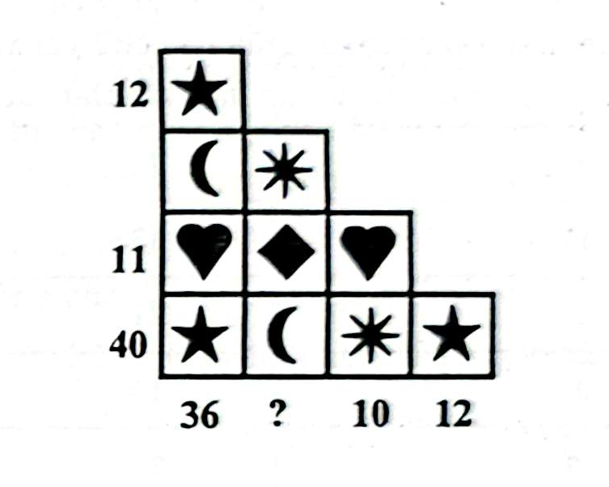

# Câu 314: Bài toán về những ký hiệu

- **Tập**: 2
- **Phần**: Phần 6: Phương pháp phân tích
- **Mức độ**: Dễ
- **Nguồn**: Trang 68 - 69 (Tập 2)
- **Tóm tắt câu hỏi**: Điền số thích hợp vào vị trí dấu hỏi chấm (?) trong bảng ma trận các ký hiệu hình học sao cho tổng hàng và tổng cột đều khớp với quy luật.

---

## Đề bài

Hãy cho biết cần phải điền con số nào vào vị trí dấu hỏi chấm (**?**) trong hình vẽ dưới đây:

---

<b>💡 Xem đáp án & Lời giải chi tiết</b>

### Đáp án & Lời giải

Con số cần điền vào dấu hỏi chấm là **21**.

*Phân tích suy luận:*
Mỗi ký hiệu trong bảng đại diện cho một giá trị số nguyên nhất định. Các con số ở rìa bên trái biểu thị tổng giá trị các ký hiệu theo từng hàng, còn các số ở rìa dưới cùng biểu thị tổng giá trị các ký hiệu theo từng cột.

Ta xác định giá trị của từng biểu tượng như sau:
1. **Hàng 1** chỉ gồm 1 Ngôi sao:
   $$\text{Ngôi sao} = 12$$
2. **Cột 4** (ngoài cùng bên phải) chỉ gồm 1 Ngôi sao ở hàng dưới cùng: Tổng là 12 (khớp hoàn toàn).
3. **Hàng 3** gồm 2 Trái tim và 1 Hình thoi kim cương: Tổng bằng 11.
4. **Cột 3** gồm 1 Trái tim (hàng 3) và 1 Bông hoa tuyết (hàng 4): Tổng bằng 10.
5. **Cột 1** gồm: Ngôi sao (12) + Mặt trăng + Trái tim + Ngôi sao (12) = 36.
   $$\Rightarrow \text{Mặt trăng} + \text{Trái tim} = 36 - 24 = 12$$
6. **Hàng 4** gồm: Ngôi sao (12) + Mặt trăng + Bông tuyết + Ngôi sao (12) = 40.
   $$\Rightarrow \text{Mặt trăng} + \text{Bông tuyết} = 40 - 24 = 16$$

Từ các dữ kiện trên, ta tìm được giá trị từng hình:
- $\text{Ngôi sao} = 12$
- $\text{Bông hoa tuyết} = 7$
- $\text{Mặt trăng} = 9$
- $\text{Trái tim} = 3$
- $\text{Hình thoi kim cương} = 11 - (3 \times 2) = 5$

Kiểm tra cột thứ 2 (cột chứa dấu **?**):
Cột này gồm 3 ô tính từ trên xuống dưới:
- Hàng 2: Bông hoa tuyết ($7$)
- Hàng 3: Hình thoi kim cương ($5$)
- Hàng 4: Mặt trăng ($9$)

Tổng giá trị của cột 2 là:
$$? = 7 + 5 + 9 = 21$$

Do đó, con số cần điền vào dấu hỏi chấm là **21**.

