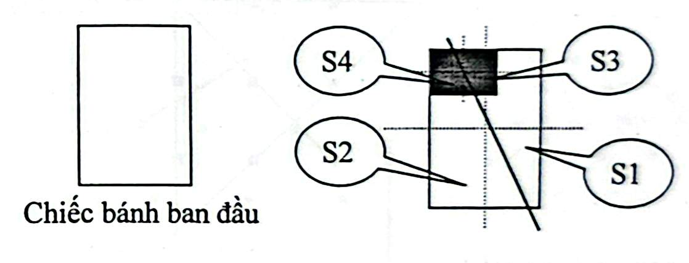

# Câu 335: Cắt bánh ngọt

- **Tập**: 2
- **Phần**: Phần 6: Phương pháp phân tích
- **Mức độ**: Dễ
- **Nguồn**: Trang 79 (Tập 2)
- **Tóm tắt câu hỏi**: Một chiếc bánh ngọt hình chữ nhật bị khoét mất một miếng hình chữ nhật có kích thước và vị trí bất kỳ. Làm thế nào chỉ bằng đúng một nhát cắt thẳng để chia phần bánh còn lại thành 2 phần bằng nhau?

---

## Đề bài

Một chiếc bánh ngọt hình chữ nhật đã bị ai đó cắt khoét mất một miếng cũng có hình chữ nhật (kích thước và vị trí của miếng bị khoét này là hoàn toàn ngẫu nhiên và tùy ý, các cạnh song song hoặc lệch với cạnh bánh ban đầu).

Làm thế nào chỉ bằng đúng **một nhát dao cắt thẳng**, bạn có thể chia phần còn lại của chiếc bánh ngọt thành hai phần có khối lượng (diện tích) hoàn toàn bằng nhau?

---

<b>💡 Xem đáp án & Lời giải chi tiết</b>

### Đáp án & Lời giải

Cắt một nhát dao theo đường thẳng **nối tâm của chiếc bánh hình chữ nhật ban đầu và tâm của miếng bánh hình chữ nhật bị khoét đi**.

*Phân tích suy luận:*
1. **Tính chất hình học:** Bất kỳ đường thẳng nào đi qua tâm đối xứng (giao điểm hai đường chéo) của một hình chữ nhật đều chia hình chữ nhật đó thành hai hình có diện tích hoàn toàn bằng nhau.
2. **Áp dụng vào bài toán:**
   - Khi đường cắt đi qua tâm của hình chữ nhật lớn ban đầu, nó chia chiếc bánh nguyên vẹn thành hai nửa bằng nhau:
     $$S_1 + S_3 = S_2 + S_4$$
   - Đồng thời, đường cắt đó cũng đi qua tâm của hình chữ nhật nhỏ đã bị khoét đi, nên nó cũng chia phần bị khoét thành hai nửa bằng nhau:
     $$S_3 = S_4$$
3. Trừ vế với vế của hai đẳng thức trên, ta được:
   $$(S_1 + S_3) - S_3 = (S_2 + S_4) - S_4 \iff S_1 = S_2$$

Như vậy, phần bánh còn lại được chia chính xác thành hai phần có diện tích bằng nhau chỉ với một nhát cắt thẳng duy nhất!

