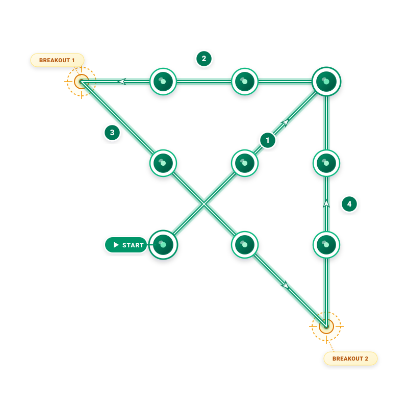

# Câu 338: Bài toán nối điểm

**Tập:** 2  
**Phần:** Phần 6 - Phương pháp phân tích  
**Mức độ:** Trung bình  
**Nguồn trang:** Trang 80, Tờ scan sheet_038  
**Tóm tắt câu hỏi:** Dùng đúng 4 đoạn thẳng vẽ liên tục (liền nét) để đi qua toàn bộ 9 điểm xếp thành lưới 3x3.

---

## Đề bài

Cho 9 điểm được sắp xếp thành một mạng lưới hình vuông $3 \times 3$ như hình dưới đây:

Làm thế nào để dùng **đúng 4 đoạn thẳng vẽ liên tục** (không nhấc bút) nối hết cả 9 điểm này?

---

<b>💡 Xem đáp án & Lời giải chi tiết</b>

### Đáp án & Lời giải:

*Phân tích suy luận:*
- Bài toán kinh điển này rèn luyện lối tư duy phân tán hay tư duy mở rộng ra ngoài khuôn khổ thông thường ("Thinking outside the box").
- Nếu chỉ tự giới hạn các đoạn thẳng trong phạm vi ranh giới của hình vuông tạo bởi 9 điểm, bạn sẽ không bao giờ có thể nối hết các điểm chỉ với 4 đoạn thẳng.
- Để giải quyết bài toán:
  1. **Nét 1 (Huy hiệu 1):** Bắt đầu từ điểm **START** (góc dưới bên trái), vẽ đường chéo đi qua tâm lên điểm góc trên bên phải (đi qua 3 điểm).
  2. **Nét 2 (Huy hiệu 2):** Từ điểm góc trên bên phải, vẽ đoạn thẳng nằm ngang kéo dài sang bên trái đi qua 2 điểm hàng trên, **vượt qua khỏi ranh giới cột ngoài cùng bên trái** một khoảng bằng độ dài cạnh ô vuông (đến đỉnh vươn ngoài **BREAKOUT 1**).
  3. **Nét 3 (Huy hiệu 3):** Từ đỉnh **BREAKOUT 1**, vẽ đường chéo xiên xuống dưới đi qua điểm đầu hàng 2 (cột trái) và điểm giữa hàng 3 (hàng dưới), tiếp tục **kéo dài xuống dưới ra ngoài ranh giới đáy** một khoảng bằng cạnh ô vuông (đến đỉnh vươn ngoài **BREAKOUT 2**, thẳng hàng với cột bên phải).
  4. **Nét 4 (Huy hiệu 4):** Từ đỉnh **BREAKOUT 2**, vẽ thẳng đứng lên trên dọc theo cột ngoài cùng bên phải đi qua điểm góc dưới bên phải và điểm giữa cột phải, kết thúc tại điểm góc trên bên phải.

Chỉ cần mạnh dạn mở rộng đường vẽ ra bên ngoài ranh giới hình vuông, bài toán lập tức trở nên vô cùng đơn giản!

