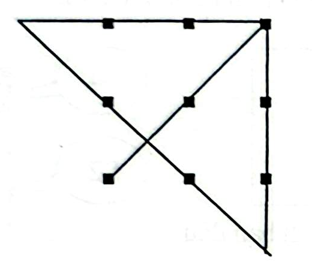

# Câu 338: Bài toán nối điểm

**Tập:** 2  
**Phần:** Phần 6 - Phương pháp phân tích  
**Mức độ:** Trung bình  
**Nguồn trang:** Trang 80, Tờ scan sheet_038  
**Tóm tắt câu hỏi:** Dùng đúng 4 đoạn thẳng vẽ liên tục (liền nét) để đi qua toàn bộ 9 điểm xếp thành lưới 3x3.

---

## Đề bài

Cho 9 điểm được sắp xếp thành một mạng lưới hình vuông $3 \times 3$ như hình dưới đây:

```
●   ●   ●

●   ●   ●

●   ●   ●
```

Làm thế nào để dùng **đúng 4 đoạn thẳng vẽ liên tục** (không nhấc bút) nối hết cả 9 điểm này?

---

<details>
<summary><b>💡 Xem đáp án & Lời giải chi tiết</b></summary>

### Đáp án & Lời giải:



*Phân tích suy luận:*
- Bài toán kinh điển này rèn luyện lối tư duy phân tán hay tư duy mở rộng ra ngoài khuôn khổ thông thường ("Thinking outside the box").
- Nếu chỉ tự giới hạn các đoạn thẳng trong phạm vi ranh giới của hình vuông tạo bởi 9 điểm, bạn sẽ không bao giờ có thể nối hết các điểm chỉ với 4 đoạn thẳng.
- Để giải quyết:
  1. **Nét 1:** Bắt đầu từ điểm góc dưới bên trái, vẽ đường chéo đi qua tâm lên góc trên bên phải.
  2. **Nét 2:** Từ góc trên bên phải, vẽ đoạn thẳng nằm ngang kéo dài sang bên trái **vượt qua khỏi cột ngoài cùng bên trái** một khoảng bằng độ dài cạnh ô vuông.
  3. **Nét 3:** Từ điểm ngoài biên đó, vẽ đường chéo xiên xuống dưới qua điểm giữa hàng 2 và điểm góc dưới bên phải, kéo dài xuống dưới ra ngoài biên một đoạn.
  4. **Nét 4:** Từ vị trí đáy ngoài biên đó, vẽ thẳng đứng lên trên đi dọc theo cột bên phải để nối các điểm còn lại.

Chỉ cần mạnh dạn mở rộng đường vẽ ra bên ngoài ranh giới hình vuông, bài toán lập tức trở nên vô cùng đơn giản!

</details>
