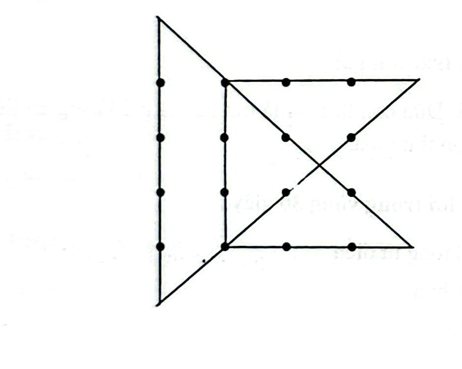

# Câu 339: Nối 16 điểm

**Tập:** 2  
**Phần:** Phần 6 - Phương pháp phân tích  
**Mức độ:** Trung bình  
**Nguồn trang:** Trang 80, Tờ scan sheet_038  
**Tóm tắt câu hỏi:** Dùng đúng 6 đoạn thẳng vẽ liền nét để nối toàn bộ 16 điểm xếp thành lưới 4x4.

---

## Đề bài

Cho 16 điểm được xếp thành một mạng lưới hình vuông $4 \times 4$:

```
●   ●   ●   ●

●   ●   ●   ●

●   ●   ●   ●

●   ●   ●   ●
```

Hãy dùng **đúng 6 đoạn thẳng vẽ liên tục** (không nhấc bút) để đi qua tất cả 16 điểm trên.

---

<details>
<summary><b>💡 Xem đáp án & Lời giải chi tiết</b></summary>

### Đáp án & Lời giải:



*Phân tích suy luận:*
- Tương tự như bài toán nối 9 điểm, bài toán này cũng đòi hỏi bạn phải vẽ các đoạn thẳng vượt ra ngoài phạm vi ranh giới của lưới $4 \times 4$.
- Lộ trình 6 nét nối liên tục như hình minh họa:
  1. Bắt đầu từ điểm góc dưới bên trái, kéo xiên lên điểm (hàng 2, cột 2) rồi kéo thẳng lên vượt quá điểm mép trên.
  2. Từ điểm bên ngoài phía trên, kéo thẳng đứng dọc theo cột thứ 2 xuống điểm đáy.
  3. Kéo xiên sang phải hoặc vượt ra ngoài góc để tạo thành các đoạn ziczac bao phủ toàn bộ 16 điểm như trong sơ đồ hình vẽ.

</details>
