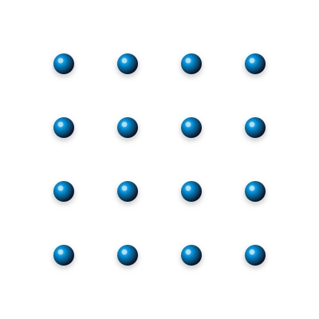

# Câu 339: Nối 16 điểm

**Tập:** 2  
**Phần:** Phần 6 - Phương pháp phân tích  
**Mức độ:** Trung bình  
**Nguồn trang:** Trang 80, Tờ scan sheet_038  
**Tóm tắt câu hỏi:** Dùng đúng 6 đoạn thẳng vẽ liền nét để nối toàn bộ 16 điểm xếp thành lưới 4x4.

---

## Đề bài

Cho 16 điểm được xếp thành một mạng lưới hình vuông $4 \times 4$:

Hãy dùng **đúng 6 đoạn thẳng vẽ liên tục** (không nhấc bút) để đi qua tất cả 16 điểm trên.

---

<b>💡 Xem đáp án & Lời giải chi tiết</b>

### Đáp án & Lời giải:

*Phân tích suy luận:*
- Tương tự như bài toán nối 9 điểm kinh điển, bài toán này đòi hỏi tư duy vượt ra ngoài ranh giới của lưới $4 \times 4$ (Think outside the box).
- Để phủ kín 16 điểm chỉ bằng 6 đoạn thẳng liên tục, các đoạn thẳng phải kéo dài vượt ra ngoài phạm vi lưới để đón đầu các đường chéo và hàng/cột:
  1. **Nét 1 (Thẳng đứng cột 1):** Bắt đầu từ điểm ngoài phía dưới $(1, 0)$, kẻ thẳng đứng lên trên qua toàn bộ 4 điểm của cột 1 đến điểm ngoài phía trên $(1, 5)$.
  2. **Nét 2 (Đường chéo nghiêng):** Từ $(1, 5)$, kẻ chéo xiên xuống dưới qua các điểm $(2, 4), (3, 3), (4, 2)$ ra điểm ngoài góc dưới bên phải $(5, 1)$.
  3. **Nét 3 (Nằm ngang hàng 1):** Từ $(5, 1)$, kẻ nằm ngang sang trái qua các điểm $(4, 1), (3, 1)$ đến điểm $(2, 1)$.
  4. **Nét 4 (Thẳng đứng cột 2):** Từ $(2, 1)$, kẻ thẳng đứng lên trên qua các điểm $(2, 2), (2, 3)$ đến điểm $(2, 4)$.
  5. **Nét 5 (Nằm ngang hàng 4):** Từ $(2, 4)$, kẻ nằm ngang sang phải qua các điểm $(3, 4), (4, 4)$ ra điểm ngoài góc trên bên phải $(5, 4)$.
  6. **Nét 6 (Đường chéo khép kín):** Từ $(5, 4)$, kẻ chéo xiên xuống dưới qua các điểm $(4, 3), (3, 2), (2, 1)$ trở về điểm xuất phát $(1, 0)$.

Toàn bộ 16 điểm đều được bao phủ trọn vẹn trong một chu trình 6 đoạn thẳng liên tục khép kín hoàn hảo.

