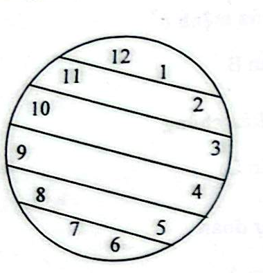

# Câu 340: Chia mặt đồng hồ

**Tập:** 2  
**Phần:** Phần 6 - Phương pháp phân tích  
**Mức độ:** Trung bình  
**Nguồn trang:** Trang 81, Tờ scan sheet_038  
**Tóm tắt câu hỏi:** Chia mặt đồng hồ tròn có các số từ 1 đến 12 thành 6 phần sao cho tổng các số trong mỗi phần bằng nhau.

---

## Đề bài

Mặt đồng hồ tròn có 12 chữ số từ 1 đến 12. Bây giờ yêu cầu bạn chia đồng hồ này thành **6 phần**, sao cho tổng những con số trong mỗi phần đều bằng nhau.

Bạn sẽ chia như thế nào?

---

<b>💡 Xem đáp án & Lời giải chi tiết</b>

### Đáp án & Lời giải:

*Phân tích suy luận:*
1. **Tính tổng giá trị của mỗi phần:**
   - Tổng của tất cả 12 số trên mặt đồng hồ là:
     $$S = 1 + 2 + 3 + \dots + 12 = \frac{12 \times 13}{2} = 78$$
   - Khi chia thành 6 phần bằng nhau, tổng các số trong mỗi phần phải là:
     $$78 \div 6 = 13$$

2. **Tìm các cặp số có tổng bằng 13:**
   Ta ghép cặp các số đối xứng qua tâm / trục ngang:
   - $12 + 1 = 13$
   - $11 + 2 = 13$
   - $10 + 3 = 13$
   - $9 + 4 = 13$
   - $8 + 5 = 13$
   - $7 + 6 = 13$

3. **Cách chia trên mặt đồng hồ:**
   Vẽ 5 đường thẳng song song nằm ngang (hơi chếch theo hướng nối các cặp số tương ứng) cắt ngang qua mặt đồng hồ để chia nó thành 6 dải song song, mỗi dải chứa đúng một cặp số có tổng bằng 13 như hình vẽ.

