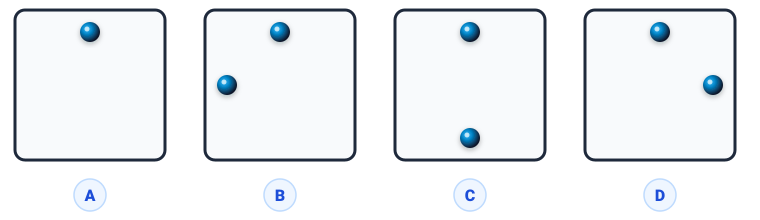
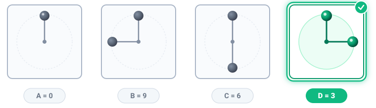

# Câu 341: Đại diện cho con số nào

**Tập:** 2  
**Phần:** Phần 6 - Phương pháp phân tích  
**Mức độ:** Trung bình  
**Nguồn trang:** Trang 81, Tờ scan sheet_038  
**Tóm tắt câu hỏi:** Dựa vào quy luật biểu diễn các số 0, 9, 6 qua vị trí các chấm đen trên ô vuông, tìm con số mà hình D đại diện.

---

## Đề bài

Xem hình vẽ dưới đây:

Biết rằng:
- Hình **A** đại diện cho **số 0**
- Hình **B** đại diện cho **số 9**
- Hình **C** đại diện cho **số 6**

Hỏi hình **D** đại diện cho số mấy?

---

<b>💡 Xem đáp án & Lời giải chi tiết</b>

### Đáp án & Lời giải:
Hình **D** đại diện cho **số 3**.

*Phân tích suy luận:*
- Các chấm đen trên các cạnh của hình vuông thực chất biểu diễn vị trí chỉ của **kim giờ và kim phút trên mặt đồng hồ tròn** (với tâm đồng hồ ở chính giữa hình vuông):
  - **Hình A:** Chỉ có 1 chấm ở chính giữa cạnh trên $\to$ Hai kim trùng nhau ở vị trí 12 giờ (tức **0 giờ**).
  - **Hình B:** Một chấm ở cạnh trên (12 giờ) và một chấm ở cạnh trái (9 giờ) $\to$ Đồng hồ chỉ **9 giờ**.
  - **Hình C:** Một chấm ở cạnh trên (12 giờ) và một chấm ở cạnh đáy (6 giờ) $\to$ Đồng hồ chỉ **6 giờ**.
  - **Hình D:** Một chấm ở cạnh trên (12 giờ) và một chấm ở cạnh phải (3 giờ) $\to$ Đồng hồ chỉ **3 giờ**.

Vì vậy, hình D đại diện cho **số 3**.

