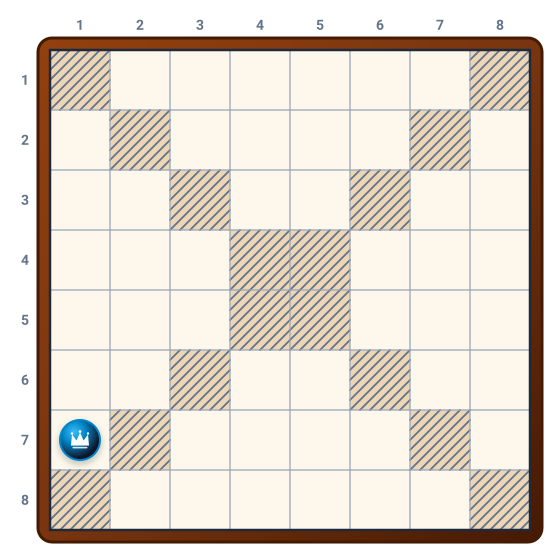
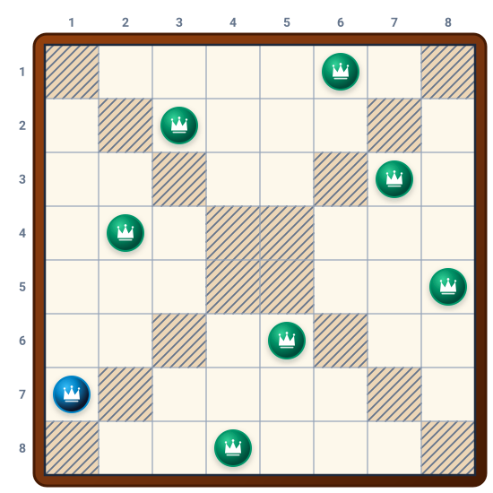

# Câu 344: Tám quân cờ

**Tập:** 2  
**Phần:** Phần 6 - Phương pháp phân tích  
**Mức độ:** Trung bình  
**Nguồn trang:** Trang 83, Tờ scan sheet_039  
**Tóm tắt câu hỏi:** Đặt 8 quân cờ (bài toán 8 quân hậu) vào 4 vùng ô trắng của bàn cờ 8x8 sao cho mỗi vùng có 2 quân và không có hai quân nào cùng hàng, cột hay đường chéo.

---

## Đề bài

Một bàn cờ có kích thước $8 \times 8$ ô, hai đường chéo lớn được gạch sọc chia các ô màu trắng còn lại thành 4 vùng (trên, dưới, trái, phải).

Yêu cầu:
- Đặt vào mỗi vùng trắng đúng **2 quân cờ** (tổng cộng 8 quân cờ).
- Không cho phép bất kỳ 2 quân cờ nào nằm trên cùng 1 hàng, 1 cột, hay trên cùng 1 đường chéo (quy tắc bài toán 8 quân hậu).
- Một quân cờ đã được đặt trước ở ô **(hàng 7, cột 1)** như trên hình vẽ.

Bạn hãy xác định vị trí của 7 quân cờ còn lại.

---

<b>💡 Xem đáp án & Lời giải chi tiết</b>

### Đáp án & Lời giải:

Vị trí của 8 quân cờ (tính theo hàng $1 \to 8$ từ trên xuống dưới, cột $1 \to 8$ từ trái sang phải):
1. **Hàng 1, Cột 6** (thuộc vùng trắng phía trên)
2. **Hàng 2, Cột 3** (thuộc vùng trắng phía trên)
3. **Hàng 3, Cột 7** (thuộc vùng trắng bên phải)
4. **Hàng 4, Cột 2** (thuộc vùng trắng bên trái)
5. **Hàng 5, Cột 8** (thuộc vùng trắng bên phải)
6. **Hàng 6, Cột 5** (thuộc vùng trắng phía dưới)
7. **Hàng 7, Cột 1** *(quân cờ đã cho trước, thuộc vùng trắng bên trái)*
8. **Hàng 8, Cột 4** (thuộc vùng trắng phía dưới)

*Phân tích suy luận:*
- **Kiểm tra phân bố theo vùng:**
  - Vùng trắng phía trên: 2 quân tại $(1, 6)$ và $(2, 3)$.
  - Vùng trắng phía dưới: 2 quân tại $(6, 5)$ và $(8, 4)$.
  - Vùng trắng bên trái: 2 quân tại $(4, 2)$ và $(7, 1)$.
  - Vùng trắng bên phải: 2 quân tại $(3, 7)$ và $(5, 8)$.
  $\Rightarrow$ Thỏa mãn mỗi vùng có đúng 2 quân cờ.
- **Kiểm tra quy tắc hàng và cột:**  
  Các cột xuất hiện lần lượt: $6, 3, 7, 2, 8, 5, 1, 4$. Cả 8 cột đều khác nhau và mỗi hàng chỉ có đúng 1 quân cờ.
- **Kiểm tra quy tắc đường chéo:**  
  - Hiệu $(r - c)$: $-5, -1, -4, 2, -3, 1, 6, 4$ (tất cả đều phân biệt, không trùng đường chéo chính).  
  - Tổng $(r + c)$: $7, 5, 10, 6, 13, 11, 8, 12$ (tất cả đều phân biệt, không trùng đường chéo phụ).  
Do đó, không có hai quân cờ nào khống chế nhau theo bất kỳ phương diện nào.

