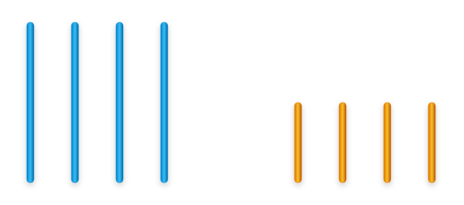
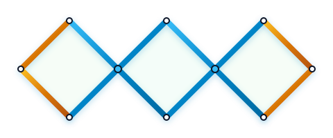

# Câu 346: Ba hình vuông

**Tập:** 2  
**Phần:** Phần 6 - Phương pháp phân tích  
**Mức độ:** Trung bình  
**Nguồn trang:** Trang 83 - 84, Tờ scan sheet_039, sheet_040  
**Tóm tắt câu hỏi:** Dùng 8 thanh sắt (gồm 4 thanh dài và 4 thanh ngắn bằng nửa thanh dài) để ghép thành 3 hình vuông bằng nhau mà không được bẻ cong.

---

## Đề bài

Có 8 thanh sắt thẳng như hình vẽ dưới đây, trong đó 4 thanh dài có chiều dài gấp đôi 4 thanh ngắn:

Với điều kiện không bẻ cong, không làm biến dạng hay cắt rời các thanh sắt, bạn làm thế nào để xếp chúng thành **3 hình vuông bằng nhau**?

---

<b>💡 Xem đáp án & Lời giải chi tiết</b>

### Đáp án & Lời giải:

*Phân tích suy luận:*
- Gọi chiều dài của mỗi thanh sắt ngắn là $a$, thì chiều dài mỗi thanh sắt dài là $2a$.
- Một hình vuông cạnh $a$ có chu vi là $4a$. Ba hình vuông riêng biệt cạnh $a$ sẽ có tổng chu vi là $3 \times 4a = 12a$.
- Tổng chiều dài của cả 8 thanh sắt là:
  $$4 \times 2a + 4 \times a = 8a + 4a = 12a$$
- Như vậy, tổng chiều dài vừa khít để tạo nên chu vi của 3 hình vuông cạnh $a$ mà không cần chồng lấn cạnh:
  - Bốn thanh dài (độ dài $2a$) được xếp chéo bắt cặp với nhau tạo thành các cạnh liên tiếp có độ dài $2a$ (mỗi thanh dài tạo thành 2 cạnh liên tiếp của 2 hình vuông liền kề chạm đỉnh).
  - Bốn thanh ngắn (độ dài $a$) đóng kín các cạnh còn lại của hai hình vuông ở hai đầu.
  - Kết quả tạo thành một chuỗi 3 hình thoi / hình vuông nghiêng $45^\circ$ có kích thước hoàn toàn bằng nhau như trong hình vẽ.

