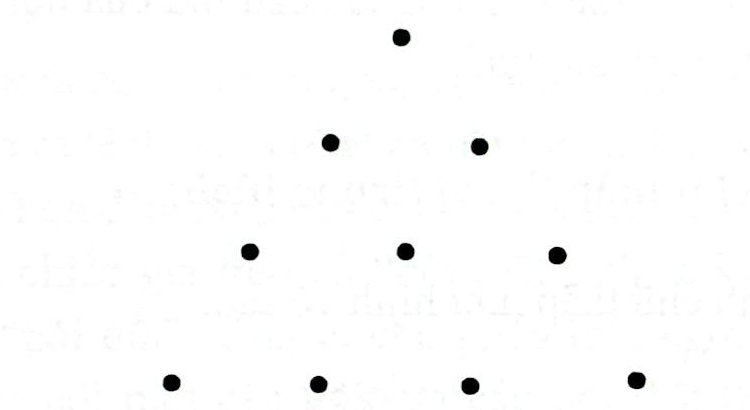
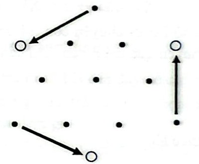

# Câu 347: Biến đổi tam giác

**Tập:** 2  
**Phần:** Phần 6 - Phương pháp phân tích  
**Mức độ:** Trung bình  
**Nguồn trang:** Trang 84, Tờ scan sheet_040  
**Tóm tắt câu hỏi:** Di chuyển đúng 3 quả cầu trong hình tam giác 10 quả cầu đang hướng lên trên để đảo ngược thành tam giác hướng xuống dưới.

---

## Đề bài

Có 10 quả cầu được xếp thành một hình tam giác đều hướng lên trên (gồm 4 hàng: hàng 1 có 1 quả, hàng 2 có 2 quả, hàng 3 có 3 quả, hàng 4 có 4 quả) như hình vẽ dưới đây:

Bây giờ chỉ cho phép **di chuyển đúng 3 quả cầu**, liệu bạn có thể đảo ngược hình tam giác này để có đỉnh hướng xuống dưới và cạnh đáy nằm ở trên cùng không?

---

<b>💡 Xem đáp án & Lời giải chi tiết</b>

### Đáp án & Lời giải:

Chỉ cần di chuyển **3 quả cầu nằm tại 3 đỉnh góc** của tam giác ban đầu:

*Phân tích suy luận:*
1. Giữ nguyên 6 quả cầu ở phần trung tâm (gồm hàng 2 có 2 quả và hàng 3 có 3 quả, cộng với 2 quả ở giữa của hàng đáy).
2. **Quả cầu thứ 1:** Lấy quả cầu ở đỉnh trên cùng (hàng 1) di chuyển xuống chính giữa phía dưới của hàng thứ 3 (để tạo thành đỉnh nhọn mới ở dưới cùng).
3. **Quả cầu thứ 2 & 3:** Lấy 2 quả cầu ở hai góc ngoài cùng của hàng đáy (hàng 4) di chuyển lên đặt vào hai đầu của hàng 2 (để tạo thành một hàng mới gồm 4 quả cầu ở trên cùng làm cạnh đáy mới).
4. Sau khi di chuyển 3 quả cầu này, ta thu được tam giác đều đảo ngược hoàn hảo có cạnh đáy 4 quả ở trên và đỉnh 1 quả ở dưới.

