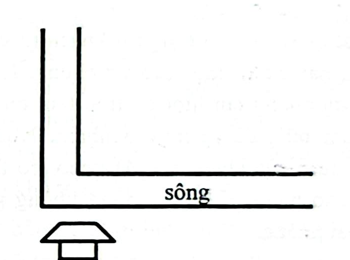
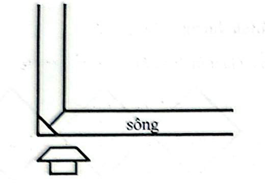

# Câu 349: Bắc cầu

**Tập:** 2  
**Phần:** Phần 6 - Phương pháp phân tích  
**Mức độ:** Trung bình  
**Nguồn trang:** Trang 85, Tờ scan sheet_040  
**Tóm tắt câu hỏi:** Dùng hai tấm ván dài đúng 3m để bắc cầu vượt qua một con sông rộng 3m tại khúc cua vuông góc $90^\circ$.

---

## Đề bài

Trước nhà cậu bé Minh có một dòng sông uốn khúc một góc $90^\circ$ như hình vẽ dưới đây:

Độ rộng của con sông là **3 mét**. Minh muốn sang bờ bên kia, nhưng trong nhà cậu chỉ có **2 tấm ván gỗ, mỗi tấm có chiều dài đúng bằng 3 mét**. Ngoài ra Minh không có đinh, dây thừng hay bất kỳ dụng cụ phụ trợ nào khác.

Làm thế nào Minh có thể dùng 2 tấm ván này để bắc cầu sang được bờ bên kia?

---

<b>💡 Xem đáp án & Lời giải chi tiết</b>

### Đáp án & Lời giải:

Minh tận dụng chính góc cua $90^\circ$ của khúc sông để bắc cầu theo các bước sau:

*Phân tích suy luận:*
1. **Bắc tấm ván thứ nhất:**  
   - Đặt tấm ván thứ nhất bắc chéo qua góc vuông của bờ bên này (tạo thành cạnh huyền của một tam giác vuông cân ở góc bờ).  
   - Với cạnh huyền dài $3\text{ m}$, khoảng cách từ đỉnh góc vuông đến điểm chính giữa của tấm ván thứ nhất là:
     $$d_1 = \frac{3}{2} = 1{,}5\text{ m}$$

2. **Bắc tấm ván thứ hai:**  
   - Đặt tấm ván thứ hai từ đỉnh góc nhọn nhô ra của bờ đối diện gác thẳng tới chính giữa của tấm ván thứ nhất.  
   - Xét khoảng cách hình học:
     - Vì sông rộng $3\text{ m}$ và rẽ góc $90^\circ$, theo đường phân giác chéo qua tâm, khoảng cách từ đỉnh góc trong (bờ đối diện) tới đỉnh góc ngoài (bờ bên này) là:
       $$D = 3 \times \sqrt{2} \approx 4{,}24\text{ m}$$
     - Khoảng cách từ đỉnh góc trong bờ đối diện tới điểm giữa của tấm ván thứ nhất là:
       $$d_2 = D - d_1 \approx 4{,}24 - 1{,}5 = 2{,}74\text{ m}$$
   - Vì $2{,}74\text{ m} < 3\text{ m}$, nên tấm ván thứ hai dài $3\text{ m}$ hoàn toàn thừa chiều dài (dư khoảng $26\text{ cm}$) để gác chắc chắn một đầu lên bờ đối diện và một đầu tì lên điểm giữa của tấm ván thứ nhất.

Minh có thể an toàn bước qua cây cầu chữ T thông minh này để sang sông!

