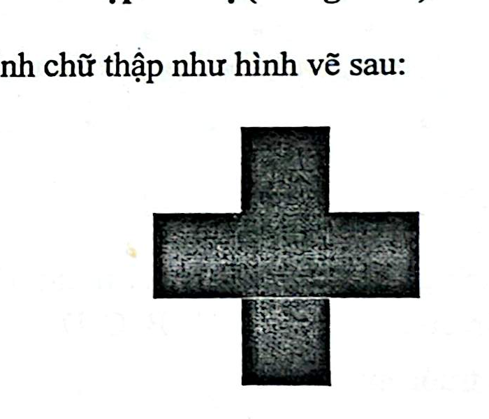
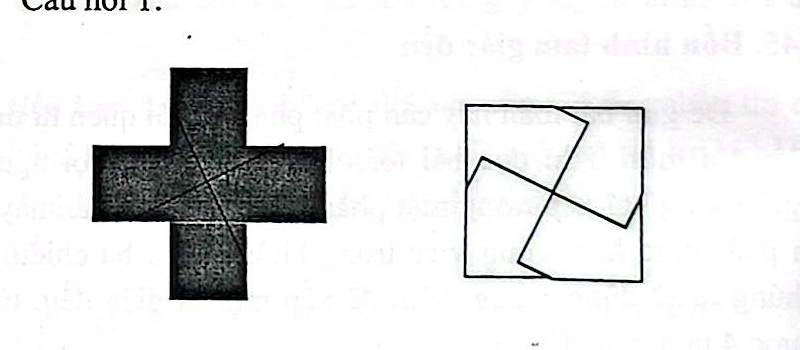
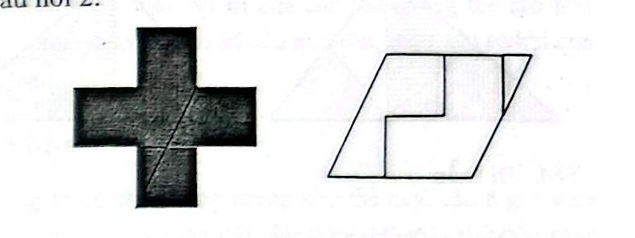
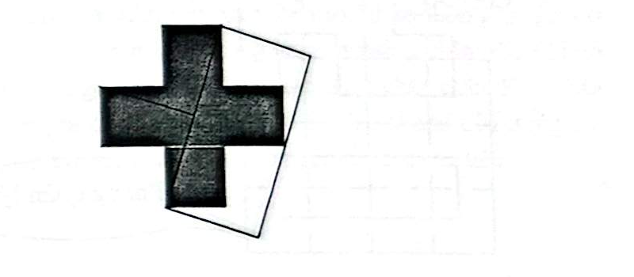

# Câu 356: Hình chữ thập thú vị

- **Tập:** 2
- **Phần:** Phần 6 - Phương pháp phân tích
- **Mức độ:** Trung bình
- **Nguồn:** Sách scan - Trang 87 - 88 (Đề bài), Trang 111 - 112 (Đáp án)
- **Tóm tắt câu hỏi:** Cắt hình chữ thập (ghép bởi 5 ô vuông bằng nhau) thành các phần để ghép lại thành một hình vuông, một hình thoi và một hình chữ nhật có tỉ lệ 2:1.

---

## Đề bài

Có hình chữ thập như hình vẽ dưới đây (tạo bởi 5 hình vuông nhỏ bằng nhau):

1. **Câu hỏi 1:** Hãy cắt hình chữ thập này thành 4 phần và ghép lại thành một hình vuông.
2. **Câu hỏi 2:** Hãy cắt hình chữ thập này thành 3 phần và ghép lại thành một hình thoi.
3. **Câu hỏi 3:** Hãy cắt hình chữ thập này thành 3 phần và ghép lại thành một hình chữ nhật có chiều dài gấp đôi chiều rộng.

---

<b>💡 Xem đáp án & Lời giải chi tiết</b>

### Đáp án & Lời giải

#### Câu hỏi 1: Ghép thành hình vuông (4 phần)
- Cắt hình chữ thập bằng hai đường cắt chéo đi qua tâm đối xứng, chia hình chữ thập thành 4 tứ giác bằng nhau.
- Xoay và ghép 4 mảnh này lại với nhau sẽ tạo thành một hình vuông hoàn chỉnh như hình vẽ dưới đây:

---

#### Câu hỏi 2: Ghép thành hình thoi (3 phần)
- Cắt hình chữ thập bằng 2 nhát cắt chia thành 3 phần (gồm một mảnh lớn chữ L uốn khúc và hai mảnh nhỏ).
- Ghép 3 mảnh này lại ta được một hình thoi như hình vẽ:

---

#### Câu hỏi 3: Ghép thành hình chữ nhật tỉ lệ 2:1 (3 phần)
- Cắt hai góc tam giác ở hai cánh đối diện của hình chữ thập.
- Đem hai mảnh tam giác vừa cắt ghép bù vào hai góc khuyết bên cạnh, hình chữ thập sẽ biến đổi thành một hình chữ nhật có chiều dài gấp đôi chiều rộng:

