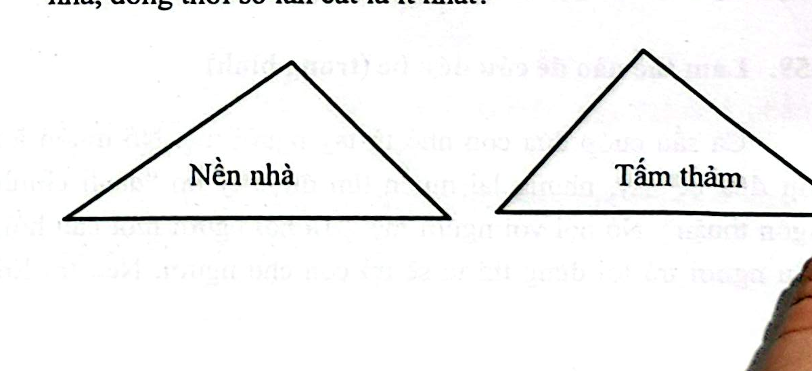
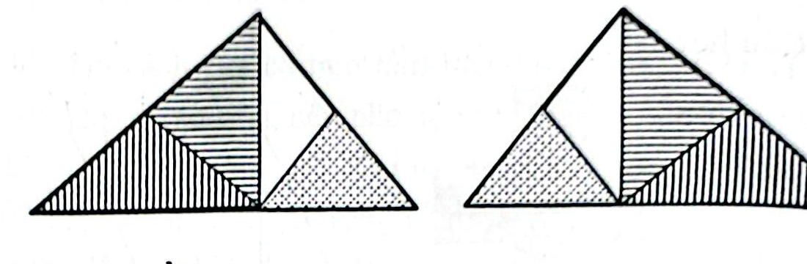

# Câu 363: Cắt tấm thảm

- **Tập:** 2
- **Phần:** Phần 6 - Phương pháp phân tích
- **Mức độ:** Khó
- **Nguồn:** Sách scan - Trang 91 (Đề bài), Trang 114 (Đáp án)
- **Tóm tắt câu hỏi:** Cắt một tấm thảm hình tam giác thường bị may ngược mặt với số nhát cắt ít nhất để ghép vừa khít nền nhà (thảm chỉ dùng được mặt phải).

---

## Đề bài

Phần sàn góc nhà có hình tam giác với ba cạnh có độ dài không bằng nhau. Mẹ bạn Minh đi mua một tấm thảm có cùng kích cỡ để trải vừa khít phần sàn nhà đó.

Tuy nhiên khi đem về trải thử thì phát hiện tấm thảm bị may nhầm mặt (nghĩa là hình dáng tấm thảm là hình phản chiếu đối xứng gương của góc sàn nhà). Nếu lật úp mặt trái tấm thảm lên thì có thể trải vừa khít, nhưng thảm dệt chỉ có thể dùng mặt phải có hoa văn mà không thể dùng mặt trái.

Không còn cách nào khác, đành phải cắt tấm thảm ra rồi ghép lại trên nền nhà. Bạn hãy cho biết phải cắt tấm thảm đó như thế nào để ghép vừa kín phần sàn nhà với số lần cắt là ít nhất?

---

<b>💡 Xem đáp án & Lời giải chi tiết</b>

### Đáp án & Lời giải

**Số lần cắt ít nhất:** Cần **3 nhát cắt** (chia tấm thảm thành 4 mảnh tam giác).

*Phân tích suy luận:*
1. **Đặc tính hình học:**
   - Trong các hình tam giác, chỉ có tam giác cân sau khi lật ngược lại (hoặc lấy đối xứng qua trục) mới giữ nguyên hình dạng ban đầu.
   - Do nền nhà là một hình tam giác thường (không cân), ta phải phân chia nó thành các tam giác vuông hoặc tam giác cân để sau khi cắt có thể hoán đổi vị trí các phần ghép tương thích.
2. **Phương pháp cắt:**
   - **Nhát cắt 1:** Từ đỉnh tam giác, hạ đường vuông góc xuống cạnh đáy (cắt theo chiều cao của tam giác).
   - **Nhát cắt 2 và 3:** Từ chân đường vuông góc trên cạnh đáy, cắt nối lần lượt lên trung điểm của hai cạnh bên tam giác.
3. **Cách ghép lại:**
   - Sau 3 nhát cắt, tấm thảm được chia làm 4 mảnh tam giác nhỏ.
   - Giữ nguyên mặt phải của thảm, đổi chỗ và xoay các vị trí thích hợp như sơ đồ hình vẽ dưới đây, ta sẽ ghép vừa khít hoàn toàn với mặt sàn nền nhà ban đầu:

