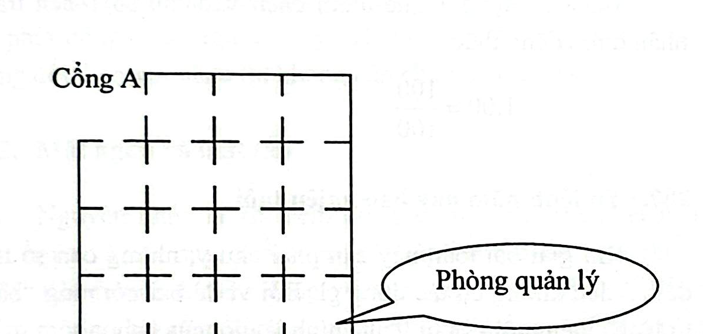
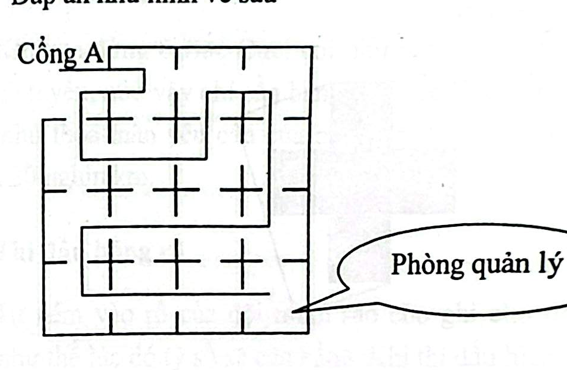

# Câu 364: Đi tuần

- **Tập:** 2
- **Phần:** Phần 6 - Phương pháp phân tích
- **Mức độ:** Khó
- **Nguồn:** Sách scan - Trang 92 (Đề bài), Trang 115 (Đáp án)
- **Tóm tắt câu hỏi:** Tìm lộ trình cho người bảo vệ đi tuần qua toàn bộ 15 phòng ($3 \times 5$), mỗi phòng đi qua đúng 1 lần từ Cổng A đến Phòng quản lý.

---

## Đề bài

Có một người bảo vệ cần phải đi tuần 15 căn phòng được bố trí theo sơ đồ lưới $3 \times 5$ như hình vẽ dưới đây. Bất cứ hai căn phòng nào kề sát nhau cũng có một cửa chung thông nhau.

Hiện tại người bảo vệ đang đứng ở vị trí Cổng vào A (phòng góc trên bên trái), muốn đi tuần qua hết tất cả các căn phòng, mỗi căn phòng chỉ đi vào một lần và đi ra một lần (không lặp lại phòng nào), cuối cùng kết thúc chuyến đi tuần tại Phòng quản lý (ở góc dưới bên phải).

Bạn hãy cho biết người bảo vệ phải đi theo lộ trình như thế nào?

---

<b>💡 Xem đáp án & Lời giải chi tiết</b>

### Đáp án & Lời giải

**Lộ trình đi tuần của người bảo vệ như sau:**

*Phân tích chi tiết lộ trình (đường đi Hamilton):*
- Từ **Cổng A** (ô hàng 1, cột 1):
  1. Đi sang phải vào ô (hàng 1, cột 2).
  2. Đi xuống vào ô (hàng 2, cột 2).
  3. Đi sang trái vào ô (hàng 2, cột 1).
  4. Đi xuống vào ô góc dưới bên trái (hàng 3, cột 1).
  5. Đi sang phải dọc theo cạnh đáy: qua ô (hàng 3, cột 2) $\to$ ô (hàng 3, cột 3).
  6. Đi lên qua ô (hàng 2, cột 3) $\to$ ô (hàng 1, cột 3).
  7. Đi sang phải vào ô góc trên bên phải (hàng 1, cột 5) qua ô (hàng 1, cột 4).
  8. Đi xuống các ô hàng bên phải (hàng 2, cột 5 $\to$ hàng 3, cột 5) rồi vòng về ô hàng 3 cột 4 để kết thúc tại **Phòng quản lý**.

Bằng đường đi uốn lượn liên tục này, toàn bộ 15 căn phòng đều được ghé thăm chính xác một lần mà không hề bị trùng lặp hay bỏ sót phòng nào.

