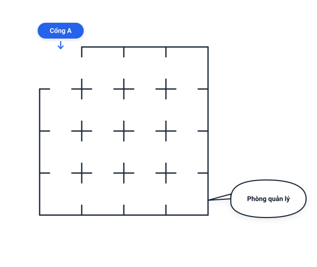
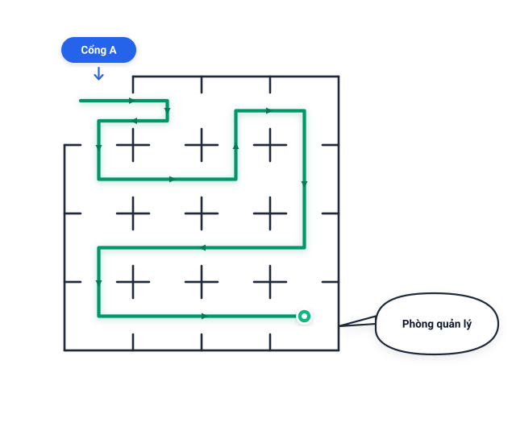

# Câu 364: Đi tuần

- **Tập:** 2
- **Phần:** Phần 6 - Phương pháp phân tích
- **Mức độ:** Khó
- **Nguồn:** Sách scan - Trang 92 (Đề bài), Trang 115 (Đáp án)
- **Tóm tắt câu hỏi:** Tìm lộ trình cho người bảo vệ đi tuần qua toàn bộ 15 phòng (lưới $4 \times 4$ khuyết góc Cổng A), mỗi phòng đi qua đúng 1 lần từ Cổng A đến Phòng quản lý.

---

## Đề bài

Có một người bảo vệ, cần phải đi tuần 15 căn phòng như hình vẽ dưới đây. Bất cứ hai căn phòng nào kề nhau cũng có một cửa chung.

Hiện tại anh ta đang đứng ở vị trí Cổng vào A (phòng góc trên bên trái), muốn đi tuần qua hết tất cả các căn phòng, cuối cùng đến Phòng quản lý (ở góc dưới bên phải). Đồng thời mỗi căn phòng chỉ đi vào một lần và đi ra một lần (không lặp lại phòng nào).

Bạn hãy cho biết, anh ta phải đi theo lộ trình như thế nào?

---

<b>💡 Xem đáp án & Lời giải chi tiết</b>

### Đáp án & Lời giải

**Lộ trình đi tuần của người bảo vệ từ Cổng A đến Phòng quản lý như sau:**

*Phân tích chi tiết lộ trình (đường đi uốn lượn):*
- Toàn bộ khu nhà gồm 15 phòng được bố trí trong một khối $4 \times 4$ (khuyết ô góc trên bên trái chính là lối vào **Cổng A**).
- Lộ trình đi tuần qua đủ 15 phòng không lặp lại:
  1. Từ **Cổng A**, đi sang phải vào phòng ở cột 2 hàng 1.
  2. Vòng xuống phòng (hàng 2, cột 2) rồi rẽ trái sang phòng (hàng 2, cột 1).
  3. Đi xuống phòng (hàng 3, cột 1).
  4. Rẽ phải đi xuyên qua hàng 3: qua (hàng 3, cột 2) $\to$ (hàng 3, cột 3).
  5. Vòng lên phòng (hàng 1, cột 3) rồi rẽ sang phòng góc trên bên phải (hàng 1, cột 4).
  6. Đi thẳng xuống dọc theo cột ngoài cùng bên phải: qua (hàng 2, cột 4) $\to$ (hàng 3, cột 4).
  7. Rẽ trái đi ngang toàn bộ hàng 3 về lại phòng góc dưới bên trái (hàng 4, cột 1).
  8. Rẽ phải đi dọc theo hàng đáy dưới cùng: qua (hàng 4, cột 2) $\to$ (hàng 4, cột 3) để kết thúc tại đích đến **Phòng quản lý** ở ô góc dưới bên phải (hàng 4, cột 4).

Bằng lộ trình uốn lượn liên tục này, người bảo vệ ghé thăm tất cả 15 căn phòng chính xác một lần theo đúng sơ đồ chỉ dẫn của sách.

