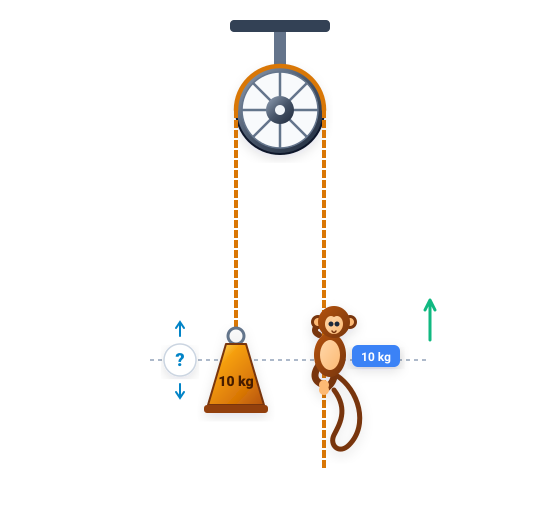
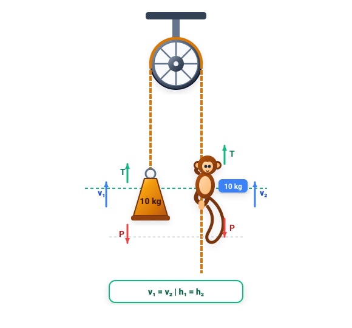

# Câu 366: Khỉ leo dây

- **Tập:** 2
- **Phần:** Phần 6 - Phương pháp phân tích
- **Mức độ:** Khó
- **Nguồn:** Sách scan - Trang 93 (Đề bài), Trang 115 - 116 (Đáp án)
- **Tóm tắt câu hỏi:** Phân tích trạng thái chuyển động của quả cân đối trọng khi con khỉ trèo lên theo sợi dây vắt qua ròng rọc không ma sát.

---

## Đề bài

Một sợi dây vắt qua một bánh xe (ròng rọc) không có ma sát và không có trọng lượng. Một đầu sợi dây treo một quả cân nặng 10 kg, đầu kia của sợi dây có một con khỉ (nặng đúng 10 kg). Quả cân và con khỉ ban đầu ở vị trí thăng bằng ngang nhau.

Khi con khỉ bắt đầu trèo lên theo sợi dây, bạn hãy cho biết quả cân sẽ chuyển động như thế nào?

Bài toán xem ra đơn giản này (do nhà toán học Lewis Carroll nêu ra năm 1893) từng khiến rất nhiều nhà toán học và vật lý học kiệt xuất đưa ra những đáp án hoàn toàn khác nhau:
- Có người cho rằng quả cân sẽ chuyển động đi lên, hơn nữa tốc độ mỗi lúc một nhanh.
- Có người lại cho rằng quả cân và con khỉ cùng chuyển động lên trên với tốc độ bằng nhau.
- Thậm chí có người nói rằng quả cân sẽ chuyển động tụt xuống dưới!

Rốt cuộc quả cân sẽ chuyển động như thế nào?

---

<b>💡 Xem đáp án & Lời giải chi tiết</b>

### Đáp án & Lời giải

**Đáp án:** Quả cân và con khỉ sẽ **luôn luôn chuyển động đồng thời và ở cùng một độ cao đối diện ngang nhau**. Vị trí của con khỉ không thể cao hơn cũng không thể thấp hơn vị trí của quả cân, thậm chí cả khi con khỉ buông tay khỏi sợi dây và rơi xuống!

*Phân tích suy luận vật lý:*
1. **Xét lực tác dụng trong hệ:**
   - Hệ thống gồm ròng rọc lý tưởng (không ma sát, không khối lượng), sợi dây không dãn nhẹ lý tưởng vắt qua ròng rọc.
   - Trọng lượng của con khỉ và quả cân bằng nhau: $P_1 = P_2 = mg = 10 \times g$.
   - Lực căng dây $T$ ở hai nhánh của sợi dây tại mọi thời điểm luôn có độ lớn bằng nhau.
2. **Khi con khỉ leo dây:**
   - Để trèo lên, con khỉ phải dùng tay nắm chặt và kéo sợi dây xuống phía dưới với một lực $F$.
   - Theo định luật 3 Newton, sợi dây sẽ tác dụng lên con khỉ một phản lực ngược lại hướng lên trên (chính là lực căng dây $T$).
   - Lực căng dây này truyền qua ròng rọc và kéo quả cân lên trên với đúng lực $T$.
   - Phương trình chuyển động:
     - Đối với con khỉ: $F_{\text{khỉ}} = T - mg = m \cdot a_{\text{khỉ}}$
     - Đối với quả cân: $F_{\text{cân}} = T - mg = m \cdot a_{\text{cân}}$
   - Vì khối lượng của khỉ và quả cân như nhau ($m = 10\text{ kg}$) và lực kéo $T$ như nhau, nên gia tốc của con khỉ và quả cân tại mọi thời điểm luôn bằng nhau:
     $$a_{\text{khỉ}}(t) = a_{\text{cân}}(t)$$
3. **Kết luận về vị trí:**
   - Ban đầu cả hai đứng yên ở cùng một độ cao ($v_0 = 0$).
   - Do có cùng gia tốc tại mọi thời điểm, vận tốc của hai vật tại bất kỳ khoảnh khắc nào cũng bằng nhau ($v_{\text{khỉ}} = v_{\text{cân}}$), và quãng đường đi được theo phương thẳng đứng luôn bằng nhau.
   - Do đó, dù con khỉ trèo nhanh, trèo chậm hay nhảy lên, thì quả cân cũng sẽ dâng lên tương ứng và luôn duy trì ở vị trí đối diện ngang bằng với con khỉ.
   - Thậm chí nếu con khỉ buông tay buông lỏng sợi dây, lực căng dây $T = 0$, cả khỉ và quả cân đều chịu tác dụng duy nhất của trọng lực rơi tự do với gia tốc $g$, nên chúng vẫn cùng rơi xuống và luôn ngang hàng nhau.

